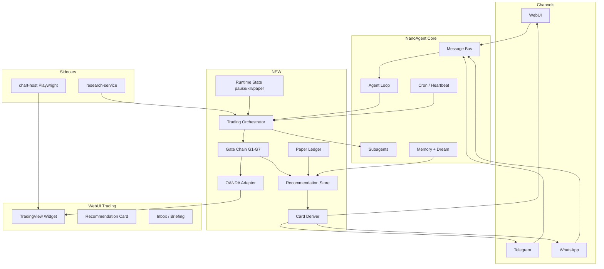

# Design: NanoAgent → Gold Trading Agent (Lonora)

Generated by `/office-hours` + `/plan-ceo-review` + `/plan-eng-review` on 2026-09-12  
Branch: `main`  
Repo: `loorksy/NanoAgent`  
Status: **APPROVED FOR IMPLEMENTATION**  
Mode: Builder (product extension on existing platform)

---

## Problem Statement

NanoAgent (fork of nanobot) is a general-purpose AI agent runtime with WebUI, Telegram, WhatsApp, MCP, cron, memory, and subagents — but **no trading domain**. The user wants a **gold-only (XAUUSD) trading recommendation agent** that:

- chats from Web, Telegram, and WhatsApp
- reads live OANDA data
- issues structured gold recommendations with approve/reject cards
- monitors market + news + open trades
- supports paper mode, pause, emergency stop, and decision memory
- embeds TradingView charts (library already imported)
- reuses the **AiChart brain** (Lonora) without rebuilding from scratch

**Core constraint:** Recommendations only — **no broker execution** (same doctrine as AiChart).

---

## Target User & Narrowest Wedge

| Dimension | Decision |
|-----------|----------|
| **Instrument** | Gold only — `XAUUSD` / `XAU_USD` |
| **User** | Arabic/English trader who wants one trusted analyst, not a generic chatbot |
| **Wedge v1** | Web chat + Telegram → live OANDA quote → one recommendation card → approve/reject → paper journal |
| **Not v1** | Live order execution, billing, admin apps, multi-asset |

---

## What Already Exists (NanoAgent)

| Capability | Location | Status |
|------------|----------|--------|
| Web chat + streaming | `webui/`, `nanobot/channels/websocket/` | ✅ Ready |
| Telegram | `nanobot/channels/telegram/` | ✅ Ready (generic) |
| WhatsApp | `nanobot/channels/whatsapp/` | ✅ Ready (generic) |
| Agent loop + tools | `nanobot/agent/loop.py`, `runner.py`, `tools/` | ✅ Ready |
| Subagents (unlimited) | `nanobot/agent/subagent.py`, `spawn` tool | ✅ Ready |
| Cron / automations | `nanobot/cron/`, heartbeat | ✅ Ready |
| Memory (Dream) | `nanobot/agent/memory.py` | ✅ Ready (generic) |
| MCP client | `nanobot/agent/tools/mcp.py` | ✅ Ready |
| TradingView library | `webui/public/charting_library/` | ✅ Imported from odysseusai |

---

## What Comes From AiChart (Source of Truth for Brain)

| Module | AiChart path | Migration |
|--------|--------------|-----------|
| Constitution + doctrine | `agent/workspace/SYSTEM.md` | **Port** → `nanobot/skills/gold-trading/` |
| Trading skills | `agent/workspace/skills/*` | **Port** |
| Tool contract (33 tools) | `agent/tools/contract.json` | **Port + map** to Python tools |
| Orchestrator + gates G1–G7 | `src/lib/agent/orchestrator.ts`, `gates/` | **Rewrite** in Python |
| OANDA adapter | `src/lib/markets/oanda.ts` | **Rewrite** → `nanobot/trading/oanda.py` |
| Recommendation store | `src/lib/recommendations/` | **Rewrite** → `nanobot/trading/recommendations/` |
| Card derivation | `src/lib/agent/cards/` | **Rewrite** (Python derive + React render) |
| TV datafeed | `src/lib/chart/tv/tvDatafeed.ts` | **Rewrite** in WebUI |
| Telegram cards/progress | `src/lib/telegram/*` | **Rewrite** on nanobot channel |
| Research backtester | `research-service/` | **Port as-is** (Python sidecar) |
| Chart capture | `chart-host/` | **Port as-is** (Docker sidecar) |

---

## Feature Matrix (User Requirements)

| # | Feature | Phase | Approach |
|---|---------|-------|----------|
| 1 | Web chat with agent | 1 | Use existing WebUI + trading workspace route |
| 2 | Telegram chat | 1 | Extend `telegram/runtime.py` with card renderer |
| 3 | WhatsApp chat | 2 | Extend `whatsapp/runtime.py` with card renderer |
| 4 | Gold only | 1 | Symbol guard in `nanobot/trading/gold.py` |
| 5 | Live OANDA data | 1 | `nanobot/trading/oanda.py` + tools |
| 6 | Gold recommendation | 2 | Gate chain + synthesizer port |
| 7 | Market analysis | 2 | Specialist subagents via `spawn` |
| 8 | Gold monitoring | 2 | Cron + heartbeat jobs |
| 9 | Unlimited on-demand agents | 1 | Existing `spawn` — no limit |
| 10 | Voice tasks (time/news/signal/trade) | 3 | Cron triggers + intent router |
| 11 | News monitoring | 2 | `web_search` + dedicated news tool |
| 12 | Trade follow-up | 2 | Recommendation lifecycle sweeps |
| 13 | In-chat alerts | 1 | `message` tool across channels |
| 14 | Recommendation card (approve/reject) | 2 | WebUI component + structured outbound |
| 15 | Inbox | 3 | WebUI page — pending recommendations |
| 16 | Briefing | 2 | Scheduled `/briefing` automation |
| 17 | Chart (embedded) | 2 | TradingView widget in thread |
| 18 | Pause | 1 | `TradingRuntimeState.paused` |
| 19 | Emergency stop | 1 | `TRADING_KILL_SWITCH` env + runtime flag |
| 20 | Paper mode | 2 | `nanobot/trading/paper.py` ledger |
| 21 | Decision memory | 2 | `memory/trades.jsonl` + Dream prompts |
| 22 | Built-in charts | 2 | `webui/public/charting_library/` + datafeed |
| 23 | Agent brain (AiChart) | 2–3 | Orchestrator + gates rewrite |

---

## Architecture



### Key architectural decisions

| Decision | Choice | Why |
|----------|--------|-----|
| Base runtime | **NanoAgent (nanobot)** | Channels, gateway, memory, subagents already production-grade |
| Brain port strategy | **Rewrite orchestrator in Python** | AiChart brain is ~34k LOC TS; mechanical port impossible |
| OANDA access | **Native Python tools** (not MCP bridge) | Simpler, fewer moving parts; MCP optional later |
| Recommendations DB | **SQLite in workspace** (`~/.nanobot/trading/`) | Matches nanobot local-first model; Postgres later |
| Chart library | **Already in `webui/public/charting_library/`** | Imported from odysseusai |
| Chart capture | **Port `chart-host/` unchanged** | Isolated Playwright; proven in AiChart |
| Research | **Port `research-service/` as sidecar** | Already Python/FastAPI |
| Execution | **None** | Recommendations only; paper mode simulates outcomes |
| i18n | **Arabic + English** | Port AiChart keys; nanobot WebUI already i18n-capable |

---

## Implementation Phases

### Phase 0 — Prerequisites (DONE)

- [x] Import nanobot into NanoAgent
- [x] Import TradingView charting library
- [x] Install gstack skills for planning workflow
- [x] This design doc

### Phase 1 — Foundation (Week-equivalent: ~1 sprint)

**Goal:** Agent can read live gold price and respond in Web + Telegram with safety controls.

| Task | Files | gstack skill at ship |
|------|-------|---------------------|
| Create `nanobot/trading/` package | `__init__.py`, `config.py`, `gold.py` | `/review` |
| OANDA adapter (quotes + candles) | `oanda.py`, `types.py` | `/review` + `/cso` |
| Python tools: `get_gold_price`, `get_gold_candles` | `nanobot/agent/tools/trading.py` | `/review` |
| Port `SYSTEM.md` + gold skill | `nanobot/skills/gold-trading/SKILL.md` | `/review` |
| Runtime state: pause / kill switch / paper flag | `runtime_state.py` | `/review` |
| Env vars in config schema | `nanobot/config/schema.py` | `/review` |
| WebUI: trading mode indicator (pause/kill/paper) | `webui/src/components/trading/` | `/qa` |
| Telegram: route gold queries through trading skill | extend channel config | `/qa` |

**Exit criteria:** User asks "سعر الذهب الآن؟" in Web or Telegram → live OANDA price with timestamp.

**Required secrets:** `OANDA_API_TOKEN`, `OANDA_ACCOUNT_ID`, `OANDA_ENV=practice`

### Phase 2 — Brain + Cards (Core product)

**Goal:** Full recommendation with gate chain, approve/reject card, embedded chart, paper journal.

| Task | Files | gstack skill |
|------|-------|-------------|
| Port gate chain G1–G7 | `nanobot/trading/gates/` | `/plan-eng-review` then `/review` |
| Port orchestrator (simplified v1) | `nanobot/trading/orchestrator.py` | `/review` |
| Recommendation store + lifecycle | `nanobot/trading/recommendations/` | `/review` |
| Card deriver (Python) | `nanobot/trading/cards/` | `/review` |
| WebUI recommendation card | `webui/src/components/trading/RecommendationCard.tsx` | `/design-review` + `/qa` |
| TradingView datafeed (OANDA) | `webui/src/lib/chart/tvDatafeed.ts` | `/qa` |
| Chart in thread | `webui/src/components/trading/ChartPanel.tsx` | `/qa` |
| Paper ledger | `nanobot/trading/paper.py` | `/review` |
| Decision memory | `memory/trades.jsonl` + Dream template | `/review` |
| News tool | `nanobot/agent/tools/news.py` | `/review` |
| Cron: market monitor + briefing | `nanobot/cron/` jobs | `/review` |
| WhatsApp card formatting | `nanobot/channels/whatsapp/` extension | `/qa` |

**Exit criteria:** User gets BUY/SELL card with entry/SL/TP, chart inline, can approve/reject, paper position recorded.

### Phase 3 — Full Parity + Operations

**Goal:** Match AiChart surface parity and operational features.

| Task | Notes |
|------|-------|
| Telegram live progress bubble (Arabic stages) | Port from `src/lib/telegram/liveProgress.ts` |
| Inbox page (pending + history) | WebUI route |
| Briefing automation (scheduled) | Cron + template |
| Voice-style task triggers | Cron: time / news / signal / trade events |
| chart-host sidecar integration | Docker compose |
| research-service sidecar | Docker compose |
| Trade follow-up sweeps | Recommendation lifecycle |
| MCP server (optional) | For Claude Connectors parity |

**Exit criteria:** Feature matrix rows 1–23 complete; Telegram/Web parity on recommendations.

---

## Directory Layout (Target)

```
nanobot/
  trading/
    __init__.py
    config.py
    gold.py              # symbol guard
    oanda.py             # OANDA v20 client
    runtime_state.py     # pause / kill / paper
    orchestrator.py      # brain coordinator
    gates/               # G1–G7
    recommendations/     # store, lifecycle, activation
    cards/               # derive cards from agent result
    paper.py             # paper ledger
  agent/tools/
    trading.py           # market tools
    news.py              # news monitoring
  skills/gold-trading/
    SKILL.md             # ported from AiChart SYSTEM.md
webui/src/
  components/trading/
    RecommendationCard.tsx
    ChartPanel.tsx
    TradingStatusBar.tsx
    InboxPanel.tsx
  lib/chart/
    tvDatafeed.ts
    tvDrawingAdapter.ts
chart-host/              # ported from AiChart
research-service/        # ported from AiChart
```

---

## Environment Variables

| Variable | Phase | Required |
|----------|-------|----------|
| `OANDA_API_TOKEN` | 1 | Yes |
| `OANDA_ACCOUNT_ID` | 1 | Yes |
| `OANDA_ENV` | 1 | Yes (`practice`) |
| `OPENAI_API_KEY` or provider keys | 1 | Yes |
| `TRADING_KILL_SWITCH` | 1 | Optional (default off) |
| `TRADING_PAPER_MODE` | 2 | Optional (default on) |
| `RESEARCH_SERVICE_URL` | 3 | Optional |
| `CHART_HOST_URL` | 3 | Optional |
| `TELEGRAM_BOT_TOKEN` | 1 | For Telegram |
| WhatsApp neonize state | 2 | For WhatsApp |

---

## Risks & Mitigations

| Risk | Impact | Mitigation |
|------|--------|------------|
| Orchestrator rewrite loses AiChart nuance | Bad recommendations | Port gate tests first; run AiChart reference scenarios |
| OANDA rate limits | Stale data | Cache + `STALE_QUOTE_MS` guard |
| TradingView licensing | Legal | Library already licensed via odysseusai; no re-publish |
| Telegram card UX gap | Poor mobile UX | Prioritize card renderer in Phase 2 |
| Scope creep (execution, billing) | Delays | CEO scope lock: recommendations only |
| Arabic RTL in cards | Broken layout | Test with `/qa` on Arabic threads |

---

## Deferred (Explicitly Out of Scope)

- Live broker execution (OANDA orders, MT5, MetaAPI)
- Multi-asset (EURUSD, indices, crypto)
- AiChart billing/subscription system
- Admin Flutter/Android apps
- Full MCP OAuth connector parity (Phase 3 optional)

---

## gstack Workflow (Mandatory for Every Phase)

| Stage | Skill | When |
|-------|-------|------|
| Plan | `/office-hours`, `/plan-ceo-review`, `/plan-eng-review` | Before each phase |
| Build | implement on `cursor/*-aba3` branch | During |
| Review | `/review` | Before merge |
| Security | `/cso` | Before Phase 2 (handles money-adjacent logic) |
| QA | `/qa` | After WebUI changes |
| Ship | `/ship` | End of each phase PR |

---

## GSTACK REVIEW REPORT

### CEO Review Summary

- **Scope:** Gold-only recommendation agent on NanoAgent — approved
- **Wedge:** Phase 1 live price → Phase 2 full card → Phase 3 parity
- **Cut:** No execution, no billing, no multi-asset
- **Moat:** AiChart brain + gate chain + Arabic-first UX

### Eng Review Summary

- **Architecture:** Python trading domain on nanobot runtime — sound
- **Biggest risk:** Orchestrator rewrite — mitigate with test-first port
- **Quick wins:** OANDA adapter, skills port, research-service sidecar
- **Two-week smell test:** Phase 1 complete = live gold price in Web + Telegram

### Open Questions for User

1. **Branding:** NanoAgent or Lonora as product name?
2. **Default language:** Arabic-first or bilingual from day one?
3. **OANDA credentials:** Ready to add as secrets now?
4. **WhatsApp priority:** Phase 2 or defer to Phase 3?

---

## The Assignment

**Start Phase 1** on branch `cursor/gold-trading-foundation-aba3`:

1. Create `nanobot/trading/` with OANDA adapter
2. Port `SYSTEM.md` to gold-trading skill
3. Wire `get_gold_price` tool into agent loop
4. Add pause/kill/paper runtime state
5. `/review` → `/qa` → `/ship` PR

---

*Design doc saved for team review. Supersedes: none (first design).*
