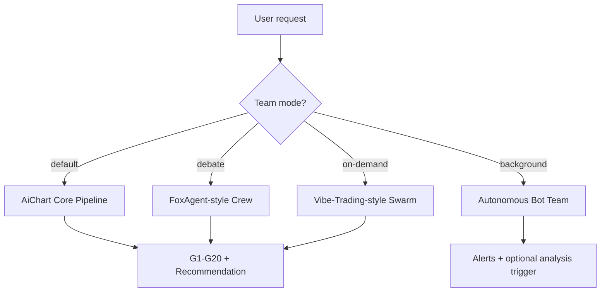
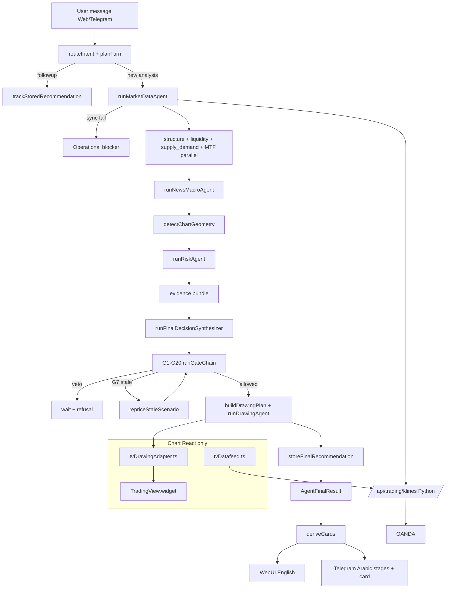

# Design: NanoAgent → Gold Trading Agent

Generated by `/office-hours` + `/plan-ceo-review` + `/plan-eng-review` on 2026-09-12  
Updated: 2026-09-12 (code trace of AiChart orchestrator + chart policy)  
Branch: `main`  
Repo: `loorksy/NanoAgent`  
Status: **APPROVED FOR IMPLEMENTATION**  
Supersedes: initial draft (same day)

---

## Problem Statement

Convert NanoAgent (Python nanobot runtime) into a **gold-only (XAUUSD) recommendation agent** that mirrors **AiChart's actual agent pipeline** (`runUnifiedChartAgent` in `orchestrator.ts`), not a simplified chat wrapper.

**Hard constraints (user decisions):**
- NanoAgent stays **Python** for the brain/runtime
- **TradingView Advanced Charts only** — no `lightweight-charts`, no chart bridges, no iframe to tradingview.com
- **Recommendations only** — no broker execution
- **UI language:** English for now
- **Telegram:** stage progress notifications in **Arabic** only
- **WhatsApp:** last priority (Phase 4)
- **Multi-Agent Trading Teams:** inspired by `loorksy/foxagent` + `HKUDS/Vibe-Trading`

---

## Multi-Agent Trading Teams

NanoAgent already has **`spawn`** + **`SubagentManager`** (unlimited on-demand agents, default 4 concurrent). We extend this into **three team modes** — not replacing the AiChart core pipeline, but augmenting it.

### Three team layers (combined model)



| Layer | Source inspiration | When it runs | Agent roles |
|-------|-------------------|--------------|-------------|
| **1. Core Fleet** | AiChart `orchestrator.ts` | Every full gold analysis (default) | structure, liquidity, supply_demand, MTF, news, risk, synthesizer |
| **2. Debate Crew** | foxagent `crew.py` | User asks for recommendation / complex setup | Technical, Fundamental, **Bull**, **Bear**, RiskManager |
| **3. Swarm Teams** | Vibe-Trading `swarm/presets/*.yaml` | User explicitly requests team / committee | YAML-defined DAG teams (parallel layers) |
| **4. Bot Scanners** | foxagent `trading_bot/coordinator.py` | Cron / heartbeat (always-on) | multi_strategy, pattern_notes, news_candle |

### Layer 1 — Core Fleet (already in plan)

Deterministic specialists run inside `trading/orchestrator.py` — same as AiChart steps 7–20. This is the **default path** for every recommendation. Not optional.

### Layer 2 — Debate Crew (foxagent pattern)

From `foxagent/backend/app/services/crew.py`:

```
TechnicalAgent → brief
FundamentalAgent → brief (if macro keywords / recommendation intent)
BullResearcher ↔ BearResearcher  (2 rounds, 90s cap)
RiskManagerAgent → validate + send_recommendation
```

**NanoAgent mapping:**

| foxagent | NanoAgent module |
|----------|------------------|
| `crew.py` pipeline | `nanobot/trading/crew/debate.py` |
| `intent.py` routing | extends `trading/intent_router.py` |
| `run_agent_turn()` per role | `spawn(wait=True)` with role-specific system prompts |
| SSE `agent_debate_message` | WebUI `TradingTeamPanel.tsx` + Telegram Arabic stage |

**Integration with core pipeline:** Debate crew **replaces** the single `runFinalDecisionSynthesizer` call when `team_mode=debate`. Bull/Bear briefs feed into RiskManager, whose output becomes the plan that enters **G1–G20** (gates stay mandatory).

### Layer 3 — Swarm Teams (Vibe-Trading pattern)

From `Vibe-Trading/agent/src/swarm/`:

- YAML presets define `agents[]` + `tasks[]` DAG with `depends_on` + `input_from`
- Parallel layers via thread pool; serial between layers
- Main agent calls `run_swarm` on demand

**NanoAgent mapping:**

| Vibe-Trading | NanoAgent module |
|--------------|------------------|
| `swarm/presets/*.yaml` | `nanobot/trading/teams/presets/*.yaml` |
| `SwarmRuntime` | `nanobot/trading/teams/runtime.py` |
| `run_worker()` | `SubagentManager.spawn(wait=True)` per task |
| `run_swarm` tool | `nanobot/agent/tools/trading_team.py` |

**Gold-specific presets to ship:**

| Preset | Roles | DAG |
|--------|-------|-----|
| `gold_analysis_committee` | macro_analyst, structure_analyst, liquidity_analyst, risk_officer, lead_analyst | macro ∥ structure ∥ liquidity → risk → lead |
| `gold_debate_desk` | bull_advocate, bear_advocate, risk_manager | bull ∥ bear → risk |
| `gold_news_war_room` | news_scanner, event_analyst, scenario_planner | scan → analyze → plan |
| `gold_mtf_panel` | h1_analyst, h4_analyst, d1_analyst, mtf_synthesizer | h1 ∥ h4 ∥ d1 → synth |

User triggers: *"run the gold committee"* / *"شغّل فريق التحليل"* → `run_trading_team(preset="gold_analysis_committee")`.

**No limit on concurrent teams** — uses existing `spawn` with configurable `max_concurrent_subagents` (default 4, user can raise).

### Layer 4 — Autonomous Bot Team (foxagent bots)

From `foxagent/backend/app/services/trading_bot/`:

```
coordinator.run_cycle():
  news_candle → multi_strategy → pattern_notes
       ↓ all signals → risk gate → save_signal → alert user
```

**NanoAgent mapping:**

| foxagent | NanoAgent module |
|----------|------------------|
| `TradingBotCoordinator` | `nanobot/trading/bots/coordinator.py` |
| `MultiStrategyAgent` | `nanobot/trading/bots/multi_strategy.py` |
| `PatternNotesAgent` | `nanobot/trading/bots/pattern_notes.py` |
| `NewsCandleAgent` | `nanobot/trading/bots/news_candle.py` |
| `BotInstance` config | `~/.nanobot/trading/bots.json` |
| Cron trigger | `nanobot/cron/` + heartbeat |

Bots run on **cron/heartbeat**, scan XAUUSD, emit alerts via `message` tool to Telegram/Web. User can promote a bot signal to full analysis (triggers Layer 1 pipeline).

### How layers interact

| Scenario | Layers used |
|----------|-------------|
| "What's gold price?" | Core fleet step 7 only (market data) |
| "Analyze gold now" | Core fleet full pipeline |
| "Give me a recommendation with debate" | Debate crew → G1–G20 |
| "Run the gold committee" | Swarm preset → G1–G20 |
| Background monitoring | Bot team → alert → optional full pipeline |
| User spawns custom agent | `spawn` tool (existing nanobot, any task) |

**G1–G20 gates always run** regardless of which team layer produced the plan. No team can bypass gates.

### UI surfaces

| Surface | What user sees |
|---------|----------------|
| WebUI `TradingTeamPanel` | Live agent timeline (like foxagent `ChatReasoning.tsx`) |
| WebUI `SwarmProgressCard` | DAG layer progress (like Vibe-Trading status card) |
| WebUI `BotDashboard` | Active bot instances + last signals |
| Telegram | Arabic stage labels per agent in crew/swarm |
| Existing subagent panel | nanobot subagent status (reuse) |

### New directory layout (teams)

```
nanobot/trading/
  crew/
    debate.py              # foxagent Bull/Bear/Risk pipeline
    roles.py               # role prompts (Technical, Bull, Bear, Risk)
  teams/
    presets/
      gold_analysis_committee.yaml
      gold_debate_desk.yaml
      gold_news_war_room.yaml
      gold_mtf_panel.yaml
    runtime.py             # Vibe-Trading-style DAG executor
    models.py              # SwarmTask, SwarmAgent, SwarmRun
  bots/
    coordinator.py         # foxagent bot cycle
    multi_strategy.py
    pattern_notes.py
    news_candle.py
  agent/tools/
    trading_team.py        # run_trading_team(preset) tool
```

### Phase assignment for teams

| Phase | Team feature |
|-------|-------------|
| **2** | Core fleet (Layer 1) — required |
| **3** | Debate crew (Layer 2) + first swarm preset `gold_debate_desk` |
| **4** | Full swarm presets + bot scanners (Layer 3 + 4) + BotDashboard UI |

---

## Chart Policy — TradingView Advanced Charts (from odysseusai)

AiChart embeds the library directly. We copy **that** pattern, not `infra/tradingview/bridge.py`.

### ✅ Allowed (same as AiChart `TvChart.tsx`)

| Component | AiChart source | NanoAgent target |
|-----------|----------------|------------------|
| Widget | `new TradingView.widget({ library_path, datafeed })` | `webui/src/components/trading/TvChart.tsx` |
| Datafeed | `src/lib/chart/tv/tvDatafeed.ts` → app's own `/api/trading/klines` | `webui/src/lib/chart/tv/tvDatafeed.ts` → Python API |
| Drawings | `tvDrawingAdapter.ts`, `tvStudyAdapter.ts` | same paths under `webui/src/lib/chart/tv/` |
| Trade overlay | `ChartTradeOverlay.tsx` (entry/SL/TP native TV shapes) | `webui/src/components/trading/ChartTradeOverlay.tsx` |
| Static library | `public/charting_library/` | `webui/public/charting_library/` ✅ already imported |

### ❌ Forbidden

| Approach | Why rejected |
|----------|--------------|
| `lightweight-charts` npm package | User policy: TradingView only |
| `infra/tradingview/bridge.py` | External TA scrape — not a real chart |
| iframe to tradingview.com | Not our licensed library |
| MCP chart widget as primary UI | Extra bridge layer |
| `recharts` / canvas charts for price | Not TradingView |
| chart-host as **primary** chart view | Screenshot sidecar only (Telegram photo, optional Phase 3) |

### Data flow (integrated)

```
TradingView.widget (React)
    → tvDatafeed.ts (IDatafeedChartApi)
    → GET /api/trading/klines  (Python, OANDA)
    → SSE /api/trading/ticks
Agent drawing commands
    → tvDrawingAdapter.apply() on live widget
```

Python serves **data only**. The chart runs entirely in React with the vendored TradingView library.

---

## AiChart Recommendation Pipeline (from code, not docs)

Entry point: **`runUnifiedChartAgent`** (`src/lib/agent/orchestrator.ts`)  
Web transport: **`runWebChatTurn`** (`src/lib/agent/webTurn.ts`) — SSE `stage` events  
Cards: **`deriveCards`** (`src/lib/agent/cards/deriveCards.ts`) — pure projection, never LLM-authored

### Stage checklist (emitStage → Telegram Arabic bubble)

From `src/lib/agent/stageEvents.ts` `KNOWN_STAGES`:

| Stage | Arabic Telegram label (to port) | When |
|-------|--------------------------------|------|
| `market_data` | جاري جلب بيانات السوق | `runMarketDataAgent` |
| `structure` | تحليل البنية السعرية | parallel fleet |
| `liquidity` | تحليل السيولة | parallel fleet |
| `supply_demand` | مناطق العرض والطلب | parallel fleet |
| `multi_timeframe` | تحليل الأطر الزمنية | parallel fleet |
| `news` | فحص الأخبار والأحداث | after fleet |
| `risk` | تقييم المخاطر والمرشحين | `runRiskAgent` |
| `final_decision` | اتخاذ القرار النهائي | `runFinalDecisionSynthesizer` |
| `drawing` | رسم التحليل على الشارت | `runDrawingAgent` (activity only) |

Web UI shows English labels; Telegram shows Arabic for these stages only.

---

### Full pipeline (happy path — new trade analysis)

| Step | Function | AiChart file | NanoAgent Python module |
|------|----------|--------------|---------------------------|
| **0** | Budget + cancel guard | `orchestrator.ts` `createRunBudget` | `trading/orchestrator.py` |
| **1** | `routeIntent` | `intentRouter.ts` | `trading/intent_router.py` |
| **2** | `planTurn` | `core/turnPlanner.ts` | `trading/turn_planner.py` |
| **3** | Early exit: follow-up on live rec | `trackStoredRecommendation` | `trading/recommendations/followup.py` |
| **4** | `resolveClosedMarketScenario` | `closedMarketScenario.ts` | `trading/closed_market.py` |
| **5** | Load agent skills | `skills/skillSelector.ts` | nanobot skills (ported MD) |
| **6** | Pre-warm chart tab (async) | `ensureChartHostTab` | WebUI keeps TV tab warm — optional |
| **7** | **`runMarketDataAgent`** | `agents/marketDataAgent.ts` | `trading/agents/market_data.py` |
| **7a** | `buildAgentMarketContext` | `marketContext/buildAgentMarketContext.ts` | `trading/market_context.py` |
| **7b** | Hard stop if `market.sync.ok === false` or gapped data | orchestrator | same guard in Python |
| **8** | Stage checkpoint hash | `stageCheckpoint.ts` | `trading/stage_checkpoint.py` |
| **9–12** | **Parallel:** `runStructureAgent`, `runLiquidityAgent`, `runSupplyDemandAgent`, `runMultiTimeframeAgent` | `agents/*.ts` | `trading/agents/structure.py`, `liquidity.py`, `supply_demand.py`, `multi_timeframe.py` |
| **13** | **Sequential:** `runNewsMacroAgent` | `agents/newsMacroAgent.ts` | `trading/agents/news_macro.py` |
| **14** | `detectChartGeometry` | `chart/geometry/` | `trading/geometry/` (OHLC math, not TV) |
| **15** | **`runRiskAgent`** → `TradeCandidate[]` | `agents/riskAgent.ts` | `trading/agents/risk.py` |
| **16** | `buildDrawingCandidates` | `drawings/buildDrawingCandidates.ts` | `trading/drawings/candidates.py` |
| **17** | `buildMarketNarrative` | `marketContext/buildMarketNarrative.ts` | `trading/market_narrative.py` |
| **18** | Evidence: lessons, case memory, macro, COT | orchestrator | `trading/evidence/` |
| **19** | **`collectVisualEvidence`** (chart PNGs) | `visualEvidence.ts` | React capture service OR defer with `visionDecisionV1=off` |
| **20** | **`runFinalDecisionSynthesizer`** | `agents/finalDecisionSynthesizer.ts` | `trading/agents/synthesizer.py` |
| **21** | `prepareDecision` (closed market forcing) | orchestrator | `trading/closed_market.py` |
| **22** | **`evaluatePlanGates` G1→G20** | `gates/buildGates.ts` + `chain.ts` | `trading/gates/` |
| **23** | G7 reprice loop | `gates/repriceLoop.ts` | `trading/gates/reprice_loop.py` |
| **24** | If gates veto → `wait` + refusal, **no storage** | orchestrator | same |
| **25** | `buildDrawingPlan` | `drawings/buildDrawingPlan.ts` | `trading/drawings/plan.py` |
| **26** | **`runDrawingAgent`** | `agents/drawingAgent.ts` | `trading/agents/drawing.py` |
| **27** | Post-draw layout save + recapture | orchestrator | React `tvDrawingAdapter` + optional capture |
| **28** | `storeFinalRecommendation` | orchestrator + `recommendations/` | `trading/recommendations/store.py` |
| **29** | `assessPlanTradability` at persist | `recommendations/tradability.ts` | `trading/recommendations/tradability.py` |
| **30** | Return `AgentFinalResult` | orchestrator | `trading/types.py` |
| **31** | **`deriveCards`** (UI layer) | `cards/deriveCards.ts` | Python derive + React `AgentCards.tsx` |

### Gate chain G1–G20 (from `buildGates.ts`)

Executed **after** synthesizer produces buy/sell plan. Short-circuit on first veto.

| Gate | ID | Required | Checks |
|------|-----|----------|--------|
| News & events | **G1** | Yes | Calendar configured; `newsRisk` known; `evaluateNewsWindow` blocks high-impact window |
| Liquidity map | **G2** | No | Liquidity agent output present |
| Supply & demand | **G3** | No | Nearest zone on plan side |
| Structure & bias | **G4** | Yes | Structure present; HTF conflict −10 conf; no visual frames −10 conf |
| Backtest | **G5** | No | Always pass (removed in AiChart) |
| Risk geometry | **G6** | Yes | `validateEntryCoherence`; target ≤ 25 ATR from entry |
| Live revalidation | **G7** | Yes | Fresh quote via `revalidatePlan`; may reanchor or veto |

If `!gateChain.allowed` → decision forced to **`wait`**, no recommendation stored, no trade drawings.

### Card order (from `cards/types.ts` CARD_ORDER)

`scenario_notice` → `decision` → `plan_levels` → `activation` → `invalidation` → `gate_checklist` → `visual_review` → `reasons` → `evidence`

Cards are **never LLM-authored** — pure projection of `AgentFinalResult`.

### Early exits (same entry, skip full pipeline)

| Trigger | AiChart function | NanoAgent equivalent |
|---------|------------------|----------------------|
| Cancel active recommendation | orchestrator early return | `recommendations/cancel.py` |
| Draw stored rec on chart | `drawStoredRecommendation` | drawing command handler |
| Explain / track existing rec | `explainStoredRecommendation`, `trackStoredRecommendation` | followup modes |
| General Q&A (no market) | `answerGeneralQuestion` | route to standard agent loop |
| News-only query | `runNewsMacroAgent` only | lightweight news path |
| Follow-up with live plan | `trackStoredRecommendation` via `planTurn` | no new analysis |

---

## Architecture



### Language & channel policy

| Surface | Language | Notes |
|---------|----------|-------|
| WebUI chat + cards | English | No Arabic UI in v1 |
| WebUI stage checklist | English | Same stages as AiChart |
| Telegram progress bubble | **Arabic** | Port `liveProgress.ts` labels |
| Telegram recommendation card | English content, Arabic stage headers | Card body can stay English |
| WhatsApp | Phase 3 | Last |

---

## What Already Exists (NanoAgent)

| Capability | Location | Status |
|------------|----------|--------|
| Web chat + SSE streaming | `webui/`, `nanobot/channels/websocket/` | ✅ |
| Telegram channel | `nanobot/channels/telegram/` | ✅ generic |
| WhatsApp channel | `nanobot/channels/whatsapp/` | ✅ defer to Phase 3 |
| Agent loop + subagents | `nanobot/agent/` | ✅ |
| Cron / heartbeat | `nanobot/cron/` | ✅ |
| Memory (Dream) | `nanobot/agent/memory.py` | ✅ |
| TradingView library | `webui/public/charting_library/` | ✅ |
| TV typings | `webui/vendor/tradingview/charting_library/` | ✅ |

---

## Implementation Phases (aligned to orchestrator steps)

### Phase 0 — DONE

- [x] nanobot in NanoAgent
- [x] TradingView `charting_library` vendored
- [x] gstack skills installed
- [x] This design doc (code-traced)

### Phase 1 — Foundation + Transport

**Maps to steps 0–7a** (budget, intent, market data, OANDA, runtime state)

| Task | Output |
|------|--------|
| `nanobot/trading/` package skeleton | config, types, gold symbol guard |
| `oanda.py` — quotes + candles | feeds `buildAgentMarketContext` |
| `/api/trading/klines` + `/api/trading/quote` routes | Python gateway for tvDatafeed |
| `intent_router.py` + `turn_planner.py` (minimal) | route gold analysis vs general chat |
| `runtime_state.py` | pause, kill switch, paper flag |
| Port `SYSTEM.md` → `skills/gold-trading/` | doctrine |
| `emit_stage` SSE + Telegram Arabic mapper | `stage_events.py` + `telegram/trading_progress.py` |
| `TvChart.tsx` + `tvDatafeed.ts` (static chart, live data) | TradingView integrated, no bridge |

**Exit:** Live XAUUSD chart in WebUI with OANDA datafeed; Telegram shows Arabic `market_data` stage; price query works.

### Phase 2 — Specialist Fleet + Synthesizer + Gates

**Maps to steps 8–24** (the core brain)

| Task | Output |
|------|--------|
| `trading/agents/structure.py` | `StructureResult` |
| `trading/agents/liquidity.py` | `LiquidityResult` |
| `trading/agents/supply_demand.py` | `SupplyDemandResult` |
| `trading/agents/multi_timeframe.py` | `MultiTimeframeResult` |
| `trading/agents/news_macro.py` | `NewsMacroResult` |
| `trading/agents/risk.py` | `TradeCandidate[]` |
| `trading/agents/synthesizer.py` | `FinalDecisionResult` |
| `trading/gates/` G1–G20 | `buildGates` + `runGateChain` port |
| `trading/gates/reprice_loop.py` | G7 stale retry |
| `stage_checkpoint.py` | resume fleet on unchanged candle hash |
| `trading/orchestrator.py` | wires steps 7–24 |

**Exit:** Full analysis run produces buy/sell/wait with gate verdicts; veto → wait with refusal text.

### Phase 3 — Drawings, Cards, Storage, Chart Overlay

**Maps to steps 25–31**

| Task | Output |
|------|--------|
| `tvDrawingAdapter.ts` | agent zones/BOS on TV widget |
| `ChartTradeOverlay.tsx` | entry/SL/TP native TV shapes |
| `trading/agents/drawing.py` | `ChartDrawing[]` JSON |
| `trading/cards/derive.py` | card projection |
| `RecommendationCard.tsx` + `AgentCards.tsx` | approve/reject UI |
| `trading/recommendations/store.py` | SQLite persistence |
| `trading/paper.py` | paper ledger on approve |
| Decision memory | `memory/trades.jsonl` + Dream |

**Exit:** User gets recommendation card with chart overlays; approve/reject updates paper journal.

### Phase 5 — Operations + WhatsApp + Sidecars

| Task | Notes |
|------|-------|
| Inbox + briefing | WebUI routes |
| Cron monitors | gold price, news, open rec follow-up |
| `chart-host/` optional | Telegram recommendation **photo** only |
| `research-service/` sidecar | backtest evidence (optional) |
| WhatsApp cards | **last** |
| Vision capture (`collectVisualEvidence`) | optional; degrades like AiChart when off |

---

## Directory Layout

```
nanobot/trading/
  orchestrator.py          # run_unified_chart_agent
  intent_router.py
  turn_planner.py
  stage_events.py            # emit_stage
  stage_checkpoint.py
  market_context.py          # buildAgentMarketContext
  closed_market.py
  oanda.py
  runtime_state.py
  types.py                   # AgentFinalResult, etc.
  agents/
    market_data.py
    structure.py
    liquidity.py
    supply_demand.py
    multi_timeframe.py
    news_macro.py
    risk.py
    synthesizer.py
    drawing.py
  gates/
    build_gates.py           # G1-G20
    chain.py
    revalidation.py          # G7
    reprice_loop.py
    news_window.py
  geometry/                  # detectChartGeometry (OHLC math)
  drawings/
    candidates.py
    plan.py
  evidence/                  # lessons, macro, COT
  recommendations/
    store.py
    followup.py
    tradability.py
  cards/
    derive.py
  paper.py

nanobot/channels/telegram/
  trading_progress.py        # Arabic stage bubble
  trading_cards.py           # card HTML renderer

nanobot/webui/
  trading_routes.py          # /api/trading/*

webui/src/
  components/trading/
    TvChart.tsx              # TradingView.widget — NOT a bridge
    ChartTradeOverlay.tsx
    RecommendationCard.tsx
    AgentCards.tsx
    TradingStatusBar.tsx
  lib/chart/tv/
    tvDatafeed.ts            # → /api/trading/klines
    tvDrawingAdapter.ts
    tvStudyAdapter.ts
```

---

## Environment Variables

| Variable | Phase | Purpose |
|----------|-------|---------|
| `OANDA_API_TOKEN` | 1 | OANDA data |
| `OANDA_ACCOUNT_ID` | 1 | OANDA data |
| `OANDA_ENV` | 1 | `practice` |
| `TRADING_KILL_SWITCH` | 1 | Emergency stop |
| `TRADING_PAPER_MODE` | 3 | Default on |
| `VISION_DECISION_V1` | 4 | Chart capture in evidence (optional) |
| `TELEGRAM_BOT_TOKEN` | 1 | Telegram |

---

## Risks

| Risk | Mitigation |
|------|------------|
| Orchestrator rewrite drifts from AiChart | Port gate tests + reference scenario parity tests from `src/lib/agent/__tests__/` |
| Visual evidence without browser | Ship with `VISION_DECISION_V1=off` first (AiChart supports this) |
| TradingView-only constraint | Lint/CI ban on `lightweight-charts` import |
| Telegram Arabic only partial | Scope to stage labels only in v1 |

---

## Deferred

- Live broker execution
- Multi-asset
- Arabic WebUI
- WhatsApp (Phase 4)
- `infra/tradingview/bridge.py` pattern
- AiChart billing/admin apps

---

## gstack Workflow (every phase)

| When | Skill |
|------|-------|
| Before phase | `/plan-eng-review` |
| After code | `/review` |
| Trading logic | `/cso` |
| WebUI/chart | `/design-review` + `/qa` |
| Ship PR | `/ship` |

---

## GSTACK REVIEW REPORT

### CEO
- Wedge: Phase 1 chart+price → Phase 2 full AiChart pipeline → Phase 3 cards/storage → Phase 4 ops
- Cut: no execution, no Arabic UI, WhatsApp last, no chart bridges

### Eng
- Python orchestrator mirrors `runUnifiedChartAgent` step order exactly
- React owns TradingView widget only; Python owns gates/agents/storage
- Biggest port: `finalDecisionSynthesizer` + `buildGates` — test-first

### Resolved decisions
- Language: English UI; Arabic Telegram stages only
- Charts: TradingView integrated widget only
- WhatsApp: Phase 4

### Open
- Branding: NanoAgent vs Lonora?
- OANDA secrets ready?

---

## The Assignment

**Phase 1** on `cursor/gold-trading-foundation-aba3`:

1. `nanobot/trading/` + OANDA + `/api/trading/klines`
2. `TvChart.tsx` + `tvDatafeed.ts` (TradingView widget, not bridge)
3. `emit_stage` + Telegram Arabic progress
4. Port `SYSTEM.md` skill
5. `/review` → `/qa` → `/ship`
