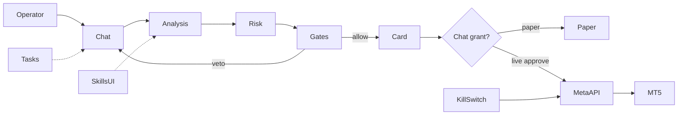

# Claude Code — Single Prompt: XAUUSD Gold Trading Agent (NanoAgent)

> **Give THIS FILE ONLY to Claude Code.**  
> It contains the full product brief, constraints, UI/settings requirements, FEATURE specs, operator doctrine, behavior rules, and all **400** field rules.  
> Do not invent missing rules. Do not add paid SaaS. Do not implement backtesting.

---

## 0. How to use

Paste or attach this entire markdown file to Claude Code and say:

```text
Implement this brief on a new branch of the NanoAgent/nanobot repo.
Start with Phase A. Obey hard constraints. Keep PRs small and tested.
```

Then continue Phases B→G in order.

---

## 1. Mission

Extend NanoAgent (Python `nanobot` + React `webui`) from gold **recommendations** into a **chat-first live trading operator** for **XAUUSD only** that:

1. Runs the existing multi-agent analysis pipeline (`nanobot/trading/`).
2. Executes/manages trades on the **operator’s own MT5 account via MetaAPI** (BYOK — operator token/account).
3. Requires **explicit human permission** before live execution (chat grant + settings).
4. Adds WebUI sections **Tasks** (simple) and **Skills** (operator can add/toggle agent skills).
5. Uses **zero paid third-party services** in the product.

Do not rebuild the product. Extend what exists.

---

## 2. Hard constraints

| Rule | Detail |
|------|--------|
| Symbol | XAUUSD only |
| Execution | MetaAPI only for live orders (operator BYOK). Encrypt secrets locally. |
| Cost | No paid SaaS (no Bloomberg, Benzinga, paid X API, paid calendars, paid sentiment cloud). |
| Backtest | **Forbidden.** No Fast Backtest engine. Vector playbook + FastDTW similarity allowed. |
| Gates | Existing quality gates stay mandatory before publish/execute. |
| Paper default | `paper_mode=true` until live enabled + chat grant. |
| Kill switch | Closes all MetaAPI positions/pendings and freezes the agent. |
| Charts | TradingView Advanced Charts only (already vendored). |
| Design | Follow `.agent/design.md`, `.agent/security.md`, `.agent/gotchas.md`. |

---

## 3. Codebase anchors (reuse)

| Area | Path |
|------|------|
| Orchestrator | `nanobot/trading/orchestrator.py` |
| Gates | `nanobot/trading/gates/` |
| Runtime | `nanobot/trading/runtime_state.py` |
| Paper | `nanobot/trading/paper.py` |
| Tools | `nanobot/agent/tools/trading_chart.py`, `trading_team.py` |
| WebUI shell | `webui/src/App.tsx`, `Sidebar.tsx` |
| Rec card | `webui/src/components/trading/TradingRecommendationCard.tsx` |
| Connect | `webui/src/components/trading/TradingConnect.tsx` |
| Automations UI | `webui/src/components/settings/system/AutomationsSettings.tsx` |
| Skills UI | `webui/src/components/settings/SkillsCatalogSettings.tsx` |
| Config | `nanobot/config/schema.py` |
| Existing skills | `nanobot/skills/gold-trading/`, `trading-proactive/`, `cron/`, `memory/` |

**Important:** Do **not** invent many new builtin skill packages unless the operator asks in a later task. Prefer storing doctrine from this prompt into workspace skills / config / prompts as Claude Code implements. This file is the source of truth.

---

## 4. Zero-cost FEATURE specs (FEATURE-01…10)

### FEATURE-01 — Telegram MTProto news listener
- Goal: free urgent news via operator Telegram user session (BYOK Telethon).
- Stack: `telethon`
- Logic: `events.NewMessage` → RAM → FEATURE-05
- Perf: capture+prefilter < 250ms
- Default: OFF until configured

### FEATURE-02 — Async RSS aggregator
- Stack: `aiohttp`, `feedparser`, `asyncio`
- Poll open feeds (Reuters/AP/Fed) every 10–15s; dedupe by guid in a `set`
- Perf: light CPU (<~2%)

### FEATURE-03 — VIP statements tracker
- Stack: Nitter RSS or `snscrape` (no paid X API)
- Tag High/Medium impact authors
- Perf: 30–60s from publish

### FEATURE-04 — Open economic calendar scraper
- Extend `nanobot/trading/news/forex_factory.py`
- Daily pull + Actual refresh near red events + surprise delta
- Perf: sync actual within 1–3s when possible

### FEATURE-05 — Zero-latency regex emergency engine
- Stack: Python `re`
- Patterns for war/airstrike/bank failure/emergency rate cut
- On match: freeze new entries + protect open positions
- Perf: < 1ms / headline

### FEATURE-06 — Local vector playbook
- Stack: ChromaDB or LanceDB local only
- Cosine similarity of current context vs stored gold scenarios
- Perf: < 10ms
- Not a backtest

### FEATURE-07 — FastDTW pattern matcher
- Stack: `fastdtw`, `numpy`, `scipy`
- Normalize last ~30 closes to [0,1]; match templates; return confidence %
- Perf: < 15ms
- Not a backtest / walk-forward

### FEATURE-08 — Post-mortem lessons SQLite
- On SL: store context; before new plan query last 3 similar losers; refuse repeats
- Perf: < 3ms

### FEATURE-09 — Local sentiment via Ollama
- Local Qwen 2.5 / FinBERT only; JSON `{bias, confidence, reason}`
- Graceful skip if Ollama down
- Perf: ~500–1200ms

### FEATURE-10 — Intermarket macro
- DXY / XAG / oil via MetaAPI symbols if present else free `yfinance`
- Allow safe-haven decoupling in panic

---

## 5. Operator doctrine — 11 principles (always-on)

1. After candle analysis, entry need not be classic horizontal S/R — price often reverses from a trendline.
2. Stop need not sit on classic S/R — price may pierce the stop area, form a pattern, then reverse; or touch a trendline then reverse.
3. A stop level may actually be the better **entry** zone (wick-stop then reclaim).
4. Always keep a stop **buffer / protection zone**.
5. A recommendation need not wait for “touch then rise” if that scenario already happened — enter with momentum.
6. Retest is not mandatory; a slow retest can mean reversal, not continuation.
7. **Chart-image rule:** From the chart screenshot, identify the formed pattern or the pattern about to form. Chart capture is analytical input, not decoration. Images confirm shape; numeric levels come from market data.
8. Do not wait for a pattern that already completed — once the call is issued, enter immediately with the recommendation direction (subject to grants).
9. Multiple trendlines can exist on the same swings; entry may come from a specific inner line/zone.
10. Do not wait for a long travel-to-entry if that creates a paradox (e.g. 100 pts to entry and only 100 pts to target).
11. TP1/TP2/TP3 need not be S/R or liquidity or “revenge” zones — price may hit a trendline then reverse.

---

## 6. Behavioral skill

1. Adaptive tone: strict when the operator tries to break risk rules; light sarcasm against overconfidence after win streaks; supportive after losses; decisive when execution is authorized.
2. Honest admission after stop-outs — no fake excuses; state the loss in numbers.
3. Full silence in dead/compressed ranges — no spam signals.
4. End-of-day reflective question for the trading journal (discipline / calm).

---

## 7. Capability map (implement as modules + settings toggles)

### Technical
Supply/Demand + FVG; MTF D1/H4→H1/M15; liquidity sweeps/turtle soup; BOS/CHoCH; auto Fib + discount/premium; tick volume + ATR; RSI/MACD divergence.

### Macro
Calendar + surprise; DXY confluence (geo decoupling allowed); Fed tone via Ollama; geo keyword radar (F01+F05 first).

### Risk
Auto lot from risk%; daily DD breaker; spread guard; cooldown after consecutive losses; max concurrent gold positions; min R:R ≥ 1:2; never widen SL; no martingale.

### Execution (MetaAPI)
Market + pending; trailing; auto BE after TP1; partial TPs; news shield; early-exit on momentum death; separate magic numbers for scalp vs swing.

### Memory (no backtest)
F06 playbook; F07 DTW; F08 lessons; dual pre-trade review (tech + risk).

### Alerts
Chart snapshot alerts; human Approve/Reject; London/NY briefs; PnL reports; NL Q&A; feed disconnect alerts; WebUI+Telegram fan-out.

### Security
Kill switch; encrypted MetaAPI secrets; SQLite ticket recovery; bad-tick filter; adopt manual trades when asked.

### Multi-task
Manage open trades while scanning; dual conditional scenarios (OCO-like software cancel); NL management commands; feature toggles in Settings/Skills UI.

---

## 8. Trade execution scenario

```text
1. Operator asks to analyze gold
2. Pipeline + gates
3. Veto → no order
4. Allow → artifacts + chart snapshot (apply chart-image rule)
5. Eligibility: kill off, not paused, MetaAPI healthy, live enabled, chat grant, risk/spread/news OK
6. Show plan + lot + R:R
7. Paper approve OR Live Execute after Approve (grant=ask) / auto if grant=auto+opt-in
8. MetaAPI order with SL+TP in same packet
9. Persist ticket; manage trail/BE/partials/news shield
10. On close → lesson row + performance
```

### Chat execution grants
`none` | `ask` (default when live on) | `auto` (double-confirm, off by default) | `manage` | `adopt_manual`

Grant via: composer chip, `/trade allow|revoke|status`, natural language, rec-card buttons, Telegram inline buttons.

---

## 9. Settings toggles to add

Connection (MetaAPI token/account/test), Paper/Live, default grant, risk%, daily DD%, max positions, min R:R, cooldown, max lot, spread caps, slippage, ATR lot scaling, trailing/BE/partials, pending TTL, magic numbers, news shield minutes, F01–F10 toggles, memory toggles (no backtest toggle), briefs/reports, kill/pause/flatten.

---

## 10. WebUI additions

Sidebar: Chat, Chart, Performance, Recommendations, Briefing, **Tasks**, **Skills**, Connect, Settings.

### Tasks (simple UX)
Calm list of active/paused/done jobs; New task with only What / When / Where; reuse cron backend; keep full Automations in Settings for power users.

### Skills (operator-facing)
Enable/disable packs; add workspace `SKILL.md`; optional free marketplace. Doctrine in this prompt may be installed as workspace skills during implementation — do not flood builtin packages without need.

### Extra UI suggestions
Execution grant banner, positions panel, risk HUD, dual-scenario board, news-shield countdown, always-visible kill switch, MetaAPI connect wizard, journal, intermarket strip.

---

## 11. Architecture (target)



---

## 12. Suggested modules

```text
nanobot/trading/metaapi/     # client, orders, recover, secrets
nanobot/trading/risk/        # lot, dd, spread, cooldown, rr
nanobot/trading/manage/      # trail, be, partials, news_shield, dual_scenario
nanobot/trading/memory_engine/  # playbook, dtw, lessons
nanobot/trading/macro_free/  # F01-F05, F09-F10
nanobot/trading/permissions/ # session grants
nanobot/agent/tools/trading_exec.py
nanobot/agent/tools/trading_account.py
webui: Tasks page, Skills page, ExecutionGrantChip, MetaApiConnect, PositionsPanel, RiskHud
```

---

## 13. Implementation phases

- **A** Settings + chat grants + Paper vs Live Execute buttons (mock/live split) + tests
- **B** MetaAPI connect + positions + kill + recovery
- **C** Trade manager (trail/BE/partials/dual/NL commands)
- **D** F01–F05, F09–F10 behind toggles
- **E** F06–F08 (no backtest)
- **F** Tasks + Skills WebUI
- **G** Behavior + briefs + reports

---

## 14. Definition of done

1. Operator connects own MetaAPI account
2. Paper default; live needs settings + grant + Approve
3. Analyze → gates → artifact → approve → order (mocked in CI)
4. Kill switch flattens + freezes
5. Tasks usable in <30s; Skills can toggle/add
6. No paid SaaS; no backtest module
7. All rules in §15–§17 obeyed

---

## 15. Field rules 1–200 (operational encyclopedia)

### 15.1 Entry timing (rules 1–25)

Operator field encyclopedia — enforce these when planning XAUUSD entries. Builtin skill text is English only; reply to the operator in their language.

## Rules

1. **Beyond classic S/R:** Do not require a horizontal support/resistance touch. In strong trends gold often reverses from dynamic trendlines or mid-path liquidity gaps.
2. **Immediate entry when ready:** If buy/sell conditions are complete and liquidity was already swept, send a market order. Do not wait for an extra dip/rally that may miss the move.
3. **Distance vs target paradox:** If the entry requires a 100-point pullback but total target is only ~100 points, the setup is logically inconsistent — prefer entering with current momentum.
4. **Pre-close entry on explosive bars:** On explosive gold momentum candles, waiting for candle close is not always required; waiting can consume ~60% of the expected move.
5. **Front-running levels:** Institutions often rest orders 15–30 gold points before the printed S/R. Open an entry window that starts before the level.
6. **Enter from FVG, not only the broken high:** In an uptrend, gold often reverses from the first fair-value gap above the broken high instead of fully retesting that high.
7. **Counter engulfing entry:** Slow prior down candles followed by a strong bullish engulfing of two bars is enough for an immediate long — no mandatory support touch.
8. **Direct breakout at liquidity sessions:** At London or New York open, a sharp break of the Asian range is a momentum entry — do not require a pullback.
9. **Equilibrium entries:** On large impulse waves, the 50% equilibrium of the wave is a preferred entry even without a prior swing high/low.
10. **Two-timeframe sync:** If M15 shows a reversal pattern while H1 is mid-impulse with the trend, priority is the H1-aligned immediate entry.
11. **Trendline fan entry:** On accelerating rises/selloffs, enter off the steepest inner trendline, not only the slow outer trendline.
12. **Time-decay cancel:** If price fails to reach a conditional entry zone for more than 4 hours, cancel the idea — break odds rise above bounce odds.
13. **News-candle wick as support:** The economic-news candle itself becomes a support zone; enter on wick touch, not by waiting for the day low.
14. **Absorption entry:** Repeated lower wicks in a tight price pocket are an immediate long signal without drawn levels.
15. **Small trendline break:** In a corrective move, a break of the minor descending trendline is a long trigger with the higher-timeframe uptrend.
16. **No deep pullback in steep trends:** When the ascent angle exceeds ~60 degrees, waiting for a deep pullback usually misses the entire rally.
17. **Round-number psychology:** Levels like 2400 or 2450 are automatic psychological entries when a rejection candle appears, even without prior support.
18. **Failed bearish pattern flip:** If a double-top fails and price breaks the neckline upward, trigger an immediate counter long.
19. **Three white soldiers:** Three rising bullish candles with expanding size after congestion is sufficient entry rationale without indicators.
20. **Range reclaim:** Price dips below support then closes back above on the same candle — immediate long.
21. **Hourly close entry:** Prefer entry near minute 59 of the hour when the candle confirms a key break, avoiding first-minute slippage of the new hour.
22. **Fast EMA alignment:** In strong trends, a bounce from EMA 20 is enough — do not require prior swing lows.
23. **ADR exhaustion reverse:** If gold has moved ~150% of average daily range, a counter entry on the first micro rejection candle is justified.
24. **Split entries:** Scale in with two clips (market + pending ~20 points away) instead of all-or-nothing.
25. **Broken high becomes support:** Classic role reversal is valid only if the bounce is fast with a clear rejection candle.

### 15.2 Stop protection (rules 26–55)

## Rules

26. **SL is not the support line:** Placing the stop directly under classic support/swing low is a critical error — that zone is preferred liquidity for stop hunts.
27. **Hit stop as alternate entry:** If SL is tagged by a wick then price closes back inside the range quickly, the prior stop level itself is often the best new entry.
28. **Mandatory buffer zone:** Always add at least 25–40 gold points of buffer beyond swing lows/highs against random noise.
29. **ATR-based stop:** Size stop distance from true volatility (ATR multiple), not a fixed point count.
30. **Stop beyond the impulse candle:** For shorts, place SL above the wick of the break candle, not above a distant historical high.
31. **Structural stop, not fixed points:** Abandon fixed stops (e.g. always 30 points). Place SL where the technical thesis is fully invalidated.
32. **Avoid round-number stops:** Market makers target round figures; prefer odd fractions (e.g. 2447.80 not 2450.00).
33. **Dynamic trendline stop:** In some trades, a close beyond the trendline is the stop criterion rather than a static price.
34. **Tighten after confirmation:** Once price prints a momentum candle in trade direction, pull SL behind that candle’s extreme to cut risk.
35. **Never widen the stop:** Expanding SL after entry to accept larger loss is strictly forbidden.
36. **Time stop:** If gold opens a trade and chops dead for more than 3 hours without expansion, close or tighten — reverse explosion risk rises.
37. **Stop beyond liquidity pools:** Place SL safely beyond equal lows/highs (magnets for wicks).
38. **Breakeven rule:** Move to breakeven only after price travels at least 1R and forms a new M15 swing in favor.
39. **Protect peak profits:** If the trade reaches ~70% of target, place a profit-protect stop near 50% of the move so winners cannot fully reverse to losers.
40. **Order-block buffer:** Place SL ~15 points beyond the institutional order block, not exactly on its edge.
41. **Shorts account for spread:** On sells, widen SL by the closing-time spread so a fake spread spike does not stop you out.
42. **Chandelier / ATR trail:** Use highest high of last N bars minus ATR multiple as a trailing stop.
43. **Asia sweep short stop:** After selling following an Asia liquidity grab, place SL ~10 points above the sweep wick high.
44. **Never park SL inside open FVG:** Do not place stops mid open fair-value gap — price tends to fill the gap fully.
45. **Momentum-break early exit:** Exit if two consecutive M5 closes print against the trade with rising momentum, even before original SL.
46. **Do not BE too early:** Moving to entry before a minor swing is cleared often stops you on a noise wick before the real move.
47. **Portfolio-percent stop:** Entry-to-SL distance must map via lot size to exactly the configured risk % (1% or 2%).
48. **Close-based stop option:** Some setups use “H1 close beyond level” rather than a wick touch.
49. **News-time free zone:** Five minutes before hot news, ensure SL sits clear of liquidity voids to reduce slippage impact.
50. **Split stops on scaled entries:** With two contracts, one can use a tighter SL and the other a wider structural SL.
51. **Channel mid-line early stop:** In channels, a break of the equidistant median can be an early stop before the far rail.
52. **Overnight safety:** Before rollover, add ~20 points to SL to absorb temporary spread widening.
53. **Shooting-star short stop:** Place sell stop ~10 points above the shooting-star upper wick extreme.
54. **Demand-zone long stop:** For longs, place SL under the demand zone that fully absorbed the last sell wave.
55. **Manual invalidate on clear opposite pattern:** Flatten if a clear H1 head-and-shoulders (or equivalent) forms against the position.

### 15.3 Retest philosophy (rules 56–80)

## Rules

56. **Retest is not mandatory:** On true gold explosions, price runs without retesting the broken level — waiting misses the trade.
57. **Slow retest can mean reversal:** Slow hesitant return to the broken level with growing opposite candles often means failed break, not a clean retest.
58. **Deep retest:** Gold frequently overshoots the broken resistance downward to deeper demand before continuing up.
59. **Retest candle speed:** A valid retest candle is fast with a long rejection wick; fat bodies that linger on the level often mean break failure.
60. **Trendline retest over horizontal:** Price may ignore the horizontal and retest a previously broken slanted trendline instead.
61. **Fake retest liquidity grab:** Return to the broken zone may only trigger retail pendings before a violent reverse.
62. **Failed retest = flip:** If price fails to bounce from retest and breaks through, flip immediately with the new direction.
63. **Lower-TF retest inside higher-TF break:** An H1 “direct break” often contains a complete M1/M5 retest.
64. **Low tick-volume retests are safer:** Retests on weak tick volume are more credible for continuation.
65. **Fib retests preferred:** Gold often prefers retesting 61.8% of the breakout wave over the zero break point.
66. **Right shoulder may skip neckline retest:** In H&S, price may never retest the neckline and drop after the right shoulder.
67. **Multiple retests weaken the level:** Three returns to the same level usually mean buy orders are exhausted and a break is near — not “stronger support”.
68. **Time-conditioned retest:** A 1-minute break followed by a ~30-minute hesitant retest can still be a healthy pullback.
69. **Zones not lines:** Treat retest levels as 15–30 point bands, not single ticks.
70. **Weekly open gaps:** Monday open gaps are later retest magnets during the week.
71. **Runaway breakout with DXY:** If breakout coincides with a strong opposite DXY move, gold may trend without any retest.
72. **Confirm with rejection candles:** Do not enter a retest on touch alone — require M15 pin bar or engulfing rejection.
73. **Broken Asia low:** When London breaks Asia low, the maximum bounce is often a touch of that low before sharp continuation down.
74. **Mid-air retest:** Price may reverse ~20 points before the broken support, testing the nearest MA instead.
75. **Parallel channel outer rail:** After breaking a descending channel, price often retests the outer roof as new support.
76. **Psychological retests:** Holding above a round level like 2400.00 after reclaim is stronger confirmation than a random swing retest.
77. **Post-storm quiet retests:** Violent news breaks are often retested calmly after the session heat fades.
78. **All-time-high retests:** New ATH retests may be long sideways digests, not sharp dumps.
79. **Oversold H4 RSI:** With extreme H4 oversold RSI, a resistance retest often turns into a buy explosion.
80. **Cancel if retest exceeds 78.6%:** If the pullback exceeds 78.6% of the breakout wave, treat the break as false and cancel.

### 15.4 Trendlines & channels (rules 81–105)

## Rules

81. **Multiple trendlines on one chart:** Draw a steep inner trendline and a slower outer trendline on the same swings; entries often start from the inner.
82. **Trendline as a band:** Draw trendlines as a price bundle covering wicks and bodies to absorb gold’s wick pierce noise.
83. **Bounce from trendline without horizontal:** Gold often ignores horizontals and reverses on a rising/falling slant alone.
84. **Third touch rule:** The third touch of a trendline is the highest-probability quick win; fourth/fifth touches carry elevated break risk.
85. **Break ≠ immediate reversal:** Breaking a rising gold trendline often leads to sideways accumulation, not necessarily a crash.
86. **Adjusted trendlines:** If a wick pierces then closes back above, redraw to contain that wick as the new slope.
87. **Parallel channel roof:** A parallel drawn on opposite swings makes a channel; touching the roof is a mandatory partial/take-profit magnet.
88. **Right-angle acceleration:** Price racing away from the trendline at a near-right angle signals a blow-off that often collapses back to the line.
89. **Minor trendline confirm:** Do not buy a horizontal support touch until the small M5 descending trendline breaks.
90. **Obvious retail trendlines are bait:** Crystal-clear beginner trendlines are often drawn to be broken for stop liquidity just behind them.
91. **Counter-trendlines for scalp:** Scalps are built on breaks of counter-trendlines against the daily path.
92. **Channel median magnet:** The mid-line acts as a magnet; bounce from it confirms trend strength toward the far rail.
93. **Trendline + horizontal confluence:** Mathematical intersection of a slant and a horizontal is a top-tier confluence entry.
94. **Break-and-retest of trendline:** After breaking a rising line, enter short on the retest from below as resistance.
95. **Body-based vs wick-based lines:** On gold, lines on candle bodies/closes are more truthful for break detection than random wick lines.
96. **Speed resistance / fan lines:** Three fans at different angles — break of first targets second; break of second targets third.
97. **RSI trendlines lead price:** A break of an RSI trendline often precedes the price trendline break by 2–3 candles.
98. **D1 trendlines are heavy:** A daily trendline rarely yields without a violent macro catalyst.
99. **Overextension ban:** If price is extremely far from the rising trendline, ban immediate longs until price breathes back near the line.
100. **Double-top trendline trigger:** Breaking the line connecting the two double-top troughs can arm the short even before neckline break.
101. **Broken line flips role:** A forcefully broken rising trendline later acts as a resistance roof.
102. **Symmetrical triangle compression:** Narrowing distance between rising and falling lines warns of a directional explosion on the break.
103. **Trendline as moving target:** For longs, the upper falling trendline can be a time-advancing profit target.
104. **Doji break = likely fake:** Breaking a trendline with weak dojis usually means liquidity absence, not a true force shift.
105. **Session sync boost:** A rising-trendline touch timed with the first minute of London open gives maximum thrust.

### 15.5 XAUUSD dynamics (rules 106–135)

## Rules

106. **Asia range sweep:** On ~80% of days, early London sweeps Asia high or low for liquidity then reverses.
107. **Gold does not forgive late stops:** Once gold reverses, exiting at −20 is better than waiting — gold can run 300 points without pause.
108. **Major psychological traps:** Around levels like 2400.00, gold often fake-breaks by 50–80 points to flush retail before the real move.
109. **Makkah 15:30 / NY open candle:** This hour often erases London’s work in minutes — close or fully protect scalps before it.
110. **Fear haven over instant inflation:** On sudden military shocks, cancel technical resistance and treat aggressive institutional market buys as fact.
111. **Temporary DXY decoupling:** In banking panic, gold can rise with the dollar — never treat inverse DXY correlation as 100% sacred.
112. **Gold ATR day:** Normal daily range is often ~250–400 points; moves under ~150 often mean the day explosion has not started.
113. **News wick trap:** The first ~5 seconds after CPI/rates are often a reverse liquidity trap before the true direction.
114. **Equal highs/lows always hunted:** Gold rarely leaves equal highs/lows untouched — it returns to raid stops even days later.
115. **Liquidity voids fill:** Huge news candles leave magnets; price usually refills at least ~50% later.
116. **Loves 78.6% Fib:** Unlike many FX pairs that stop at 50/61.8, gold prefers deep 78.6 corrections to raid more stops before launch.
117. **London PM fixing window:** Around 18:00–19:00 London, gold fixing flows can force sudden liquidations.
118. **Midnight spread trap:** Roughly 23:55–00:15 platform time, gold spread blows out — ban trading and tight stops.
119. **True support break = vertical:** If gold breaks real support and holds with two H1 closes below, expect vertical continuation to next historic support, not a mild correction.
120. **Do not chase giant green candles:** Buying after +150 points in 5 minutes is suicide; buy in pre-explosion congestion.
121. **Real yields (TIPS) drag:** Persistently rising real yields are a structural lid on large-TF gold rallies.
122. **Friday behavior:** Friday closes often see fund profit-taking and strong counter-week moves.
123. **Monday first hour:** Week-open chop often reflects weekend sentiment and gap fills.
124. **Dead ranges kill oscillators:** In a tight ~70-point box, RSI/Stoch give serial false signals — ignore them.
125. **Safe-haven runaway:** On geopolitical panic days, every small dip is an immediate buy.
126. **Silver lead:** If silver breaks its prior high while gold lags, gold usually catches up violently.
127. **US bank holidays:** On US holidays (e.g. Labor Day) gold is dead/random and burns accounts via spread — stand aside.
128. **Late NY reversal:** After ~20:00 Makkah time, gold often corrects against the day’s main path.
129. **Previous day close magnet:** Prior day close acts as invisible S/R magnet.
130. **H4 200 EMA regime:** Above H4 200 EMA = long-biased regime; below = short-biased — treat as major regime line.
131. **Pre-NFP stagnation:** Days before NFP trap gold in a tiny range — trading inside is equity death.
132. **Miners lead (GDX):** Gold miner index can lead spot gold by hours.
133. **Bollinger extreme snap:** A full H1 close outside the outer Bollinger band warns of a snap back toward mid-band.
134. **Dollar-per-point math:** A $1 gold move equals 100 points on many point-accounting setups — precise risk math prevents one-candle margin calls.
135. **Slow grind up, violent down:** Gold rallies often grind for days; profit-taking selloffs can finish in hours with giant engulfing bars.

### 15.6 Take profit (rules 136–160)

## Rules

136. **Target is not always S/R:** First target can be a slanted trendline, channel mid-line, or an ATR-based percent — not only horizontals.
137. **Mandatory partial at 1R:** Take 50% off when price travels 1R, then move stop to entry.
138. **Open targets at ATH:** When gold prints new all-time highs with no prior resistance, use Fib extensions 1.272 and 1.618.
139. **Exit before round psychology:** If target is 2500.00, park TP near 2496.00 so a pre-round rejection does not steal the fill.
140. **Time exit before session end:** Flatten day trades about one hour before New York close even if final TP is unmet.
141. **Prior day high/low:** PDH/PDL are among the most reliable daily targets on gold.
142. **Extend on marubozu thrust:** If TP1 is hit by a giant full-body marubozu, do not fully exit — extend toward the next level.
143. **Hard RSI exhaustion:** Manually exit if H1 RSI exceeds ~85 even if structural TP is farther.
144. **Momentum exhaustion:** If price needs 10 candles to cover what one candle covered earlier, bank profits now.
145. **First opposing FVG:** On longs, the first bearish FVG ahead is a primary exit magnet.
146. **Take 70–80% of the wave:** Leave the final tip of the move — wave ends produce sharp reversals.
147. **After TP2, lock behind TP1:** When TP2 hits, trail stop to behind TP1 so remaining size is house money.
148. **Channel trade single target:** Longs from channel floor target the roof only — do not assume a breakout.
149. **Shrink targets before major news:** If a winner sits 15 minutes before a rate decision, flatten available profit immediately.
150. **External liquidity target:** A long born from a low often targets the external high that started the prior sell.
151. **Spread-aware TP on longs:** Compute TP so it still nets the planned R after exit spread cost.
152. **H&S measured move:** Project head-to-neckline distance from the break for the pattern target.
153. **Three-stage harvest:** Example ladder: 40% / 30% / 30% runner with the trend.
154. **Lower-TF reverse pattern exit:** In an H1 long, a clear M5 double top is enough to flatten now.
155. **Promote day trade to swing:** From a confirmed weekly low, cancel the tiny day target and trail for multi-day expansion.
156. **SMA 50 pullback target:** In corrections, the 50-day SMA is often the decisive rebound target.
157. **No weekend holds for day book:** Avoid Saturday/Sunday exposure that can gap against the position at Monday open.
158. **Liquidation-run target:** Aim beneath clusters of retail buy stops to capture the full flush.
159. **Elliott third-wave minimum:** In a third wave up, minimum objective is often 1.618 of wave one.
160. **Structure break ends greed:** On first M15 opposite swing break, exit any remaining profit — do not wait for entry stop.

### 15.7 Candle traps (rules 161–180)

## Rules

161. **Hammer trap mid-path:** A hammer without a real liquidity base mid-move is bait for retail longs before the drop.
162. **Silent breakout is weak:** Breaking resistance with a tiny body is not buyer strength; real breaks need a body ~80% of the range.
163. **Doji = indecision, not auto reverse:** A doji means both sides pause for new liquidity — trend may continue.
164. **Failed bearish engulfing flip:** If a bearish engulfing prints then the next bar fails to continue down, treat it as a short trap and buy.
165. **Shooting star at ATH:** Highest short credibility when upper wick is ≥3× the body at a historic high.
166. **Gradual momentum shift:** Large bearish bodies shrinking to tiny bodies signal seller exhaustion and a pending upside explosion.
167. **Micro new highs distribution:** Printing new highs by only a few points with long wicks often means cautious institutional distribution before a collapse.
168. **Inside-bar compression:** Three bars inside a giant mother bar = coiled spring; trade the break direction.
169. **First London 15m trap:** The first M15 of London open is frequently a fake direction magnet.
170. **Close in top quartile:** A candle closing in the top 25% of its range confirms bulls regardless of a long lower wick.
171. **Late chase ban:** Five consecutive M15 green candles make correction more likely than continuation — ban chasing longs.
172. **Double rejection wicks:** Two long wicks at the same pocket confirm an institutional wall that will not break yet.
173. **Absorption engulf:** A strong down bar fully engulfed by the next up bar on the same TF wipes seller control.
174. **Prior-day low wick reclaim:** Sweeping yesterday’s low by wick then closing back inside yesterday’s range is a top long reversal.
175. **Strong trends shed long wicks:** True thrusts print one-color bodies with minimal opposing wicks.
176. **Range-box trap:** A fake break one side of a rectangle often reverses to run the opposite side completely.
177. **Selling climax:** A giant high-volume down bar after a long decline often marks end of selling (flush), not the start of a new leg down.
178. **Bodies tell truth, wicks hunt liquidity:** Bias structure decisions to open/close bodies; treat wick noise as stop-raid material.
179. **Not every gap must fill now:** Breakaway structural gaps can stay open for months — do not force an immediate fill trade.
180. **Spinning tops at support:** After a decline, spinning tops at support often precede a new launch base.

### 15.8 Execution discipline (rules 181–200)

## Rules

181. **Standing aside is a trade:** When signals conflict and clarity is gone, flat is a profitable capital-protecting decision.
182. **Zero-hesitation execution:** Once algorithmic conditions are true and grants allow, send immediately — do not wait for late human second-guessing (unless chat grant is `ask`, which requires Approve first).
183. **Auto-cancel stale pendings:** Any buy/sell limit/stop unfilled for 3 hours is cancelled — context expired.
184. **No double-down on same side loser:** Ban opening a new gold long while a prior losing long is still open (no loss stacking).
185. **Separate scalp vs swing magic numbers:** Each strategy has its own magic number; never merge a scalp stop with a swing stop.
186. **Unscheduled 80-point spike:** If gold moves ~80 points in one minute with no technical cause and no calendar event, flatten immediately — likely news leak.
187. **Revenge freeze:** After two consecutive losses in the same session, freeze new entries for 60 minutes (extendable via settings cooldown).
188. **Double-check lot math:** Recompute lot size twice in code before send so a decimal error cannot blow the account.
189. **Fresh tick before send:** If the last MT5/MetaAPI tick is older than 5 seconds, abort — suspect disconnect.
190. **No bias lock:** If structure breaks against the bias, drop the prior narrative immediately — market is right.
191. **Daily max loss halt:** At configured daily drawdown (default 3%), flatten all and disconnect trading until next day.
192. **Market orders on hard confirmation:** Prefer market over limit when a confirmed break candle exists so you catch the train.
193. **Cancel if price already ran half to TP:** If price travels ~50% to target before the pending fills, delete the pending — do not chase the return.
194. **Comment the thesis code:** Write the setup code into the order comment (e.g. `BOS_M15_FVG_Retest`) for later review.
195. **No new entries last 15 minutes of day:** End-of-day liquidity is thin; swap/spread costs rise.
196. **Live R:R recompute:** If price drifts one point worse than planned entry and R:R falls below 1:1.5 (or configured floor), cancel.
197. **Holiday blackout:** Fully disable the algo on major holidays (New Year, Thanksgiving, etc.) when primary market makers are absent.
198. **Kill TF contradictions:** If H4 is explicit long while M15 shows a completed distribution short pattern, ban entry until frames agree.
199. **Lot scales on balance, not floating equity:** Increase size from closed balance growth, never from unrealized equity spikes.
200. **Golden rule:** The market is always right; technical analysis is a probability map. Protect capital first; profits second.

## 16. News & violent volatility rules (1–100)

## Section 1 — Pre-news precautions (1-18)

1. **Pre-news freeze window:** Ban new entries 15 minutes before high-impact releases (CPI, NFP, FOMC).
2. **Cancel all pendings:** Delete limit/stop pendings 10 minutes before the event to avoid catastrophic slippage fills.
3. **Protect winners:** Move open winners to BE or close ~70% size 10 minutes before pivotal data.
4. **Flatten near-entry trades:** Close any trade still within ~30 gold points of entry to avoid instant stop-out from spread blowouts.
5. **Pre-emptive spread watch:** Two minutes before release, if spread is >3× normal, engage auto trade lock.
6. **Priced-in analysis:** Compare the prior 4 hours of price vs consensus — a sharp pre-move often means the outcome is already absorbed.
7. **Pre-news range box:** Mark high/low of the last 30 minutes before the print as sweep boundaries.
8. **Disable tight trailing:** Turn off tight trailing immediately before news — initial chaos will stop you out of the real trend.
9. **Simultaneous prints risk:** Escalate danger when two red events print together (e.g. unemployment + NFP).
10. **Ping check:** If MetaAPI/MT5 latency >50ms one minute before news, ban trading.
11. **Avoid rollover collisions:** Ban entries if the event collides with daily swap/rollover.
12. **Consensus deviation threshold:** Require a minimum surprise delta (e.g. ~50k NFP jobs) before treating the print as tradable shock.
13. **Fed testimony silence:** Stay fully flat for the entire chair testimony and press Q&A.
14. **DXY pre-leak:** If DXY breaks lows minutes before the print with no visible cause, treat as early leak favoring gold upside.
15. **Macro extreme rails:** Prefetch nearest daily S/R 150–300 points away as likely wick magnets.
16. **Half risk on data days:** Cap risk at 0.5% (vs 1%) for any trade taken the same day as major data.
17. **No stop-market chase:** Never place buy-stop/sell-stop to catch the explosion — fills at worst slippage.
18. **Scheduled vs unscheduled split:** Code paths must distinguish calendar events from sudden geopolitics.

## Section 2 — Reading the live print (19-34)

19. **CPI logic:** Hotter-than-expected CPI → yields/USD up → sharp gold dump (inverse when cooler).
20. **NFP dynamics:** Very strong jobs + falling unemployment → delayed cuts → immediate gold sell pressure.
21. **Split-data paralysis:** Strong jobs but soft wages → classify as conflicted high-risk and cancel all trades.
22. **Revisions matter:** A downside revision to last month can erase a “good” headline and flip gold bullish.
23. **Decision vs presser:** The rate decision sets the first move; the chair’s tone ~30 minutes later often sets the day trend.
24. **Buy rumor, sell fact:** If gold rallied hard into a 99% priced cut, the actual print often dumps as profit-taking.
25. **Surprise delta score:** Exact consensus matches usually mean chop — do not force a directional trade.
26. **PMI < 50:** Sub-50 PMI contraction impulse often lifts gold as a hedge.
27. **Ignore secondary noise:** Drop consumer confidence / home sales when they land in the same week as CPI/NFP.
28. **Yield divergence:** USD-positive headline but falling 10Y yields → gold dip is likely temporary.
29. **PPI as CPI preview:** Hot PPI often seeds gradual gold downside into the next CPI.
30. **Absorption speed:** If a bad print is absorbed back to release price in <5 minutes, institutional bid is dominant.
31. **Jobless claims spikes:** Unusual claims jumps support tactical gold longs.
32. **Dovish keyword buy:** Phrases like slowdown, downside risks, watch employment → tactical long bias.
33. **FedWatch jump:** Post-print spike in cut odds supports gold continuation for the session.
34. **USD+gold both down:** Simultaneous dumps mean broad de-leveraging, not a clean data response.

## Section 3 — News candle microstructure (35-55)

35. **60-second void:** Absolute ban on entries/analysis in the first 60 seconds — algorithmic chaos.
36. **Two-sided liquidity sweep:** A candle that tags pre-news high then low in the same minute is a flush, not a trend.
37. **First M5 close is reference:** Trade in the direction of the first post-news M5 body if body ≥70% of range.
38. **Rejection wick rule:** Upper wick ≥2× body after a spike up = trap → arm short.
39. **News FVG:** Giant one-minute voids become later magnets — do not buy until ~50% fill.
40. **True break needs M15 close:** Direction counts only after an M15 fully closes outside the pre-news box.
41. **Instant engulf reverse:** +100 in minute one fully engulfed in minute two → day bias is down.
42. **No FOMO mid-giant bar:** After a 150-point bar, ban chasing the extreme — enter only on pullback.
43. **Tick volume climax:** Volume collapsing right after the first burst means fuel is spent.
44. **Range reclaim reversal:** Break of a major daily low then reclaim within 10 minutes = short trap / major long.
45. **Wickless cascade:** Successive one-way minutes with no wicks = sustained institutional flow — ride it.
46. **Asia high fake:** News wick through Asia high by a few points then collapse is a textbook daily sweep.
47. **M1 noise filter:** Do not make fatal decisions on M1 closes after news — use M5/M15.
48. **Bollinger > extreme:** ~90% of the bar outside upper band implies mandatory mean reversion toward mid.
49. **Shock wick as future SL:** The extreme wick of the shock candle is the ideal later stop anchor.
50. **Trendline break confirmation:** If the shock closes above a major H1 descending trendline, bias flips sustainably up.
51. **Volatility compression trap:** If gold barely moves (~20 points) on a huge print, a delayed violent expansion often hits within 30 minutes.
52. **Hollow break:** Fast support break on weak tick volume is a fake — do not sell it.
53. **News doji stalemate:** First M15 as a huge-volume doji = war draw — wait for a side break.
54. **First micro LL warning:** In a spike up, breaking the prior one-minute low is the first profit-taking warning.
55. **Hold above shock high:** Holding above the first shock high for >15 minutes supports continuation to new extremes.

## Section 4 — Spread, slippage, operational safety (56-72)

56. **Spread kill switch:** Halt execution if gold spread >60 points (60 cents); resume only after 3 minutes of normal spread.
57. **Slippage tolerance:** Reject market sends if expected slippage >25 points.
58. **No martingale under volatility:** Ban add-ons/doubling during post-news violence.
59. **Execution latency:** If order round-trip >1000ms in the journal, cancel further entry attempts.
60. **Prefer offset limits after news:** Post-news entries use calculated buy/sell limits, not naked market chases.
61. **Intraday equity guard:** If floating equity drops 2% in one news candle, flatten everything.
62. **Post-stop cooldown:** After a news stop-out, mandatory 45-minute cool-off before scanning again.
63. **Wide buffer SL after calm:** Post-stabilization entries need ≥+30 points extra SL buffer for late wicks.
64. **Avoid :58–:02 around news hours:** Skip new orders across the hour boundary during event windows.
65. **Half-distance pending cancel:** If price runs 50% to TP before fill, delete the pending forever.
66. **Bad tick shield:** Ignore a tick that spikes ~80 points and snaps back on the next tick.
67. **Volatility-adjusted lots:** If ATR doubles, cut lot size roughly in half.
68. **No blind fade:** Ban buying “because it fell a lot” or selling “because it rose a lot” without a completed pattern.
69. **Windfall protocol:** If the full day target prints within 2 minutes of the release, close 100% and stop trading.
70. **Margin level warning:** Ban new risk if margin level falls below 500% in high vol.
71. **Disconnect alert:** If feed drops >10 seconds with an open news trade, emergency-alert the operator.
72. **SL-first packet:** Send stop loss in the same atomic packet as entry — never naked.

## Section 5 — Riding the real post-news trend (73-86)

73. **15-minute rule:** Best high-odds entries usually begin 15–30 minutes after the print.
74. **Retest shock high/low:** Wait for a calm retest of the break level, then enter with the rebound/continuation.
75. **First H1 close after data:** Day bias often equals the first post-event H1 close direction.
76. **OTE pullback:** After the first explosion, Fib the full impulse and enter 61.8–78.6.
77. **NY continuation window:** If 15:30 Makkah data confirms direction, trend often persists until ~18:30.
78. **Staged exits after majors:** Split TP into three clips to ride extended data trends.
79. **Weekly level break → swing:** Data break + hold above a prior weekly high can justify multi-day swing longs.
80. **Absorption detection:** Failure to print a new high in the next three bars after the shock warns of reverse/correction.
81. **Engulf after pullback:** After the shock pullback, an M5 engulfing of corrective bars arms continuation.
82. **ADR overextension:** At ~200% ADR on the news move, ban chase; hunt reversals instead.
83. **Broken roof becomes floor:** Any ceiling detonated by news becomes the best buy-on-dip later.
84. **DXY must confirm gold longs:** Do not buy gold post-news unless DXY keeps breaking its micro lows (except geopolitics).
85. **Broadening wedge exit:** Higher highs + lower lows after news = chaotic expansion — flatten.
86. **Follow-up official comments:** Post-data Fed speak that affirms the print holds the trend; contradictory speak can reverse it.

## Section 6 — Geopolitical safe haven (87-100)

87. **Cancel technicals in hot war:** On sudden airstrikes/war breaks, ignore resistance and oscillators — priority is long.
88. **No shorting panic:** Absolute ban on gold shorts during escalating geopolitical attacks regardless of TA bait.
89. **Trusted flash → market buy:** On confirmed major geo flash from reputable wires, market-buy without waiting for a dip.
90. **Weekend gap caution:** Gap-up >150 points on Monday from weekend events — ban immediate chase; wait for gap digest.
91. **Full decoupling allowed:** In global panic, gold can rise with USD and falling equities — do not require weak USD.
92. **Open extension targets:** In geo panic, cancel near TPs; use outer Fib extensions 2.0 / 2.618.
93. **De-escalation invalidation:** Official ceasefire/de-escalation → flatten longs immediately ahead of violent dumps.
94. **Banking panic dips are buys:** Regional bank failures / sovereign stress — every dip is a buy.
95. **Announcement candle stop:** Place SL ~20 points under the low of the candle that launched on the geo flash.
96. **Media amplification trap:** Distinguish skirmishes from major crises; hype of minor events often dumps hours later.
97. **Mainstream FOMO peak:** When non-traders’ TV leads with gold mania, the rally is late — raise caution.
98. **News velocity metric:** Escalation headlines every few minutes keep the long light green.
99. **Chokepoint / oil shocks:** Threats to shipping lanes that lift oil also lift gold — strategic long bias.
100. **Sovereign volatility rule:** In panic, the smart trader is not the one who catches every tick — it is the one who exits the storm with capital intact.

## 17. News-candle detection rules (1–100)

When multiple detectors fire (ATR×3 + tick z-score + spread blowout), classify as a definite news candle and engage news-shield protocols whether or not the calendar listed an event.

## Section 1 — Calendar / clock sync (1-15)

1. **US 8:30 / 10:00 ET rule:** Wide-range bars at :00 or :30 synced to major US data windows classify as news candles immediately.
2. **:45 flash PMI:** Explosive bars at minute :45 (e.g. 9:45 ET) tied to flash PMI are news candles.
3. **FOMC 14:00 ET:** Any bar at 14:00 ET on FOMC day is a rate-decision candle regardless of shape.
4. **Presser 14:30 ET:** Sequential bars starting 14:30 ET for ~45 minutes are live speech news candles.
5. **NFP first Friday:** 8:30 ET first Friday is NFP by definition — no TA confirmation required.
6. **London open EU macro:** Giant bars 08:00–08:15 London with UK GDP/CPI classify as EU macro news candles.
7. **London PM gold fix:** High-volume surge near 15:00 London reflects bullion fixing flows.
8. **Treasury auction 13:00 ET:** Explosive bars at US auction times link to 10Y/30Y results.
9. **OpEx / futures expiry Fridays:** Abnormal late-month Friday volatility = liquidation/settlement candles.
10. **API sync <60s:** If candle start vs red calendar event delta <60 seconds → auto news candle.
11. **Oil inventory spillover:** Wednesday ~10:30 ET bars that violently move gold with oil = energy-linked news candle.
12. **ECB decision Thursday:** ECB meeting decision bars (CET schedule) are monetary shock candles affecting gold.
13. **OPEC+ meetings:** Unscheduled production decision spikes classify as commodity news candles.
14. **Unscheduled Fed speech streams:** Bars synced to live Fed principal speeches are news candles.
15. **Quarter-end rebalance:** Final 30 minutes of Mar/Jun/Sep/Dec sessions with abnormal flow = institutional rebalance candles.

## Section 2 — Range / ATR detectors (16-30)

16. **3× ATR rule:** Candle range (H−L) > 3× ATR(14) of same TF → confirmed news candle.
17. **M1 outlier:** Gold moving 60–80+ points in one M1 outside dead sessions is a news fingerprint.
18. **ADR fraction:** One M5 consuming >40% of average daily range → news candle.
19. **Velocity metric:** >~1.5 points/second sustained ~30 seconds without pullback.
20. **vs last 20 bars:** Current bar length ≈ sum of prior 10 bars → external news driver.
21. **Hidden intraday gap:** Tick-to-tick jumps leaving an untraded void inside the bar.
22. **Bollinger > 3.5σ:** Close beyond 3.5σ Bollinger = crushing news event.
23. **Weekly range eat:** One H1 engulfing the prior three days’ full range.
24. **Spike candle:** Vertical >100 points in <120 seconds then abrupt stop on a pivot.
25. **Expanding bar anomaly:** M5 lengths doubling geometrically within minutes.
26. **Low-vol breakout bar:** Giant bar after a ≤15-point coil = news ignition.
27. **PDH+PDL same M15:** Breaking yesterday high and low inside one M15 = major data shock.
28. **Near-marubozu M5:** ≥120-point M5 with almost no wicks.
29. **Air-retrace bar:** Huge travel then ~80% retrace inside the same candle without clean bases.
30. **Range z-score > 4:** Statistical range anomaly vs session history.

## Section 3 — Tick velocity and volume (31-45)

31. **Tick volume z-score > 3.5:** Tick count >3.5σ vs last 50 bars.
32. **Tick frequency spike:** From ~5–15 ticks/s to ~80–150 ticks/s on gold.
33. **Volume climax front-load:** ~70% of the bar’s ticks in the first 15 seconds then sudden drop.
34. **M1 ultra-high volume:** One M1 matching a quiet-session full H1 tick count.
35. **Gapless torrent:** Continuous orders with <5ms gaps between ticks.
36. **Buy volume in giant down bar:** Heavy buy absorption at the lows of a crash bar.
37. **25% of session volume in one bar:** Single candle contributes ≥25% of session activity so far.
38. **Rocket on falling follow-through volume:** Spike then dying volume = news impulse without sustainable liquidity.
39. **ATH break volume peak:** Day’s highest tick reading exactly on a key break driven by data.
40. **Heavy delta imbalance:** One side >90% of ticks in the bar.
41. **Ask evaporation:** Buy ticks with wide jumps as liquidity providers pull offers.
42. **Same-minute historical compare:** Volume >500% vs same minute on prior days → news certainty.
43. **Edge density:** Tick density piled on wick extremes = rapid stop flush battle.
44. **Freeze then burst:** ~2s tick freeze (broker load) then 200-tick burst.
45. **Vacuum slip:** Huge slippage on relatively low ticks because opposing book vanished at the print.

## Section 4 — Spread dynamics (46-60)

46. **Spread > 3× normal:** Bid/ask from ~15–20 to 60–120 points in fractions of a second.
47. **Pumping spread:** Spread expands/contracts wildly tick-to-tick — classic protective LP signature.
48. **Wide spread into a trend up:** Rocketing price while spread stays huge = unstable offers.
49. **Bid/Ask freeze asymmetry:** Ask frozen while Bid keeps jumping (or reverse).
50. **Live slippage >20 points:** Between shown and filled price on probe orders.
51. **DOM clearance:** Depth-of-market levels vanish, leaving a vacuum moved by tiny size.
52. **Spread leads price by ~10s:** Dealers widen before the print before price actually runs.
53. **Gapped ticks:** e.g. 2450.10 → 2451.80 with no intermediate prints.
54. **Mid-NY abnormal spread:** Sudden wide spread in peak NY liquidity = emergency event.
55. **Open-spread rejection:** Resistance touch with doubled spread then snap — stop-raid trap.
56. **Spread stays wide >3 minutes after the bar:** Panic regime continues.
57. **Gold-only spread blowout:** Gold spread ×5 while EURUSD normal → metal/geo specific event.
58. **Ask-only ATH pierce:** Ask tags ATH while Bid never does — engineered short squeeze of stops.
59. **Liquidity vacuum slip:** Straight-line drop with no opposing bids.
60. **Wide spread + low realized vol pre-speech:** Classic minutes before a Fed chair talk.

## Section 5 — Intermarket sync (61-75)

61. **DXY mirror spike:** Violent gold up bar second-synced with equally violent DXY down bar.
62. **US10Y shock:** 10Y yield jumps >~1.5% relative move as the gold bar forms.
63. **XAG synchrony:** Gold and silver bars agree >95% in the same minute.
64. **Decoupling anomaly:** Gold and USD both rocket — war/banking absolute haven.
65. **Risk-off with SPX:** Giant SPX down bar synced with giant gold up bar.
66. **Oil sync:** Gold and Brent explode same minute → Middle East / energy geopolitics fingerprint.
67. **USDJPY flash:** USDJPY ±80 points with the gold bar → shared US data shock.
68. **Copper split test:** Gold alone (copper flat) → rates/monetary; gold+copper together → growth/PMI.
69. **VIX spike:** VIX +5% within minutes synced to the gold bar.
70. **CHF/JPY haven sync:** Gold rising with CHF strength across pairs confirms haven news candle.
71. **Central-bank intervention candles:** Extreme FX moves from direct BOJ/etc intervention spilling to gold.
72. **Crypto risk dump:** BTC dumping while gold rockets → flight from risk to traditional haven.
73. **XAUEUR confirmation:** New highs in both XAUUSD and XAUEUR deny “USD-only” explanation.
74. **TIPS breakdown:** Real yields collapsing on CPI → historic gold buy candle fuel.
75. **FX leads gold by ~10s:** Violent EURUSD move 10 seconds before gold warns the gold news candle is imminent.

## Section 6 — Morphology and structure (76-90)

76. **Expanding horn candle:** Long upper + long lower wick with tiny body — two-way news thrash.
77. **Engulfing flush:** Break prior high by ~30 then close ~50 below prior low in the same bar.
78. **Exhaustion pin-bar:** Wick ≥80% of a ≥150-point range — classic news rejection.
79. **Wickless cascade:** Missing shadows on successive M1/M5 = relentless institutional pressure.
80. **Tower / imbalance candle:** Vertical pierce of multiple zones leaving a full imbalance void.
81. **Outside bar extremum:** Range above prior 5 highs and below prior 5 lows simultaneously.
82. **V-reversal pair:** −80 on one minute then +100 on the next — flush then true path.
83. **Body hold above resistance:** M15 full close above hard resistance with no upper wick = news thrust.
84. **3-bar news cascade:** Three near-equal wickless M5 thrusts — rare except after major data.
85. **Multi-level single-bar break:** One candle breaks descending TL + horizontal + Fib together.
86. **Super-sized doji:** ~200-point range with open≈close — bulls vs bears war on the print.
87. **Fake hang / collapse close:** Spikes a high then collapses in last ~10 seconds into a small red body.
88. **Breakaway tick gap:** Next M1 opens ≥15 points above prior close in live continuous session.
89. **Asia range eaten in one pulse:** One bar consumes the entire Tokyo range in the first NY minute.
90. **H4 marubozu from news chain:** An H4 becomes a full marubozu from a sequence of aligned prints.

## Section 7 — Unscheduled geopolitics (91-100)

91. **Asian midnight flash:** >100-point move in the quietest Asia hours → military/urgent statement.
92. **Volatility halt candle:** CME circuit-breaker pause then huge spot jump after halt.
93. **Weekend gap candle:** Monday open gap >150 points from weekend political shocks.
94. **Strike / chokepoint candle:** Vertical long with record buy ticks on attack or strait-closure headlines.
95. **Silent coil then 80-point blast:** No calendar event — wire flash fingerprint.
96. **Tariff / sanctions candle:** Sudden duty/sanctions packages hitting metals trade.
97. **Banking panic buy:** Regional bank equity crash spawning panic gold buying.
98. **De-escalation dump candle:** Giant red bar on official ceasefire/diplomatic end.
99. **Sovereign downgrade candle:** Gold ignition after major US/sovereign rating cuts.
100. **Master classifier:** If ATR ≥3× and tick volume explodes and spread blows out together → definite news candle; engage news shield/protection immediately whether scheduled or surprise.

## 18. Integrity checksum

- Operator principles: 11 (includes chart-image rule)
- Behavioral rules: 4
- FEATURE specs: 10
- Operational rules: 200
- News/volatility rules: 100
- News-candle rules: 100
- **Total numbered encyclopedia rules: 400**

If any rule is missing while implementing, stop and ask — do not invent.

---

## 19. Starter message for Claude Code

```text
Read and implement docs/prompts/CLAUDE_CODE_XAUUSD_FULL_PROMPT.md
Start Phase A only: trading settings toggles, per-chat execution grants,
Paper vs Execute Live on the recommendation card, with unit tests.
Hard constraints: MetaAPI BYOK later (interfaces/mocks ok now), no paid SaaS,
NO backtest, paper default, keep existing gates. Do not create extra builtin
skill packages yet — treat this prompt as the doctrine source.
```
