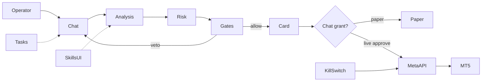

# Claude Code — Single Prompt: XAUUSD Gold Trading Agent (NanoAgent)

> **Give THIS FILE ONLY to Claude Code.**  
> English only. It contains the full product brief, constraints, UI/settings, FEATURE-01…10 engineering specs, capability specs 1–9 (algorithms, ratios, timings), operator doctrine with full reasons, behavior, and all **400** field rules with **title plus full why/how** (not summaries).  
> Do not invent missing rules. Do not add paid SaaS. Do not implement backtesting.

---

## 0. How to use

Paste or attach this entire markdown file to Claude Code and say:

```text
Implement this brief on a new branch of the NanoAgent/nanobot repo.
Start with Phase A. Obey hard constraints. Keep PRs small and tested.
```

Then continue Phases B→G in order.

---

## 1. Mission

Extend NanoAgent (Python `nanobot` + React `webui`) from gold **recommendations** into a **chat-first live trading operator** for **XAUUSD only** that:

1. Runs the existing multi-agent analysis pipeline (`nanobot/trading/`).
2. Executes/manages trades on the **operator’s own MT5 account via MetaAPI** (BYOK — operator token/account).
3. Requires **explicit human permission** before live execution (chat grant + settings).
4. Adds WebUI sections **Tasks** (simple) and **Skills** (operator can add/toggle agent skills).
5. Uses **zero paid third-party services** in the product.

Do not rebuild the product. Extend what exists.

---

## 2. Hard constraints

| Rule | Detail |
|------|--------|
| Symbol | XAUUSD only |
| Execution | MetaAPI only for live orders (operator BYOK). Encrypt secrets locally. |
| Cost | No paid SaaS (no Bloomberg, Benzinga, paid X API, paid calendars, paid sentiment cloud). |
| Backtest | **Forbidden.** No Fast Backtest engine. Vector playbook + FastDTW similarity allowed. |
| Gates | Existing quality gates stay mandatory before publish/execute. |
| Paper default | `paper_mode=true` until live enabled + chat grant. |
| Kill switch | Closes all MetaAPI positions/pendings and freezes the agent. |
| Charts | TradingView Advanced Charts only (already vendored). |
| Design | Follow `.agent/design.md`, `.agent/security.md`, `.agent/gotchas.md`. |

---

## 3. Codebase anchors (reuse)

| Area | Path |
|------|------|
| Orchestrator | `nanobot/trading/orchestrator.py` |
| Gates | `nanobot/trading/gates/` |
| Runtime | `nanobot/trading/runtime_state.py` |
| Paper | `nanobot/trading/paper.py` |
| Tools | `nanobot/agent/tools/trading_chart.py`, `trading_team.py` |
| WebUI shell | `webui/src/App.tsx`, `Sidebar.tsx` |
| Rec card | `webui/src/components/trading/TradingRecommendationCard.tsx` |
| Connect | `webui/src/components/trading/TradingConnect.tsx` |
| Automations UI | `webui/src/components/settings/system/AutomationsSettings.tsx` |
| Skills UI | `webui/src/components/settings/SkillsCatalogSettings.tsx` |
| Config | `nanobot/config/schema.py` |
| Existing skills | `nanobot/skills/gold-trading/`, `trading-proactive/`, `cron/`, `memory/` |

**Important:** Do **not** invent many new builtin skill packages unless the operator asks in a later task. Prefer storing doctrine from this prompt into workspace skills / config / prompts as Claude Code implements. This file is the source of truth.

---

## 4. Zero-cost FEATURE specs (FEATURE-01…10) — full engineering detail

No paid terminals (Bloomberg, Benzinga, paid X API). Operator BYOK only. Each feature is a settings toggle; defaults are safe (listeners OFF until configured).

### FEATURE-01 — Instant Telegram news (MTProto scraper)
- **Goal:** Capture economic/political flashes with zero paid subscription.
- **Stack:** Python, Telethon (Telegram MTProto). Operator supplies their own user session.
- **Logic:** Lightweight userbot listens to fast news channels (examples: FinancialJuice, Walter Bloomberg, and similar public fast-wire channels the operator chooses). On `events.NewMessage`, pass raw text immediately into FEATURE-05 in RAM (no disk round-trip).
- **Perf:** capture + handoff < 250ms.
- **Default:** OFF until session is configured.

### FEATURE-02 — Async economic/geopolitical RSS aggregator
- **Goal:** 24h watch of open wire/central-bank feeds with no API bill.
- **Stack:** `aiohttp`, `feedparser`, `asyncio`.
- **Logic:** Async loop polls RSS (Reuters, AP News, Federal Reserve press releases, and similar open feeds) every 10–15 seconds. Store `guid` / `entry.id` in an in-memory `set()` to skip duplicates. Extract title + summary into the central event matrix.
- **Perf:** poll cycle should stay very light (target < ~2% CPU).

### FEATURE-03 — VIP official statements tracker
- **Goal:** Watch central-bank / policy principals without paying for X API.
- **Stack:** public or self-hosted Nitter RSS instances, or `snscrape`.
- **Logic:** Follow RSS of Fed, ECB, Treasury/policy principals. Extract new posts, quoted text, and links. Tag author weight High/Medium impact.
- **Perf:** 30–60 seconds from publish.

### FEATURE-04 — Open economic calendar JSON/HTML scraper
- **Goal:** Daily structured CPI / NFP / GDP / FOMC schedule with live Actual updates.
- **Stack:** `httpx` / `requests`, BeautifulSoup4. Extend existing `nanobot/trading/news/forex_factory.py`.
- **Logic:** Pull the free calendar (Forex Factory / Investing open endpoints) at 00:01 GMT into a table: `[event, time, currency, forecast, previous]`. Around red events, re-scrape every 30 seconds to fill Actual and compute Surprise Delta (actual − forecast).
- **Perf:** Actual sync within 1–3 seconds of the official print when the open source updates.

### FEATURE-05 — Zero-latency regex emergency engine
- **Goal:** Protect/freeze instantly on catastrophe keywords without waiting for an LLM.
- **Stack:** Python built-in `re`.
- **Logic:** Classified regex matrices, for example:
  - Attack/war: `\b(missile|airstrike|war declared|explosion|invaded|ceasefire)\b`
  - Monetary shock: `\b(emergency rate cut|surprise hike|bank failure|default)\b`
- Any text from FEATURE-01 or FEATURE-02 is scanned in-memory. On a ban-class match: freeze new orders and protect open MT5/MetaAPI positions immediately.
- **Perf:** match < 1ms per headline.

### FEATURE-06 — Local vector playbook
- **Goal:** Compare current technical+macro context to stored successful gold scenarios (not a backtest).
- **Stack:** ChromaDB or LanceDB, 100% local.
- **Logic:** Store 500+ historical gold scenarios with embeddings, e.g. “false break of Asia high + M15 structure break + overbought + weak dollar”. Embed the live context; retrieve by cosine similarity; return match % plus how price behaved then.
- **Perf:** retrieve < 10ms.

### FEATURE-07 — FastDTW live pattern matcher
- **Goal:** Compare last ~30 gold bars to template shapes (Accumulation, Distribution, Turtle Soup) mathematically, free.
- **Stack:** `fastdtw`, `numpy`, `scipy`.
- **Logic:** Normalize recent closes to [0, 1]. Run Dynamic Time Warping vs stored templates. Return Match Confidence %.
- **Perf:** < 15ms. **Not a backtest / walk-forward engine.**

### FEATURE-08 — Post-mortem lessons SQLite
- **Goal:** Self-learning memory that blocks repeating the same losing setup.
- **Stack:** local `sqlite3`.
- **Logic:** On stop-out, record `[entry, SL, time, DXY state, break pattern, spread, direct technical cause]`. Before a new recommendation, SQL-check whether the candidate matches the last 3 losing setups in the same conditions. If yes, refuse and tell the operator: rejected because it repeats yesterday’s liquidity-context error.
- **Perf:** query < 3ms.

### FEATURE-09 — Local sentiment via Ollama
- **Goal:** Hawkish vs Dovish / inflation tone with zero cloud cost and no data leaving the machine.
- **Stack:** local Ollama with Qwen 2.5 (3B/7B) or FinBERT.
- **Logic:** Only texts that already passed FEATURE-05 go to the model. Prompt must return JSON only:
  `{"bias": "BULLISH_GOLD" | "BEARISH_GOLD" | "NEUTRAL", "confidence": 0.0-1.0, "reason": "short explanation"}`.
  Use as a confirmatory weight, not a standalone trade trigger. If Ollama is down, skip gracefully.
- **Perf:** ~500–1200ms depending on hardware/GPU.

### FEATURE-10 — Free intermarket macro engine
- **Goal:** Watch gold drivers (DXY, yields if available, silver, oil) without paid data vendors.
- **Stack:** MetaAPI/MT5 broker symbols when listed; free `yfinance` fallback.
- **Logic:** Live/close snapshots for:
  - Dollar index: USDX or DXY
  - Silver: XAGUSD
  - Oil: USOIL or UKOIL
  Build a short-horizon correlation / divergence matrix. Example: DXY prints a new high while gold fails to print a new low → strong gold-up confluence. Safe-haven decoupling (gold up with USD) is allowed in panic — never treat inverse DXY as 100% sacred.
- **Perf:** update with platform ticks / short poll cycle.

---

## 5. Operator doctrine — 11 principles (always-on)

Each principle is a standing constraint. Full reason included.

1. **Entry is not required at classic S/R:** After candle analysis, the entry zone does not have to be a horizontal support or resistance line. Candles often travel to a trendline and then reverse for a buy or a sell.
2. **The stop is not required at classic S/R:** The stop-loss location does not have to sit on the same resistance or support line. Candles may pierce the stop area, form a pattern, then reverse (buy or sell), or they may tag a trendline and then reverse.
3. **A stop level may be the better entry:** The place used as a stop is not always the correct stop; that same level can be the appropriate new entry zone.
4. **Always keep a stop protection buffer:** There must always be a protection zone around the stop (see field rules 28+).
5. **Do not wait for a condition that already happened:** A recommendation does not have to be built on a remaining condition such as “must touch the zone then rise” if that scenario has already occurred.
6. **Retest is not mandatory and can mean reversal:** A retest is not a required condition. A slow retest can be evidence of reversal rather than continuation.
7. **Chart-image rule:** From the chart screenshot, identify the pattern that has formed or the pattern that is about to form. Chart capture (`capture_gold_chart` / TradingView snapshot) is an analytical input, not decoration. Infer current pattern, forming pattern, entry/stop/target zones, visible liquidity, and multiple trendlines. Images confirm **shape**; numeric levels come from market data, not pixel guessing. If visual analysis or a recommendation is requested, attach or request a snapshot before locking the pattern when a snapshot is available.
8. **Immediate entry when the call is issued:** It is not required to wait for a specific pattern or scenario to finish forming if it has already formed. Once the trade call is given, enter immediately with the recommendation direction (subject to execution grants).
9. **Multiple trendlines on the same candles:** More than one trendline can form on the same candle structure; a specific inner line/zone can be the entry.
10. **Distance-versus-target paradox:** It is not required to wait for price to fall or rise a long way into an entry. Example: 100 points of travel to entry and only 100 points to target is a logical contradiction — prefer current momentum.
11. **Targets are not required to be S/R or liquidity:** TP1/TP2/TP3 need not be built on support, resistance, a liquidity pool, or a “revenge” zone. Price may reach a trendline and then reverse.


## 6. Behavioral skill (capability 9 — full)

1. Adaptive speech modes: military-strict if the operator tries to break risk or remove a stop; light sarcasm to deflate ego after a fast win streak; calm support after losses; decisive when execution is authorized.
2. Direct technical admission after any stop-out — no invented excuses. State how liquidity hunted the pattern and the loss in numbers to keep realism.
3. Total silence in dead, untradeable ranges — no random signals (trains patience until real liquidity).
4. A short end-of-day journal question (example: “Did you follow the plan today without hesitation or rushing?”) to record psychological discipline.

---

## 7. Detailed capability specifications (from the original engineering docs)

Implement each item as a module + settings toggle. Numbers below are defaults the operator can change.

### 7.1 Technical & price action

**1.1 Supply/Demand and Fair Value Gaps (FVG).** Scan three-bar sequences for imbalance left by aggressive liquidity. Draw the zone precisely and mark whether the gap is fully filled, partially filled, or still open. Use unfilled/partial FVGs as bounce zones or as targets to dump remaining size.

**1.2 Multi-timeframe.** Layered read: extract regime and structural zones from D1 and H4, then drop to H1 and M15 for timing. Never open a micro trade that fights the governing higher-timeframe path.

**1.3 Liquidity sweeps and fakeouts (Turtle Soup).** Watch historical swing highs/lows. If price raids the level (takes stops) then closes back inside with a long rejection wick, classify as a liquidity trap and prepare a reversal with the sweep — not a breakout chase.

**1.4 Market structure (BOS & CHoCH).** Algorithmic swing-point engine. Continuation = Break of Structure (break of highs in an uptrend / lows in a downtrend). Early reversal = Change of Character (break of the last low that formed a new high, or the symmetric bearish case).

**1.5 Auto Fibonacci and dynamic levels.** Measure the last impulse automatically. Mark institutional discount/premium including 0.618–0.786. Compute session S/R without manual drawing.

**1.6 Tick volume + ATR.** Use MT5/MetaAPI tick volume to confirm that a break has real participation (avoid empty fake breaks). Use ATR for natural gold noise and logical stop distance.

**1.7 RSI / MACD divergence.** Continuously compare gold swing highs/lows vs momentum-indicator swing highs/lows. Bullish/bearish divergence is an early warning that buyers or sellers are weakening before it is obvious on candles.

### 7.2 Macro & sentiment radar

**2.1 Live economic calendar.** Track Fed funds, CPI, NFP (and related gold drivers). Compute surprise = actual − consensus to size the shock.

**2.2 DXY linkage.** Gold is USD-priced and usually inverse to DXY. A dollar break/bounce is mandatory confluence for gold longs/shorts — except the documented safe-haven decoupling case (banking panic / hot war).

**2.3 Central-bank tone.** Process open news summaries of Fed-official speeches. Classify Hawkish (pressures gold down) vs Dovish (supports gold up) via FEATURE-09 after FEATURE-05.

**2.4 Geopolitical safe-haven radar.** Scan open flash headlines for crisis/war tokens (FEATURE-01 + FEATURE-05). Priority: fast longs and a ban on gold shorts during genuine fear waves.

### 7.3 Risk guardrails

**3.1 Auto lot size.** Once entry and stop are known, size the contract so potential loss equals a fixed percent of balance (default 1%, optional 2%). No manual lot typing.

**3.2 Daily drawdown breaker.** Track session realized+floating loss. At the cap (default 3% of balance): flatten all gold, cancel pendings, freeze trading until next day.

**3.3 Spread guard.** Read Bid–Ask from MetaAPI before send. If spread is abnormal (session close, violent news), abort the order.

**3.4 Cooldown lock.** After two consecutive losses, mandatory freeze (default 2–4 hours, minimum 60 minutes per discipline rule 187) to block revenge trading.

**3.5 Max concurrent gold positions.** Default cap 2 so floating size and margin are not stacked into a shock.

**3.6 Minimum R:R filter.** If projected reward < 2× risk (1:2), reject automatically so the book can grow even with a modest win rate.

### 7.4 Execution & trade management (MetaAPI → operator MT5)

**4.1 Direct-safe execution.** Send, modify, cancel market orders and pending Limit/Stop via MetaAPI with low latency. No second paid execution broker.

**4.2 Dynamic trailing stop.** Trail behind live swing highs/lows or an ATR multiple (Chandelier: highest high of last 10 bars minus ATR multiple).

**4.3 Auto breakeven.** When programmed TP1 is hit (and M15 structure confirms when stop-protection rules require it), move SL to entry so residual size is risk-free.

**4.4 Partial take profit.** Default ladder: close 50% at TP1, 25% at TP2, leave 25% as runner. Operator-editable percents.

**4.5 News shield.** About 10 minutes before a red event: alert the operator and/or protect open trades (BE or flatten ~70%) to avoid slippage/spread blowouts. Also honor the 15-minute pre-news new-entry freeze.

**4.6 Early-exit recommendation/action.** If candles show a strong reversal or momentum dies before TP or SL, recommend or (if grant allows) flatten to bank/cut.

### 7.5 Memory & internal review (no backtest)

**5.1 Historical analogue search.** Compare current structure+volatility+sweep context to stored gold history (FEATURE-06) before deciding.

**5.2 Fast backtest.** **DO NOT IMPLEMENT.** Forbidden. Use FEATURE-07 shape match only.

**5.3 Post-trade self-review.** On every close, auto-write whether exit followed the plan or was undisciplined, and expected vs actual.

**5.4 Lessons ledger.** Persist repeated errors (early entry before close, trading a dead market, etc.) and require them as pre-checks (FEATURE-08).

**5.5 Dual internal review.** Technical engine proposes; risk engine audits lot, spread, exposure. The order goes out only if both pass.

### 7.6 Alerts & operator interface

**6.1 Instant alert + drawn chart image.** Auto snapshot showing entry, stop, targets, and the technical reason. Send immediately (apply chart-image rule: the picture is used to name the formed/forming pattern).

**6.2 Human-in-the-loop.** Recommendation with Approve / Ignore (and Execute Live vs Paper). Wait for operator approval when grant is `ask`.

**6.3 Morning brief before London and New York.** Compact briefing: key liquidity, prior highs/lows, gold pivot levels for the session.

**6.4 Daily/weekly performance.** Net P&L, win rate, realized R:R, max drawdown for the period.

**6.5 Natural-language Q&A.** Operator may ask “what is gold doing now?” and get a short data-backed answer in their language.

**6.6 Feed-loss alert.** Heartbeat on MetaAPI/MT5 ticks. If ticks stall beyond a few seconds, emergency-notify the operator.

**6.7 Simultaneous fan-out.** Publish the same update to WebUI and Telegram (and WhatsApp if already enabled) without a material delay between them.

### 7.7 Security & resilience

**7.1 Master kill switch.** One UI button, chat emergency phrase, or API call: close all gold at market, cancel all pendings, freeze the agent.

**7.2 Encrypted local secrets.** MetaAPI token/account stored encrypted locally (not plaintext git). Treat like a protected env store under `~/.nanobot/`.

**7.3 Local trade-state recovery.** Persist ticket IDs and management state in SQLite continuously so a process restart resumes managing live positions.

**7.4 Bad-tick filter.** If a print jumps an absurd distance vs the last trade and snaps back, ignore it so a broker glitch cannot fire orders.

**7.5 Adopt operator manual trades.** Detect positions the operator opened on phone/desktop, ask whether to take over management (protect, trail, partials).

### 7.8 Multi-tasking & orchestration

**8.1 Continuous scan while managing.** Async: trail/protect open tickets in seconds **and** scan gold for new confluence without blocking.

**8.2 Two conditional plans.** Arm buy-on-break and sell-on-failure together. Whichever price confirms first is activated; the sibling is cancelled immediately (software OCO).

**8.3 Scalp vs swing isolation.** A multi-day H4/D1 swing can coexist with M-frame scalps via separate magic numbers. Never merge their stops.

**8.4 Natural-language orders.** Example: “move every gold stop to entry if price tags 2500” → execute via MetaAPI modify when grant includes `manage`.

**8.5 Skill/feature toggles.** Operator can enable/disable any capability (news shield, early exit, F01–F10, etc.) from Settings/Skills without code edits.

---

## 8. Trade execution scenario

```text
1. Operator asks to analyze gold
2. Pipeline + gates
3. Veto → no order
4. Allow → artifacts + chart snapshot (apply chart-image rule)
5. Eligibility: kill off, not paused, MetaAPI healthy, live enabled, chat grant, risk/spread/news OK
6. Show plan + lot + R:R
7. Paper approve OR Live Execute after Approve (grant=ask) / auto if grant=auto+opt-in
8. MetaAPI order with SL+TP in same packet
9. Persist ticket; manage trail/BE/partials/news shield
10. On close → lesson row + performance
```

### Chat execution grants
`none` | `ask` (default when live on) | `auto` (double-confirm, off by default) | `manage` | `adopt_manual`

Grant via: composer chip, `/trade allow|revoke|status`, natural language, rec-card buttons, Telegram inline buttons.

---

## 9. Settings toggles to add

Connection (MetaAPI token/account/test), Paper/Live, default grant, risk%, daily DD%, max positions, min R:R, cooldown, max lot, spread caps, slippage, ATR lot scaling, trailing/BE/partials, pending TTL, magic numbers, news shield minutes, F01–F10 toggles, memory toggles (no backtest toggle), briefs/reports, kill/pause/flatten.

---

## 10. WebUI additions

Sidebar: Chat, Chart, Performance, Recommendations, Briefing, **Tasks**, **Skills**, Connect, Settings.

### Tasks (simple UX)
Calm list of active/paused/done jobs; New task with only What / When / Where; reuse cron backend; keep full Automations in Settings for power users.

### Skills (operator-facing)
Enable/disable packs; add workspace `SKILL.md`; optional free marketplace. Doctrine in this prompt may be installed as workspace skills during implementation — do not flood builtin packages without need.

### Extra UI suggestions
Execution grant banner, positions panel, risk HUD, dual-scenario board, news-shield countdown, always-visible kill switch, MetaAPI connect wizard, journal, intermarket strip.

---

## 11. Architecture (target)



---

## 12. Suggested modules

```text
nanobot/trading/metaapi/     # client, orders, recover, secrets
nanobot/trading/risk/        # lot, dd, spread, cooldown, rr
nanobot/trading/manage/      # trail, be, partials, news_shield, dual_scenario
nanobot/trading/memory_engine/  # playbook, dtw, lessons
nanobot/trading/macro_free/  # F01-F05, F09-F10
nanobot/trading/permissions/ # session grants
nanobot/agent/tools/trading_exec.py
nanobot/agent/tools/trading_account.py
webui: Tasks page, Skills page, ExecutionGrantChip, MetaApiConnect, PositionsPanel, RiskHud
```

---

## 13. Implementation phases

- **A** Settings + chat grants + Paper vs Live Execute buttons (mock/live split) + tests
- **B** MetaAPI connect + positions + kill + recovery
- **C** Trade manager (trail/BE/partials/dual/NL commands)
- **D** F01–F05, F09–F10 behind toggles
- **E** F06–F08 (no backtest)
- **F** Tasks + Skills WebUI
- **G** Behavior + briefs + reports

---

## 14. Definition of done

1. Operator connects own MetaAPI account
2. Paper default; live needs settings + grant + Approve
3. Analyze → gates → artifact → approve → order (mocked in CI)
4. Kill switch flattens + freezes
5. Tasks usable in <30s; Skills can toggle/add
6. No paid SaaS; no backtest module
7. All rules in §15–§17 obeyed

---

## 15. Field rules 1–200 (operational encyclopedia)

Each rule includes the title and the full reason. Obey both.

### 15.1 Entry timing (1–25)

1. **Bypassing Classic Support and Resistance:** It is not necessary for the agent to wait for a touch of a horizontal support or resistance line; in strong trends, gold often bounces from dynamic trendlines or liquidity gaps in the middle of the distance.

2. **Immediate Entry Scenario Without Waiting:** If the agent detects that buy or sell conditions are complete and liquidity has already been swept, it must issue an immediate market entry order and not wait for an additional drop or rise that may miss the move.

3. **The Distance-versus-Target Paradox:** If the entry condition requires the price to retrace 100 points to a specific level, while the overall target is only 100 points, the trade becomes logically contradictory, and priority goes to entering with the current momentum.

4. **Anticipatory Entry Before the Close:** On explosive momentum candles in gold, it is not always required to wait for the candle to close; waiting for the close can consume 60% of the expected move range.

5. **Incomplete Bounce (Front-Running):** Trading institutions often place their orders several points before support and resistance zones; therefore an entry window must be opened starting 15 to 30 gold points before the level.

6. **Entry via the Liquidity Gap (FVG), Not the High:** In an uptrend, gold often reverses from the first fair value gap above the broken high instead of dropping to retest the high itself.

7. **Entry with a Counter Engulfing Candle:** If the previous candles were slowly bearish and then a strong bullish candle appeared that engulfed two candles, this is an immediate buy entry without requiring a touch of any support.

8. **Direct Break Entry at Liquidity Time:** At the London or New York session open, a sharp break of the Asian range is treated as a direct momentum entry without waiting for a bounce.

9. **Entry at Equilibrium Zones:** In large impulse waves, the 50% level of the wave length is considered a preferred entry zone even if it does not coincide with any previous high or low.

10. **Synchronizing Entry Across Two Different Timeframes:** If a reversal pattern forms on M15 while H1 is trading in the middle of a directional candle, priority goes to the instantaneous entry with the H1 trend.

11. **Entry on Fan Lines (Trendline Fan):** When gold's decline or rally accelerates, the entry is built on the steepest trendline, not the slow main trendline.

12. **Canceling the Entry Condition When Time Slows:** If the price is delayed in reaching the conditional entry zone for more than 4 hours, the idea is canceled because the probability of breaking the zone becomes higher than the probability of bouncing from it.

13. **Entry from the News-Candle Low:** The candle produced by an economic news release becomes itself a support zone; the entry is at a touch of the candle wick, not waiting for the day's low.

14. **Entry Based on Price Absorption:** Repeated lower wicks in a narrow price area are considered an immediate buy-entry signal without the need for drawn technical lines.

15. **Small-Trendline-Break Entry:** In a corrective move, a break of the minor descending trendline is used as a buy-entry signal with the overall uptrend.

16. **Avoid Waiting for a Correction in a Steep Trend:** When gold's ascent angle exceeds 60 degrees, any wait for a deep pullback to enter will result in missing the entire rally.

17. **Entry on a Touch of Round-Number Levels:** Numbers such as 2400 or 2450 form automatic psychological entry zones if they coincide with a reversal candle even without prior support.

18. **Entry After a Failed Bearish Pattern:** If a double-top pattern fails to push the price down and breaks the neckline to the upside, the immediate opposite buy is activated.

19. **Entry Conditioned on Candle Sequence:** A succession of 3 rising bullish candles of increasing size (Three White Soldiers) after chop is a sufficient entry justification without the need for indicators.

20. **Entry via Range Reclaim:** A drop of price below support then a rapid return to close above it in the same candle is an immediate buy-entry signal.

21. **Hourly Closing-Candle Entry:** Enter at minute 59 of the hour if the candle confirms a break of an important level, to avoid price slippage in the first minute of the new hour.

22. **Entry Aligned with the Fast Moving Average:** In strong trends, a bounce of gold from EMA 20 is sufficient as an entry zone without waiting for previous lows.

23. **Counter Entry After Daily Range Exhaustion:** If gold has moved 150% of its average daily range (ADR), a counter entry is justified at the first instantaneous reversal candle.

24. **Entry with a Split-Order System:** Distribute the entry across two tranches (market and a pending order 20 points away) instead of missing the move or entering the full size at a single point.

25. **Bullish Entry from a Broken Prior High That Turned into Support:** The classic role-reversal rule is used only if the bounce is fast and with a clear rejection candle.

### 15.2 Stop protection (26–55)

26. **The Stop Loss Is Not the Support:** Placing the stop loss directly under the support line or the classic low is a grave error, because that zone is market makers' preferred target for hitting liquidity.

27. **The Stop Zone as an Alternative Entry Zone:** If the stop loss is hit by a candle wick and then price closes quickly back inside the range, the previous stop level is itself the best new entry zone.

28. **Mandatory Protection Zone (Buffer Zone):** A protective margin must always be added to the stop loss below the lows of no less than 25 to 40 points on gold to resist random volatility.

29. **Volatility-Based Stop (ATR-Based SL):** The stop-loss distance must be measured as a multiple of true volatility (ATR) (for example, ) and not as a fixed number of points.

30. **Stop Loss Above the Explosive Candle:** In sell trades, the stop is placed above the wick of the candle that caused the break, not above the distant historical high.

31. **Structural Stop, Not a Point Stop:** The concept of a fixed stop (such as always 30 points) is canceled; the stop is placed at the point that, if price reaches it, completely invalidates the technical idea.

32. **Avoid Placing the Stop at Round Numbers:** Market makers target whole numbers; the stop must always be placed at odd fractions (such as 2447.80 instead of 2450.00).

33. **Stop at the Dynamic Trendline:** In some trades, a break and close of a candle below the trendline is the stop criterion, not a fixed numeric price.

34. **Tightening the Stop When a Confirmation Candle Appears:** As soon as price launches and forms a momentum candle in the trade's direction, the stop is immediately pulled behind that candle's low to reduce risk.

35. **Forbidding Moving the Stop Backward:** It is strictly forbidden under any circumstance to widen the stop loss after it has been entered in order to accept a larger loss than planned.

36. **Time-Based Stop Loss (Time Stop):** If gold opens a trade and oscillates in a dead range for more than 3 hours without launching, the contract is closed or the stop is tightened in anticipation of a reverse explosion.

37. **Stop Below the Liquidity Pool:** Always place the stop behind two equal lows (Equal Lows) at a safe distance because these lows are a magnet for candle wicks.

38. **Moving the Stop to Entry (Breakeven Rule):** The stop is moved to entry only after price has traveled a distance equal to the stop's own value ( ) and a new low has formed on M15.

39. **Protecting Peak Profits:** If the trade has achieved 70% of the target, a profit-protection stop must be placed at the 50% level of the move to deny the market the chance to turn the profit into a loss.

40. **Stop Protected by an Order-Block Buffer:** The stop is placed 15 points after the end of the institutional Order Block, not exactly at it.

41. **Separating the Sell Stop from the Spread:** In sell trades, the stop distance must be increased by the amount of spread widening at close time to avoid the trade being stopped out by a phantom spread.

42. **Dynamic Trailing Stop (Chandelier Exit):** Use the highest high of the last 10 candles minus an ATR multiple as a trailing stop level that follows price.

43. **Stop Behind the Asia High:** When selling gold after an Asia-session liquidity sweep, the stop is placed 10 points above the highest wick recorded by the sweep candle.

44. **Avoid Placing the Stop Inside Price Gaps:** The stop is never placed in the middle of an open FVG because price will inevitably return to fill it completely.

45. **Instant Stop on Momentum Break:** Exit the trade if two consecutive candles close against the direction on the M5 timeframe with rising momentum, even before the original stop is hit.

46. **Do Not Move the Stop to Entry Too Early:** Moving the stop to the entry point before a minor high is exceeded causes the trade to be stopped out by a volatility wick before the launch toward the target.

47. **Portfolio-Percentage-Based Stop:** The distance between entry and stop must programmatically equal exactly 1% or 2% of the balance by adjusting the lot size.

48. **Close-Referenced Stop Loss:** In some cases, the stop is programmed on the basis of "an hourly candle closing below the level" and not merely a quick wick touch.

49. **Protecting Trades at News Time:** 5 minutes before hot news, the stop must be in a zone completely free of liquidity gaps to reduce the effect of price slippage.

50. **Distributing Stop Losses Across Split Contracts:** When entering with two contracts, the first stop can be placed tight and the second behind the larger structural low to distribute risk.

51. **Stop on a Break of the Channel Midline:** In price channels, a break of the midline (Equidistant Median) is considered an early stop level before the channel low.

52. **Overnight Safety Stop:** Before overnight contract settlement (Rollover), the stop is increased by an extra 20 points to absorb the temporary widening of the spread.

53. **Stop Behind the Inverted Hammer (Shooting Star):** The sell stop is placed 10 points above the highest point of the shooting-star wick.

54. **Stop Based on Supply Balance:** If the trade is a buy, the stop is placed under the demand zone that engulfed the entire last down-wave.

55. **Protective Exit When an Opposite Pattern Appears:** Cancel the trade and hit the stop manually if a clear opposing head-and-shoulders pattern appears on the H1 timeframe.

### 15.3 Retest philosophy (56–80)

56. **A Retest Is Not a Mandatory Condition:** In true price explosions on gold, price runs away without any retest of the broken level, and waiting misses the trade.

57. **A Retest as Evidence of Reversal:** If price returns slowly and hesitantly to the broken level and then bearish candles begin to dominate, this is often not a retest but a failed break and a true reversal.

58. **Deep Retest:** In many cases gold overshoots the broken resistance line to the downside to retest deeper demand zones beneath it before rising.

59. **Speed of the Test Candle:** A successful retest candle must be fast and rejected with a long wick; full-bodied candles that settle at the level mean the breakout has failed.

60. **Retesting the Trendline, Not the Horizontal Line:** Price may ignore the horizontal level and retest a previously broken sloping trendline to rest on it and launch.

61. **Fake Retest to Sweep Liquidity:** Price returning to the broken zone may be only to trigger traders' pending buy orders and then drop violently to hunt them.

62. **Failed Retest as a Sell Opportunity:** When price fails to bounce from the retest level and drops below it, the position is immediately flipped to a sell trade with the new trend.

63. **Retest on a Smaller Timeframe:** What appears as a direct breakout on the H1 timeframe often contains a completed and ideal retest on the M1 or M5 timeframe.

64. **Effect of Trading Volumes on the Test:** A retest that occurs with weak trading volumes (Low Tick Volume) is the safest and most credible for continuation.

65. **Retesting Fibonacci Levels:** Gold prefers to retest the 61.8% Fibonacci level of the broken wave instead of retesting the zero breakout point.

66. **Testing the Right Shoulder:** In head-and-shoulders patterns, price may never bounce to retest the neckline at all, and instead simply drop directly after forming the right shoulder.

67. **Multiple Retests Weaken the Level:** If price returns to test the same level 3 times, this does not indicate its strength but the exhaustion of buy orders and the approach of its break.

68. **Time-Conditioned Retest:** If the breakout candle took one minute and the retest candle took 30 minutes of hesitant decline, this is a healthy bounce.

69. **Retesting Zones, Not Lines:** Retest levels must be treated as a "price range" spanning 15 to 30 points and not as a mere numeric price.

70. **Retesting the Weekly Opening Gap:** Price gaps left at the market open on Monday are considered inevitable later retest targets during the week.

71. **Upside Break Without a Test (Runaway Breakout):** If the breakout is accompanied by a strong opposite rise in the DXY index, gold will drop without any test of the highs.

72. **Confirming the Retest with Reversal Candles:** Do not enter a retest trade merely on a price touch; a Pin Bar or engulfing candle on M15 confirming rejection must be seen.

73. **Retesting the Broken Asia Low:** When gold breaks the Asia session low at the London open, the maximum bounce rise is a touch of that same low before the sharp drop.

74. **Mid-Air Retest:** Price may bounce 20 points before reaching the broken support line and content itself with testing the nearest moving average.

75. **Retesting Parallel Trendlines:** When a descending channel is broken, price often retests the outer ceiling of the channel as new support.

76. **Retesting Psychological Levels:** Price resting above a level such as 2400.00 after exceeding it represents a stronger confirmation than retesting any random high.

77. **Retest After Stormy News:** News shocks leave violent break levels; these levels are often retested after the session ends in complete calm.

78. **Retesting the All-Time High:** When gold records a new all-time high, the retest may be via a long sideways oscillation range and not a sharp drop.

79. **Failed Test in Exhaustion Zones:** If the RSI indicator is in sharp oversold zones on H4, any retest of broken resistance will turn into a buying explosion.

80. **Canceling the Retest Idea When the Range Widens:** If the retest decline exceeds 78.6% of the break wave, the scenario is canceled and the break is considered entirely fake.

### 15.4 Trendlines and channels (81–105)

81. **Multiple Trendlines on the Same Chart:** An inner sharp trendline (Inner Trendline) and a main outer trendline (Outer Trendline) can be drawn on the same candles; the entry starts from the inner one.

82. **The Trendline as a Zone, Not a Thin Line:** The trendline is drawn as a price bundle that embraces both wicks and bodies together to absorb gold's instantaneous wick breakouts.

83. **Bounce from the Trendline Without Touching Support:** Gold often completely ignores horizontal levels and reverses as soon as it touches a sloping rising trendline.

84. **The Third-Touch Rule:** The third rest on the trendline is the strongest and highest-probability for a fast profit, while the fourth and fifth rests carry an elevated break risk.

85. **A Trendline Break Does Not Mean Reversal:** A break of the rising trendline on gold often leads to a sideways accumulation path and not necessarily to a sharp decline.

86. **Adjusted Trendlines:** If a candle wick breaks the trendline and returns to close above it, the line is redrawn to contain this wick as a new slope angle.

87. **The Dual Parallel Trendline:** Drawing a line parallel to the trendline on the opposite highs creates a price channel; a touch of the channel ceiling is considered a mandatory take-profit target.

88. **The Accelerating Horizontal Trendline:** Acceleration of price movement and its departure from the trendline at a right angle indicates a nearby price explosion that ends with a collapse toward the line.

89. **Breaking the Minor Trendline as a Confirmation Signal:** Do not buy on a touch of horizontal support except after a break of the small minor descending trendline on the 5-minute timeframe.

90. **The Fake Trendline of Market Makers:** Trendlines that are very obvious to novice traders are drawn for the purpose of breaking them and sweeping the stop liquidity placed directly behind them.

91. **Counter-Trendlines:** Entry into fast trades (scalping) is built on breaking trendlines that run counter to the overall daily path.

92. **The Channel Midline (Channel Median):** The midline plays the role of a price magnet; a bounce from it confirms trend strength and reaching the opposite side.

93. **Intersection of a Trendline with a Horizontal Level:** The mathematical meeting point between a sloping trendline and a horizontal support level represents an entry point with the highest possible success rate (Confluence Zone).

94. **Break and Retest of the Trendline:** Entry after a break of the rising trendline is when price bounces to re-touch the line from below as a resistance barrier.

95. **Trendline Based on Wicks versus Bodies:** On gold, trendlines drawn on body closes are more truthful in revealing a break than random wick lines.

96. **Fan Trendline (Speed Resistance Lines):** Draw three trendlines at different angles; a break of the first line warns of a drop to the second, and a break of the second targets the third.

97. **RSI Indicator Trendline:** Draw trendlines on the RSI indicator; a break of the indicator trendline precedes a break of the actual price trendline on the chart by two to three candles.

98. **Trendlines on Large Timeframes:** A trendline drawn on the D1 timeframe remains a solid barrier that cannot be easily exceeded except with a violent macro economic release.

99. **Price Divergence from the Trendline:** Price moving a very large distance away from the rising trendline imposes a ban on immediate buying until price returns to breathe near its line.

100. **Breaking the Double-Top Trendline:** A break of the trendline connecting the two lows of the double-top pattern represents activation of the sell signal even before the neckline is broken.

101. **A Broken Trendline Reverses Its Function:** A strongly broken rising trendline turns in the future into a resistance ceiling that blocks any new upside attempts.

102. **Symmetrical-Triangle Trendlines:** Narrowing of the distance between the rising and falling trendlines inside the triangle warns of an explosion that determines direction based on which line is broken.

103. **Using Trendlines as Moving Targets:** In a buy, the upper descending trendline can be made the moving take-profit target as time advances.

104. **Breaking the Trendline with a Doji Candle:** A trendline break with weak Doji candles indicates a false break caused by an absence of liquidity and not a real change in forces.

105. **Synchronizing the Trendline with the Trading Session:** Price resting on a rising trendline in sync with the first minute of the London exchange open gives the trade maximum thrust.

### 15.5 XAUUSD dynamics (106–135)

106. **Asia Session Liquidity Trap (Asian Range Sweep):** On 80% of days, gold at the start of the London open breaks the highest high or lowest low of the Asia market to sweep liquidity and then fully reverses.

107. **Gold Does Not Forgive a Late Stop:** If gold's reverse move has started, exiting with a 20-point loss is better than waiting, because gold is capable of moving 300 points without stopping.

108. **Major Psychological-Number Traps:** Around levels such as 2400.00, gold repeats oscillation and fake breaks by a margin of 50 to 80 points to flush small traders' contracts before the real move.

109. **The 3:30 PM (15:30) Makkah Candle (New York Open):** This 15:30 candle often wipes out everything the London session built in minutes; instantaneous contracts must be closed or fully secured before it.

110. **Gold Is a Haven of Fear, Not Instant Inflation:** In moments of urgent military tensions, technical analysis is canceled entirely and gold moves up as a fait accompli driven by institutional market orders.

111. **Temporary Decoupling from the Dollar Index (DXY Decoupling):** Gold may rise with a rising dollar in cases of severe banking panic; do not rely on the inverse relationship as a 100% sacred rule.

112. **Gold's Natural Volatility Size (Gold ATR):** Gold's natural daily range is between 250 and 400 points; any move of less than 150 points means the market has not yet started its explosion.

113. **News-Candle Wick Trick (News Wick Trap):** The first move 5 seconds after a CPI or rate-decision release is often a reverse trap move to swallow liquidity before the true direction.

114. **Targeting Equal Highs/Lows:** Gold does not leave equal lows or highs without returning to break them and hunt the stops placed behind them even after days.

115. **Sharp Liquidity Void:** The very long candles gold leaves at news time are attraction zones that price will later return to fill at least 50% of.

116. **Gold Loves the Bounce from 78.6% Fibonacci:** Unlike currencies that content themselves with 50% or 61.8%, gold prefers very deep corrections to hit the largest number of stops before launching.

117. **Daily Closing Move (Daily Fixing):** From 6:00 to 7:00 PM London time, spot gold prices are fixed, and sudden contract liquidations occur in it.

118. **Trading During Spread Widening (The Midnight Spread Trap):** From 11:55 PM until 12:15 AM platform time, the gold spread widens insanely; trading or placing tight stops is forbidden then.

119. **Breaking Gold Support and Turning It into a Bearish Explosion:** If gold breaks a true support level and holds below it with two H1 candles, it does not correct but collapses vertically to touch the next historical support.

120. **Do Not Chase Giant Green Candles:** Buying after gold has risen 150 points in 5 minutes is trading suicide; the correct buy is in the stagnation zones before the explosion.

121. **Gold's Relationship with Real Bond Yields (TIPS Yields):** A continuous rise in bond yields forms a permanent restraining pressure on gold's rise on large timeframes.

122. **Gold's Behavior on Friday:** Friday closes often see profit-taking and liquidation of major funds' positions, causing strong reverse moves against the week's direction.

123. **The First-Hour Candle of Monday:** The week's opening oscillation reflects holiday sentiment and often sees filling of leftover price gaps.

124. **Gold Cancels Indicators in Sideways Paths:** Indicators such as RSI or Stochastics give successive false signals when gold is trapped in a tight 70-point range.

125. **Safe Haven Runaway:** On days of geopolitical panic, every bearish correction no matter how small is an immediate buy opportunity without hesitation.

126. **Harmonic Correlation with Silver:** If silver breaks its previous high and gold lags in breaking its high, gold will inevitably catch up with it in an accelerated form (Silver Leading).

127. **Avoid Trading on US Bank Holidays:** Gold's movement on United States holidays (such as Labor Day) is dead and random and burns the account with the spread.

128. **Afternoon Reversals (Late NY Reversal):** After 8:00 PM Makkah time, gold often starts a corrective move that opposes the direction it followed throughout the day.

129. **Gold Tests Invisible Liquidity Zones:** Previous days' closing levels (Previous Day Close) represent magnetic support and resistance barriers on gold.

130. **Breaking the 200 EMA on the H4 Timeframe:** This is considered the dividing line between gold's long-term uptrend and downtrend; trading above it is a permanent buy and below it a permanent sell.

131. **Pre-Employment-Data Move (NFP Stagnation):** Gold adheres to a very tight trading range on the days preceding the US jobs report; trading inside it is a drain on the portfolio.

132. **Gold Moves as One Block with Mining Stocks:** Watching the gold-mining companies index (GDX) gives a leading indicator of actual gold moves by hours.

133. **Bounce from Bollinger Bands Limits:** A gold candle exiting entirely outside the outer Bollinger Band range on H1 warns of an immediate corrective bounce toward the midline.

134. **Contract Size and Pricing:** A one-dollar move in gold's price equals 100 points in pip accounts; accurate risk calculation is the foundation to prevent a margin call in a single candle.

135. **Quiet Ascent and Violent Descent:** Gold's rise often takes days of slow graduation, while profit-taking and the decline occur in a few hours and with giant engulfing candles.

### 15.6 Take profit (136–160)

136. **The Target Is Not Always Support or Resistance:** The first target can be a sloping trendline, or a price-channel midline, or merely a percentage calculated with the ATR indicator.

137. **Mandatory Partial Close (Take Partial):** Take 50% of the contract's profits as soon as a distance equal to the stop point ( ) is achieved and immediately move the stop to the entry point.

138. **Open Target in Historic Trends:** When gold records a new all-time high and prior resistances vanish, targets are set with Fibonacci extensions (1.272 and 1.618).

139. **Exit Before the Psychological Level by a Safety Distance:** If the target resistance is 2500.00, the take-profit order must be placed at 2496.00 to avoid price bouncing before touching the whole number.

140. **Timed Exit Before Session Close:** Close open instantaneous trades one hour before the New York session close, regardless of whether price reached the final target or not.

141. **Targeting Previous-Day Highs and Lows:** Yesterday's high (Previous Day High) and yesterday's low (PDL) are the most accurate and reliable daily targets in gold trading.

142. **Extended Target with Engulfing Candles:** If price reaches the first target with a giant full Marubozu candle, do not close the trade; extend the target to the next level because the momentum is extraordinary.

143. **Taking Profit When Sharp Exhaustion Appears:** Close the trade manually if the RSI indicator reaches levels above 85 on the H1 timeframe even if the technical target is farther.

144. **Exit on Slowing Price Movement (Momentum Exhaustion):** If price took 10 candles to move a distance it previously covered in one candle, close your profits immediately.

145. **Target at the First Opposite Liquidity Gap:** In buy trades, the first bearish FVG zone that meets price on the way is considered a primary exit target because it will block the rise.

146. **Do Not Be Greedy for the Entire Wave:** Content yourself with 70% to 80% of the expected range of the price move and leave the rest, because wave endings see sharp reversals.

147. **Securing Profits After the Second Target:** When the second target is hit, the stop loss is pulled and placed behind the first target so it becomes a guaranteed profit in the pocket.

148. **The Opposite Target in Price Channels:** A buy from the price-channel low has as its only target the channel ceiling and not an attempt to break it.

149. **Shrinking Targets Before Major News Releases:** If there is a winning trade 15 minutes before a rate-decision release, targets are closed immediately on the available profit.

150. **Targeting External Liquidity Levels:** The logical target of a buy trade that launched from a low is hunting the high from which the original decline started.

151. **Adjusting Targets According to the Spread:** In buy trades, the profit target must be calculated precisely to offset the spread cost deducted on exit.

152. **Target Based on the Head-and-Shoulders Pattern:** The pattern target is measured by calculating the vertical distance from the head to the neckline and projecting it from the break point.

153. **Gradual Multi-Stage Exit:** Split taking profit into 3 levels: 40% first target, 30% second target, 30% left as a running contract to chase the overall trend.

154. **Exit When a Reversal Pattern Appears on a Smaller Timeframe:** If you are in an H1 buy trade and an explicit double-top pattern appears on M5, close the trade immediately.

155. **Converting the Instant Trade into a Swing Trade:** If the entry is from a confirmed weekly low, the limited daily target is canceled and replaced with chasing profits over the long term.

156. **Target at the Bounce from the 50-Day Average:** In corrective moves, the SMA 50 moving average is a decisive target for the bouncing wave.

157. **Taking Profit Before the Weekend Holiday:** Avoid holding trades overnight over Saturday and Sunday to avoid the market opening on a catastrophic price Gap against the trade.

158. **Targeting Liquidation Lows (Liquidation Run Target):** Make the target below the levels at which buy stops have clustered in order to capture the entire liquidation move.

159. **Proportional Target for Elliott Waves:** In the third rising wave, the minimum target is 1.618 of the length of the first wave.

160. **Accepting Realized Profit When Market Structure Changes:** Exit with any available profit as soon as the first minor low is broken on M15 and do not wait for the entry stop to be hit.

### 15.7 Candle traps (161–180)

161. **Hammer-Candle Trap (Hammer Trap):** A hammer candle that appears in the middle of the path without resting on a true liquidity zone is a trap for small traders to buy before the drop.

162. **Silent-Breakout Trick:** Breaking resistance with a small-bodied candle does not express buyers' strength; a true breakout requires a full-bodied candle representing 80% of its range.

163. **A Doji Candle Means Hesitation, Not Reversal:** The appearance of a Doji does not require a reverse entry; it means both sides have paused awaiting new liquidity that may continue the same trend.

164. **Failed Engulfing-Candle Trap:** If a bearish candle engulfs a previous bullish candle, then the next candle fails to continue downward, this is considered a sell trap and buying must be done immediately.

165. **Shooting Star at the All-Time High:** It gives the highest credibility for a sell if the upper wick is three times longer than the candle body.

166. **Gradual Engulfing (Momentum Shift):** A shift of candles from a decline with large bodies to a decline with tiny bodies indicates selling exhaustion and an approaching bullish explosion.

167. **Multiple-High-Break Trap:** Recording new highs by a margin of only a few points and with long wicks reflects cautious institutional distribution that warns of an imminent collapse.

168. **Inside Bars:** 3 candles inside the range of a giant mother candle indicate price compression followed by an explosion in the direction of the break.

169. **First Impulse-Candle Trap in London:** The first 15-minute candle at the London open is in many cases a trap to steer attention toward a false direction.

170. **Strength of the Close in the Upper Third:** A candle that closes in the upper 25% of its range confirms bulls' control regardless of the length of the lower wick.

171. **Late-Entry Trap Behind Consecutive Candles:** A succession of 5 consecutive bullish candles on the M15 timeframe makes the probability of a correction higher than the probability of continuation; buying is banned here.

172. **Double Price Rejection (Double Rejection Wicks):** Formation of two consecutive long wicks in the same price zone confirms the presence of an institutional wall of force that cannot currently be broken.

173. **Lower Absorption Candle:** A strong bearish candle followed by a bullish candle that fully engulfs it on the same timeframe wipes out sellers' influence and confirms the rise.

174. **Previous-Day-Candle-Break Trap:** Breaking yesterday's lowest low with the wick and quickly bouncing to close inside yesterday's range is the strongest bullish bounce pattern.

175. **Fading Wicks in a Strong Trend:** A strong trend does not contain long upper and lower wicks, but single-color candles that push price regularly.

176. **Rectangle-Pattern Trap (Range Box Trap):** Price exits the sideways range in one direction to deceive traders into a breakout, then reverses to fully break the opposite side.

177. **Selling-Climax Candles:** A giant bearish candle with historic trading volume appearing after a long down-wave represents the end of the decline and the flushing of contracts, not its beginning.

178. **Candle Bodies Tell the Truth and Wicks Hunt Liquidity:** Always rely on the close and open prices of candle bodies to determine the true price direction and ignore wick noise.

179. **Gap-Fill Trap:** Not every price gap must close immediately; gaps resulting from a structural breakaway (Breakaway Gaps) may remain open for months.

180. **Spinning Tops in Support Zones:** They indicate sellers' confusion after a descending path and are considered a prelude to building a new bullish launch base.

### 15.8 Execution discipline (181–200)

181. **Refraining from Trading Is Itself a Trade:** In times of absent clear vision and overlapping signals, remaining in spectator mode is a profitable decision that protects capital.

182. **Strict Execution Without Hesitation (Zero-Hesitation Execution):** As soon as the algorithmic conditions for the trade are met, the order must be sent immediately without waiting for consultation or a late human confirmation.

183. **Automatically Canceling Pending Trades:** Any pending order (Buy Limit / Sell Limit) that has not triggered within 3 hours of being issued is canceled programmatically because the technical context has expired.

184. **Preventing Double Entry on the Same Asset:** Ban opening a new buy trade on gold if there is a previous losing buy trade that has not yet been closed, to prevent stacking losses.

185. **Separating Scalping Trades from Swing:** Each strategy has its own Magic Number; it is not permitted to merge an instantaneous trade's stop with a long-term trade's stop.

186. **Immediate Exit on Leakage of Hot News:** If gold moves 80 points in one minute without a technical reason or an announced news time, close positions immediately due to the possibility of an emergency news leak.

187. **Programmatically Banning Revenge Trading:** Freeze the trading platform and prevent opening any new orders for 60 minutes in the event of recording two consecutive losses in the same session.

188. **Dual-Verification Rule for Lot Size:** Review the contract-size calculation twice via the code before sending to ensure that a decimal-point error will not lead to an arithmetic disaster.

189. **Updating Instant Data Before Sending:** Check the last price tick issued from MT5; if the data is older than 5 seconds, execution is canceled on suspicion of a connection outage.

190. **Flexibility Before a Changing Market:** If gold's direction suddenly changes and market structure is broken, the bullish bias is canceled immediately without intellectual stubbornness or clinging to the previous analysis.

191. **Respecting Maximum Daily Loss Levels:** If the account reaches a 3% daily drawdown, the agent automatically closes all trades and cuts its connection until the next morning.

192. **Executing at Market Prices in Cases of Decisive Confirmation:** Rely on market orders instead of limits when a break-and-confirmation candle is detected to ensure catching the move's train.

193. **Canceling the Recommendation If Price Moves Half the Distance to the Target:** If price runs toward the target before the pending entry order is triggered, the trade is canceled and price is not chased on its return.

194. **Documenting the Entry Reason in the Order Log:** Record the technical code on which the trade was built (such as: BOS_M15_FVG_Retest) in the Comment field of each contract for review.

195. **Banning Trading 15 Minutes Before the Daily Market Close:** Avoid opening new positions at the end of the day because of the sharp drop in liquidity and the rise in overnight and spread costs.

196. **Instant Recalculation of Reward versus Risk:** If price moves one point worse than the specified entry point and the R:R ratio deteriorates to less than 1:1.5, the entry is canceled.

197. **Banning Trades on Official Holidays:** Fully disable the trading algorithm on New Year's and Thanksgiving due to the absence of market makers and major central banks.

198. **Confirming the Chart Is Free of Contradictions:** If the H4 timeframe signal is an explicit buy while the M15 timeframe shows a completed bearish distribution pattern, entry is forbidden until the two timeframes align.

199. **Controlling the Lot When Balance Increases:** Increasing lot size with account growth is done based on the fixed closing balance and not floating profits (Equity vs Balance).

200. **The Ongoing Golden Rule:** The market is always right, and technical analysis is merely a map of probabilities; the absolute priority is protecting capital first, and achieving profits second.

## 16. News and violent-volatility rules (1–100)

### 16.1 Pre-news precautions (1–18)

1. **Mandatory Freeze Window (Pre-News Freeze Window):** Ban opening any new trades 15 minutes before the release of high-impact news (CPI, NFP, FOMC) to avoid the chaos of a liquidity sweep.

2. **Cancel All Pending Orders:** Delete all pending buy and sell orders (Limit & Stop) 10 minutes before the news to prevent them from being triggered by destructive price slippage.

3. **Securing Running Winning Trades:** Move the stop loss of previously open trades to the entry point or close 70% of their size 10 minutes before pivotal data.

4. **Liquidating Trades Near the Entry Point:** Close any trade that has not moved more than 30 gold points away from its entry point to prevent an immediate stop hit due to spread widening.

5. **Monitoring Preemptive Spread Widening:** Measure the spread 2 minutes before the news; if it has widened to more than 3 times the normal average, the automatic trading lock is activated immediately.

6. **Checking Pre-Market Pricing (Priced-in Analysis):** Compare price movement in the 4 hours preceding the news with expectations; a sharp directional move before the news means the market has already absorbed the result in advance.

7. **Defining the Quiet Positioning Range (Pre-News Range):** Draw the highest high and lowest low gold formed in the last 30 minutes before the news and adopt them as break boundaries and liquidity traps.

8. **Disabling the Tight Trailing Stop:** Cancel the instantaneous profit-chasing feature (Trailing Stop) immediately before the news, because the initial random volatility will hit the stop and deprive you of trend continuation.

9. **Filtering Simultaneous News:** Classify the danger of the moment when two simultaneous releases occur (such as the unemployment rate in parallel with Non-Farm Payrolls NFP).

10. **Verifying Connection Efficiency and Ping:** Confirm that the response time of the connection to the MT5 server is less than 50ms one minute before the news; if delay increases, trading is completely forbidden.

11. **Avoid Trading at Preliminary Market Close:** Ban entry if the news coincides with the daily contract rollover and interest-update time (Rollover).

12. **Calculating Expected Deviation (Consensus Deviation Threshold):** Program the value of the gap between expected and actual needed to truly move the market (such as a 50,000-job gap in NFP).

13. **Banning Trades on Federal Chair Testimony Days:** Maintain complete silence throughout the duration of the central bank chair's testimony before Congress until the press conference fully ends.

14. **Detecting Liquidity Rush in DXY Before the News:** If the dollar index is breaking lows minutes before the news without an apparent reason, it is considered an early leak of negative data that supports a gold rise.

15. **Defining Maximum Bounce Zones (Macro Extreme Zones):** Draw the nearest daily support and resistance zones 150 to 300 points away from the current price in anticipation of them being touched by the news candle.

16. **Fixing Exceptional Lot Size:** Reduce the allowed risk size to half (0.5% instead of 1%) for any operation executed on the same day as major data.

17. **Banning Direct Stop Trading Orders (Stop-Market Trap):** Refrain from placing Buy Stop or Sell Stop orders to hunt the news explosion because they are filled at the worst prices of financial slippage.

18. **Separating Periodic News from Sudden News:** Programmatically distinguish between calendar-scheduled data and emergency geopolitical events that require immediate intervention without timetables.

### 16.2 Reading the live print (19–34)

19. **CPI Shock Rule (CPI Logic):** Release of an inflation figure higher than expectations = a rise in bond yields and the dollar = a sharp and fast drop in gold, and the reverse is true.

20. **Jobs-Report Shock (NFP Dynamics):** Very strong employment with falling unemployment supports postponing a rate cut = immediate selling pressure on gold.

21. **Conflicting-Numbers Predicament (Split Data Paralysis):** If jobs come in dollar-positive and average wages come in negative, the market is classified as "high-risk conflicting" and all trades are canceled automatically.

22. **Impact of Prior Revisions (Revisions Impact):** Watch the revision of last month's data; a downward revision of last month's figure immediately cancels the positivity of the current figure and reverses in gold's favor.

23. **Rate Decisions versus the Press Conference:** The decision to hold or raise rates determines the first move, but the Federal chair's tone in the conference 30 minutes later is what leads the final direction of the day.

24. **The "Buy the Rumor and Sell the Fact" Equation:** If gold rose strongly before an expected rate-cut release with 99% probability, the moment of the actual news release will see a distributional drop for profit-taking.

25. **Surprise-Gap Gauge (Surprise Delta Score):** Do not react to the news if it is an exact match to expectations; a match means stability and tight oscillation with no true direction.

26. **Reading the Purchasing Managers' Index (PMI Index):** A drop of purchasing managers' indices below the 50.0 barrier indicates economic contraction and pushes gold into a fast rise as an investment haven.

27. **Ignoring Secondary Figures:** Filter and ignore consumer-confidence and home-sales indicators if they are released in the same week as major inflation and employment data.

28. **Immediate Impact of Bond Yields (Yield Divergence):** If dollar-positive news is released but 10-year bond yields decline, gold's drop will be temporary and it will bounce up quickly.

29. **Interpreting the Producer Price Index (PPI):** It is treated as an early warning for upcoming CPI data; positive PPI surprises pave the way for gradual bearish waves on gold.

30. **Calculating the Speed of Number Absorption:** Measure the time taken for price to return to the release point; rapid absorption of negative data in less than 5 minutes indicates overwhelming institutional buying power.

31. **Reading the Weekly Jobless-Claims Report:** Unusually large jumps in claims applications indicate labor-market weakness and grant gold instantaneous buying support.

32. **Interpreting Federal Speeches via Keywords:** Detect easing (Dovish) phrases such as "slowdown, downside risks, monitoring employment" to support an instantaneous buy.

33. **Detecting a Shift in Rate-Futures Probabilities:** Track the FedWatch tool immediately after the news; any jump in the probability of a rate cut supports continuation of gold's rise for the rest of the session.

34. **Isolating the Instant Dollar Effect:** If gold drops with a dropping dollar at the same time, the driver is a comprehensive liquidity flush in the market and not a natural response to the data.

### 16.3 News-candle microstructure (35–55)

35. **The Dead First-Minute Rule (The 60-Second Void):** An absolute ban on any entry or analysis attempt during the first 60 seconds of data release; the candles in this minute represent algorithmic chaos.

36. **Double-Sweep Trap (Two-Sided Liquidity Sweep):** Formation of a candle that hits the high of the pre-news range then drops in the same minute to hit the low is a model of flushing traders' contracts and not a trend.

37. **M5 Candle Close as the Primary Reference:** The first 5-minute candle that closes after the news is the adopted technical standard; trading is in the direction of the candle body if it represents more than 70% of its range.

38. **Long Reversal-Wick Rule (Rejection Wick Rule):** If the news candle forms a long upper wick equal to twice its body after a sudden rise, the rise is classified as a trap and selling is activated immediately.

39. **Defining the Imbalance Gap Produced by the News (News FVG):** Leaving a huge price void in the one-minute candle defines a later bounce zone; do not buy until price returns to fill 50% of this void.

40. **True-Break Rule of the Pre-News Range:** The post-news direction is not credited unless a 15-minute (M15) candle closes entirely outside the boundaries of the range defined before the news.

41. **Instant Engulfing-Candle Trick:** If gold rises 100 points in a minute, then the next candle engulfs the entire rise in the second minute, the true direction of the day is down.

42. **Refraining from Entering in the Middle of a Giant Candle:** If the gold candle has moved 150 points, buying at the high out of FOMO is banned; entry is exclusively with the correction.

43. **Monitoring Consecutive Tick Volumes (Tick Volume Climax):** A decline in volumetric trading volumes immediately after the first candle means the algorithmic fuel has run out and the move is about to stop.

44. **Range Reclaim Reversal Rule:** If the news breaks a major daily low then price returns within 10 minutes and trades above the low, this is conclusive evidence of a sell trap and a major buy opportunity.

45. **Fading Wicks in a Sweeping Trend:** When the minutes' candles following the news open and move in one direction without forming any wicks, this is continuous institutional liquidity flow that supports riding with the trend.

46. **Detecting a Fake Break of the Highest Asian High:** Exploiting the news candle to break the Asia high by a few points then an immediate collapse is considered the clearest daily liquidity-sweep model on gold.

47. **One-Minute Timeframe Rule (M1 Noise Filter):** Do not rely on one-minute candle closes to make fateful decisions at news time; always rely on M5 and M15 to filter noise.

48. **Outer Bollinger Band Explosion:** The news candle exiting 90% outside the upper Bollinger Band limit indicates extreme price extension that imposes an inevitable correction toward the midline.

49. **Analyzing the Shock-Candle Wick as a Support Level:** The lowest point reached by the wick of the rising news candle is considered the ideal stop-loss level for any subsequent buy trade.

50. **Synchronizing Candles with a Trendline Break:** If the news explosion leads to a break of a major descending trendline on H1 and a close above it, the trend automatically changes to a sustained uptrend.

51. **Paralyzed-Oscillation Phenomenon (Volatility Compression Trap):** If gold does not move after important news and remains confined in a 20-point range, a delayed violent explosion will occur within 30 minutes.

52. **Support-Break Trap with a Hollow Candle:** Breaking support with a fast candle of weak tick volume resulting from a liquidity void is considered a fake break not credited for a sell.

53. **Balance of Forces at the News Doji Candle:** Closing of the first 15-minute candle after the news as a Doji candle with huge trading volume means buyers and sellers are equal and trading is banned until one of its sides is broken.

54. **Momentum Reversal with a Break of the First Minor Low:** In an explosive rise, a break of the lowest low of a previous one-minute candle is the first warning of the start of a profit-taking and correction wave.

55. **Price Holding Above the News High:** If gold holds above the high recorded by the first news candle for more than 15 minutes, the rising path continues toward new historic targets.

### 16.4 Spread, slippage, operational safety (56–72)

56. **Burning-Spread Filter (Spread Kill Switch):** Stop the execution engine programmatically if the gold spread exceeds 60 points (60 cents), and restore it only after the spread has stabilized for 3 minutes.

57. **Calculating Mandatory Price Slippage (Slippage Tolerance):** Reject execution of any market order if the expected slippage between the quoted and filled price exceeds 25 points.

58. **Preventing Doubling Contracts at Loss Time (No Martingale Under Volatility):** Ban opening any averaging or multiplier contracts during violent market movement after news to avoid account liquidation.

59. **Confirming Market Depth in MT5:** Monitor order-execution speed through the Journal event log; if processing time exceeds 1000ms, entry attempts are canceled immediately.

60. **Using Protected Limit Orders (Limit Orders with Offset):** Entry after the news is exclusively via Buy/Sell Limit orders placed at calculated levels instead of buying directly at market.

61. **Protecting Instant Drawdown (Intraday Equity Guard):** If the account's total floating equity drops by 2% in a single candle at news time, all account trades are closed automatically.

62. **Freezing the Account After a News Stop Hit:** In the event of a trade exiting by a stop hit at news time, the system imposes a mandatory cooling-off period of 45 minutes before examining the market again.

63. **Widening-Stop Rule (Wide Buffer SL):** In trades that open after the news has settled, a safety margin of no less than an extra 30 points must be added to the stop to protect it from late wicks.

64. **Avoid Trading in the Last Minutes of the Hour:** Avoid sending any new orders between minute 58 and minute 02 of the following hour at news time because of contract settlement and a change in liquidity.

65. **Canceling the Recommendation If Price Moves Half the Distance to the Target:** If price runs a distance equal to 50% of the specified target before the entry order is caught, the pending order is deleted permanently.

66. **Verifying the Validity of Received Prices (Bad Tick Shield):** Isolate and ignore any price tick that suddenly jumps by a margin of 80 points and returns on the next tick, to avoid technical errors of the liquidity provider.

67. **Contract-Size Rule Adapting to ATR (Volatility-Adjusted Lots):** Automatically shrink lot size in inverse proportion to the ATR indicator; if gold's volatility doubles, lot size drops to half.

68. **Preventing Immediate Counter Entry Against the Shock Move:** Ban opening buy trades merely because price "dropped a lot," or sell trades merely because it "rose a lot," without a completed technical pattern.

69. **Protecting Shock Profits (Windfall Profit Protocol):** If the trade achieves the entire day's target within two minutes of the news, it is closed immediately at 100% and trading is ended.

70. **Monitoring the Free-Margin Level (Margin Level Warning):** Ban opening any new trade if the available margin level in the account drops below 500% during high-volatility periods.

71. **Handling a Sudden Connection Outage:** In the event of losing connection to the trading server for more than 10 seconds while an open trade exists at news time, an emergency alert is sent to the operator.

72. **Automatic Execution of the Safety Condition (SL First Execution):** Program sending the stop order in inevitable sync with the entry order in the same data Packet without any time delay.

### 16.5 Riding the real post-news trend (73–86)

73. **The Golden Stability Window (The 15-Minute Rule):** The best timing to enter high-success-rate trades starts after 15 to 30 minutes have passed from the news release.

74. **Entry on a Retest of the Shock-Candle High/Low:** Wait for price's calm return to test the break level of the first news candle and enter with the bounce direction.

75. **Relying on H1 Candle Closes After the News:** Gold's true direction is determined by the close of the first hourly candle after the economic statement is released; trading is in the direction of this close.

76. **Exploiting the Equilibrium Gap (Retracement to OTE):** After the first explosive move ends, Fibonacci is drawn on the entire candle, and entry is between the 61.8% and 78.6% levels.

77. **Momentum-Continuation Rule in the New York Session:** If 3:30 PM (15:30) Makkah-time news confirms gold's direction, the move often continues in the same direction until 6:30 PM.

78. **Gradual Exit After Major News:** Split take-profit targets into three successive parts to absorb the long extended trends that economic data create.

79. **Confirming the Trend with a Break of Historic Levels:** If the news explosion coincides with a break of a previous weekly high and holding above it, it is considered a swing opportunity to buy gold that lasts for days.

80. **Detecting Momentum Decline After the Shock (Absorption Detection):** If price fails to record a new high in the three candles following the news candle, this is a warning of trend reversal or the start of a corrective path.

81. **Entry with a Confirmed Engulfing Candle After the Correction:** Wait for the news-candle correction to end and an M5 candle to appear that engulfs the corrective candles for immediate entry with the main trend.

82. **Counter Trading After Daily-Range Exhaustion (ADR Overextension):** If gold has covered 200% of its average daily range in the news move, continuing to chase the trend is forbidden and reversal signals are stalked.

83. **Broken Resistance Turning into a Solid Support Wall:** Any price ceiling that was blown up by news immediately turns into the best buy point on the first calm pullback to touch the price.

84. **Alignment Rule with the DXY Index After the Shock:** Do not enter a gold buy after the news unless the dollar index confirms the move with a continuous break of its instantaneous lows.

85. **Exit When a Broadening Wedge Pattern Appears:** Formation of successive higher highs and lower lows after the news indicates insane random volatility that imposes an immediate exit from the market.

86. **Following Post-Data Statements:** Monitor Federal officials' statements in the hours following the data; statements supporting the figure confirm the trend, and those opposing it reverse it.

### 16.6 Geopolitical safe haven (87–100)

87. **Canceling Technical Analysis at Military-Crisis Time:** When wars or sudden airstrikes break out, all technical resistances and oversold indicators are canceled and gold turns to an explicit buy.

88. **Absolute Ban on Selling in Safe-Haven Waves (No Shorting Panic):** Ban opening any sell trades on gold no matter how tempting the technicals during escalating attacks and geopolitical crises.

89. **Immediate Buy with the First Reliable Emergency Report:** Enter with a direct and fast market buy order as soon as global news agencies confirm a huge geopolitical event without waiting for any correction.

90. **Handling Inflamed Weekly Opening Gaps:** If gold opens a rising Gap Up due to weekend events of more than 150 points, immediately chasing the buy is banned and gap liquidation is awaited.

91. **Complete Decoupling from the Dollar and Stocks:** In times of global panic, gold rises in sync with a rising dollar and falling stock markets; do not rely on dollar weakness as a condition for gold's rise here.

92. **Targeting Historic Highs as Open Targets:** In geopolitical panic waves, nearby targets are canceled and outer Fibonacci extensions (2.0 and 2.618) are used as primary targets.

93. **Tracking a Decline in Statement Intensity (De-escalation Invalidation):** As soon as official data is released indicating de-escalation or a ceasefire, buy trades are closed immediately in anticipation of a violent and fast price collapse.

94. **Riding Banking-Panic Waves:** On the bankruptcy of major banks or a sovereign default, gold is treated as the first survival asset; every corrective decline represents an inevitable buy opportunity.

95. **Stop Based on the Urgent-Announcement Candle Low:** The stop loss is placed 20 points below the low from which price launched as soon as the geopolitical report spread.

96. **Caution Against Media-Amplification Traps:** Distinguish between limited skirmishes and major crises; media amplification of passing events is followed by strong bearish distribution after a few hours.

97. **Avoid Buying at the Peak of the Panic Wave:** When gold news and its purchases headline general news channels for non-traders, the rally is at its end and caution against a corrective drop is required.

98. **Calculating News-Flow Speed (News Velocity Metric):** Detect the pace of successive urgent reports; succession of escalation news every few minutes gives a green light to continue buy trades.

99. **Managing Gold Contracts at the Close of Global Trade Straits:** Crises that threaten shipping lanes and oil prices raise inflation and gold together; buying is the only strategic option then.

100. **The Sovereign Rule of Gold Volatility:** In times of panic and major news, always remember: the smart trader is not the one who profits every point in the market, but the one who crosses the storm with a sound account and protected capital.

## 17. News-candle detection rules (1–100)

### 17.1 Calendar / clock sync (1–15)

1. **Zero-Minute Rule for US Data (The 8:30 AM / 10:00 AM EST Rule):** If a wide-range candle forms at minute 00 or 30 in sync with the timing of major US data, it is classified as a news candle immediately.

2. **The Minute-45 Candle (Flash PMI Releases):** Explosive candles that appear at minute 45 (such as 9:45 AM New York time) are usually linked to the release of preliminary purchasing managers' indices and are treated as a news candle.

3. **Federal Rate-Decision Window (FOMC 2:00 PM EST):** Any candle that forms at exactly 2:00 PM Washington time every 6 weeks is a rate-decision candle regardless of its shape.

4. **Federal Press-Conference Candle (2:30 PM Presser):** The successive candles that start at 2:30 PM and last for 45 minutes are live-statement candles and are classified as sequential news candles.

5. **Jobs-Report Candle (First Friday of the Month):** The 8:30 AM New York-time candle on the first Friday of every calendar month is officially the NFP candle without the need for technical confirmation.

6. **London Exchange Opening Candle (London Open News Flow):** The huge candles between 8:00 and 8:15 AM London time coincident with UK GDP or inflation data are classified as a European macro candle.

7. **Daily Gold-Fixing Candle (London PM Gold Fix):** At 3:00 PM London time, candles of sudden high volume express spot-gold repricing flows among banks.

8. **US Bond-Auction Candle (Treasury Auctions):** Explosive candles at 1:00 PM New York time are linked to the results of 10- or 30-year Treasury bond auctions.

9. **Monthly Contract-Close Candle (OpEx / Futures Expiration):** Candles of anomalous volatility on the last Fridays of the month at gold futures contract close are classified as liquidation and settlement-flow candles.

10. **Synchronizing the Candle with the Calendar Window (API Sync):** If the time gap between the start of the candle forming and the time of a red-classified (High Impact) event on the calendar is less than 60 seconds, it is classified as a news candle automatically.

11. **Oil-Inventories Report Candle and Its Extended Effect:** The Wednesday 10:30 AM Eastern America-time candle; if it causes a violent gold move in sync with an oil jump, it is recorded as a correlated energy news candle.

12. **European Central Bank Statement Candle (ECB Rate Decision):** The Thursday 2:15 PM Central Europe-time candle (meeting days) is treated as a monetary-shock candle for currencies and is reflected on gold.

13. **OPEC Plus Meeting Candle (OPEC Meetings):** Explosive candles on OPEC meeting days, resulting from production decisions not scheduled by the hour, are classified as commodity news.

14. **Unscheduled Central-Bank-Governor Speech Candle:** The candle that coincides with the appearance of a live broadcast or statement texts of the Federal chair at an economic forum.

15. **Quarter-End Candle (End of Quarter Rebalancing):** Anomalous price candles in the last 30 minutes of trading at the end of March, June, September, and December are classified as institutional portfolio-rebalancing candles.

### 17.2 Range / ATR detectors (16–30)

16. **Range-Multiple Exceedance Rule (3x ATR Rule):** If the instantaneous candle's range (High - Low) is greater than 3 times the ATR indicator average of the last 14 candles, it is a confirmed news candle.

17. **Explosion in the One-Minute Candle (M1 Range Outlier):** Gold moving more than 60 to 80 points in a single one-minute candle outside stagnation times is considered a direct fingerprint of a news candle.

18. **Instant Daily-Range Breakout Candle:** If a 5-minute candle covers more than 40% of gold's average daily range (ADR) in one burst, it is immediately recorded as a news candle.

19. **Accelerating Distance-Covering Speed (Velocity Metric):** Price moving at a rate exceeding 1.5 points per second for a continuous distance without any bounce for 30 seconds.

20. **Range Expansion Compared with the Last 20 Candles:** If the current candle's size equals the combined lengths of the last 10 previous candles together, the driver is an external news engine.

21. **Hidden Gap Candle (Hidden Intraday Gap):** Price jumping from one tick to the next without executing trades in the middle space, leaving a price void inside the instantaneous candle.

22. **Immediate Break of Extreme Bollinger Limits (> 3.5σ):** Closing of the candle outside the 3.5 standard-deviation range of the Bollinger Bands indicator indicates a sweeping news event.

23. **Weekly-Range Liquidation Candle:** A one-hour candle engulfing the entire trading range of the previous three days to the upside or the downside.

24. **Instant-Jump Candle (The Spike Candle):** A fast vertical move exceeding 100 points in less than 120 seconds followed by a sudden stop at a pivotal number.

25. **Doubling of Average Candle Range (Expanding Bar Anomaly):** When the length of successive candles increases with doubling geometry ( ) on the M5 timeframe within a few minutes.

26. **Low-Volatility Dump Candle:** Appearance of a huge candle after a period of extremely tight volatility whose range does not exceed 15 points; the shocking contrast confirms intervention of the news engine.

27. **Exceeding Yesterday's High and Low in a 15-Minute Candle:** Breaking yesterday's highest price and yesterday's lowest price inside the same 15-minute candle indicates a major data shock.

28. **Extended One-Direction Range Candle:** A candle longer than 120 points with almost no upper or lower wick (Full Body Marubozu) on the M5 timeframe.

29. **Air-Retracement Candle:** Price covering a huge distance then bouncing 80% in the same candle without forming clear support and correction zones.

30. **Statistical Range-Anomaly Coefficient (Z-Score of Range > 4):** When the standard deviation of the current candle's range is four degrees higher than the session's historical average.

### 17.3 Tick velocity and volume (31–45)

31. **Tick-Volume Explosion (Z-Score of Tick Volume > 3.5):** Recording a tick count inside the candle that exceeds the average tick volumes of the last 50 candles by more than three standard deviations.

32. **Ticks-per-Second Rate (Tick Frequency Spike):** A rise in tick-flow pace from the normal average (5-15 ticks/second) to more than 80-150 ticks/second on gold.

33. **Declining-Volume Climax Candle (Volume Climax):** Concentration of 70% of the candle's total tick volume in only the first 15 seconds of the candle's life then a sudden drop in pace.

34. **Benchmark Volume on the Minute Timeframe (M1 Ultra-High Volume):** Tick volume of a single M1 candle exceeding the equivalent of a full H1 candle's volume in quiet trading times.

35. **Explosive-Volume Candle Without Time Gaps:** Continuous order flow that does not allow recording a time gap exceeding 5 milliseconds between one tick and the next.

36. **Rising Volume in a Giant Bearish Candle:** Concentration of huge buying trading volume at the bottom of a fast bearish candle; an instantaneous news-absorption fingerprint of the market maker.

37. **Doubling of the Session's Cumulative Volume:** A single candle contributing 25% of the session's entire volumetric activity up to that moment.

38. **Opposite Volume-Void Candle:** Rocket-like price rise with declining trading volume in the candles immediately following; evidence of a news-response move unsupported by sustainable liquidity.

39. **Volume Explosion on a Break of the All-Time High:** Recording the highest tick reading of the day at the moment of breaking a major level driven by economic data.

40. **Unbalanced-Flow Candle (Heavy Delta Imbalance):** Complete dominance of one side of the market (buy or sell) at a ratio exceeding 90% of the candle's total ticks.

41. **Sell-Offer Disappearance Candle (Ask Evaporation):** An increase in buying ticks with wide price jumps resulting from market makers withdrawing from placing limit orders.

42. **Comparing Volume with the Historical Average of the Same Time:** Comparing the candle's volume with the volume of the same minute on previous days; an increase of more than 500% means it is certainly a news candle.

43. **Trading Density at the Candle Extremes:** Concentration of trading ticks densely at the candle's upper or lower wick, illustrating a fast liquidation battle at news time.

44. **Synchronizing a Volume Jump with a Temporary Price Halt:** Freeze of tick movement for two seconds as a result of order-processing pressure on the broker's server then an explosion of 200 ticks in one burst.

45. **Complete Volume-Dump Candle:** Occurrence of huge price slippage with relatively low tick volume due to a complete absence of opposing liquidity in the order book at the moment the figure is released.

### 17.4 Spread dynamics (46–60)

46. **Sudden Spread Widening (Spread > 3x Normal):** Doubling of the gap between Bid and Ask from 15-20 points to 60-120 points in fractions of a second.

47. **Oscillating-Spread Phenomenon (Pumping Spread):** Stretching and shrinking of the spread at an insane speed with every new tick, which is the classic fingerprint of precautionary liquidity-sweep algorithms.

48. **Wide Spread with a Bullish Directional Candle:** Rocket-like price rise with the spread remaining very wide; a sign that liquidity providers refuse to offer stable sell prices.

49. **Delayed Update of Bid or Ask Price (Bid/Ask Freeze):** Freeze of the Ask price with the Bid price continuing to jump higher; an instantaneous pricing imbalance resulting from a news shock.

50. **Price Slippage in Instant Order Execution:** Occurrence of price slippage between the order price and the execution price exceeding 20 points in the engine's experimental trades.

51. **Order-Book Liquidation Candle (Order Book Clearance):** Disappearance of deep liquidity levels (Depth of Market) on the trading platform, leaving a void that moves price with small trades.

52. **Spread Widening 10 Seconds Before the Price Move:** Liquidity providers anticipating the statement release by deliberately widening the price gap before actual price moves by points.

53. **Interrupted-Tick Phenomenon (Price Gap Ticks):** Price transferring from 2450.10 to 2451.80 in a single tick without passing through the intermediate prices.

54. **Liquidity Drop in Peak Hours:** Sudden spread widening in the middle of the New York session (where liquidity is at its highest levels); conclusive evidence of an emergency event.

55. **Rejection Candle with an Open Spread:** Price reaching resistance with the spread doubling and price bouncing; a market-maker trap to trigger buy stops at depressed prices.

56. **Spread Not Returning to Normal After the Candle Closes:** Continued spread widening for more than 3 minutes after the explosive candle closes confirms continuation of the panic state in the market.

57. **Spread Divergence Between Gold and Currencies:** Gold spread widening 5 times while the EURUSD spread is normal; evidence that the news concerns metals or political tensions exclusively.

58. **High-Break Candle by Spread Only:** Hitting an all-time high by extension of the Ask price without the actual Bid price reaching it, to liquidate sell positions.

59. **Liquidity-Free Price Slide (Liquidity Vacuum Slip):** Drop of the gold candle without opposing buy offers, making the decline appear as a straight line with no resistances.

60. **Spread Widening Synchronized with a Drop in Instant Volatility:** Prices diverging with hesitant candle movement minutes before the Federal chair's speech.

### 17.5 Intermarket sync (61–75)

61. **Instant Opposite Explosion of the Dollar Index (DXY Mirror Spike):** Formation of a violent rising candle on gold in exact second-level sync with an equally violent falling candle on the dollar index.

62. **Bond-Yield Shock (US10Y Yield Shock):** A move of 10-year bond yields of more than 1.5% up or down at the moment the gold candle forms.

63. **Complete Synchronization with Silver (XAGUSD Synchrony):** Movement of the gold candle at a speed paralleling the silver candle's movement at a concordance ratio exceeding 95% in the same minute.

64. **Exceptional Decoupling Candle (Decoupling Anomaly):** A rocket-like rise of gold with a rocket-like rise of the dollar in the same candle; conclusive indication of a war report or a sharp banking crisis (absolute safe haven).

65. **Index-Drop Candle with a Gold Rise:** Formation of a giant falling candle on the S&P 500 index in sync with a giant rising candle on gold (Risk-Off Shock).

66. **Synchronized Jump in Crude Oil Prices:** Explosion of the gold candle and the Brent oil candle in the same minute; a fingerprint of a geopolitical-tension report in the Middle East region or energy supplies.

67. **Dollar/Yen Pair Explosion (USDJPY Flash Move):** USDJPY moving 80 points at the same moment as the gold candle; confirmation of a joint US data release (such as inflation or employment).

68. **Industrial-Metals Bounce Candle (Copper):** If gold moves alone while copper is static, the news is monetary/rates; and if they move together the news concerns global growth indicators and PMI indices.

69. **Volatility-Index Jump (VIX Spike):** A rise of the fear and volatility index VIX by a percentage exceeding 5% within a few minutes in sync with the gold candle.

70. **Synchronizing Gold's Move with Safe Currencies (Franc and Yen):** A parallel rise of gold and the Swiss franc against all currencies confirms the safe-haven character of the news candle.

71. **Central-Bank Float or Intervention Candle:** Movement of gold-linked currency pairs at record figures as a result of direct banking intervention (such as Bank of Japan intervention).

72. **Opposite Crypto-Market Shock:** A drop of Bitcoin and high-risk liquidity in sync with an explosion of the green gold candle; evidence of liquidity exiting toward traditional assets.

73. **Synchronizing Gold's Break with Gold Priced in Euros (XAUEUR):** Recording an all-time high on gold in dollars and in euros together in the same candle negates that the move is merely dollar weakness.

74. **Inflation-Bond Response Candle (TIPS Breakdown):** A drop of real bond yields at record levels feeds a historic buy candle on gold as soon as CPI data is released.

75. **Gold's Delayed Response to Currency News:** A violent EURUSD move 10 seconds before the gold candle; an early signal to the agent that the gold news candle is coming immediately.

### 17.6 Morphology and structure (76–90)

76. **Two-Headed Spoon Candle (Expanding Horn Candle):** A candle that leaves a long upper wick and a long lower wick with a tiny body; a result of violent news oscillation in both directions.

77. **Instant Full-Engulfing Candle (Engulfing Flush):** A candle that breaks a previous candle's high by 30 points then drops to engulf its low and closes 50 points below it in the same timeframe.

78. **Single-Wick Rocket Candle (Exhaustion Pin-Bar):** A candle whose wick represents more than 80% of its total length of more than 150 points; the classic news-rejection pattern.

79. **Loss of Small Shadows on the Path:** Complete disappearance of shadows from successive candles on the M1 and M5 timeframes; indication of continuous institutional buying or selling pressure that does not allow any correction.

80. **Hollow Tower Candle (Tower Candle):** A vertical candle that breaks several technical zones without any pause, leaving behind a complete liquidity void (Imbalance).

81. **Outer-Range Candle (Outside Bar Extremum):** A candle whose range is higher than the highest high of the last 5 candles and lower than the lowest low of the same candles combined.

82. **Counter-Attack Candle (V-Reversal Candle):** A drop of the one-minute candle by 80 points then a rise of the next candle immediately by 100 points; a fast liquidation before the rising path.

83. **Candle Body Holding Outside Resistance Without Correction:** A 15-minute candle closing entirely above solid resistance without any upper wick indicates the news's driving force.

84. **Three Merged-Candles Candle (3-Bar News Cascade):** A succession of 3 candles on M5 of the same size, momentum, and direction with almost no wicks; a rare state that occurs only after major data.

85. **Simultaneous Break of Trendlines and Levels:** The candle breaking a descending trendline and a horizontal resistance and a Fibonacci level at once and with only a single candle.

86. **Oversized-Volume Doji Candle (Super-Sized Doji):** A candle of 200-point range but whose close price exactly matches its open price; a result of a fierce war between bulls and bears at statement time.

87. **Fake Rising Hanging Candle:** A candle that rises strongly to record a high, but 10 seconds before its close it collapses leaving a giant wick and a small red body at the bottom.

88. **Instant Breakaway Gap (Breakaway Tick Gap):** Opening of the next one-minute candle 15 points above the previous candle's close inside the live market without a daily close.

89. **Asian-Range Breakout Candle in a Single Pulse:** A candle that overruns the entire Tokyo session trading range in the first minute of the New York open.

90. **Formation of a Marubozu Candle Pattern on Large Timeframes:** Transformation of a 4-hour (H4) candle entirely into a driving Marubozu candle resulting from a sequence of aligned news.

### 17.7 Unscheduled geopolitics (91–100)

91. **Anomalous Midnight Candle (Asian Midnight Flash):** Occurrence of a move exceeding 100 points on gold in the quietest trading periods (early Asia session); conclusive evidence of a military report or an emergency statement.

92. **Temporary Trading-Halt Candle (Volatility Halt Candle):** Freeze of gold futures trading on the Chicago exchange (CME Circuit Breaker) for minutes is reflected on the spot chart as a halt of ticks then a huge price jump.

93. **Weekend News-Gap Candle (Weekend Gap Candle):** Opening of the Monday-dawn candle with a price gap exceeding 150 points resulting from emergency political events that occurred while markets were closed.

94. **Warnings and Military-Strikes Candle:** A vertical rising candle of record buying trading volume appearing as soon as reports of a military attack or the closing of shipping straits are circulating.

95. **Succession of Silent Candles Then a Sudden Explosion:** Complete price stability then a launch of 80 points in a single candle without any economic indicator on the agenda; a fingerprint of breaking news on news agencies.

96. **Presidential-Intervention or Economic-Sanctions Candle:** Candles resulting from announcements of sudden tariff imposition or international sanctions packages affecting gold and metals trade.

97. **Fast Banking-Collapse Candle:** A drop of regional bank stocks that generates a panic-buying candle (Panic Buying) on gold as an immediate haven from systemic risks.

98. **Reverse Bounce of the Political-De-escalation Candle:** Gold collapsing with a giant falling candle as soon as an official statement of a ceasefire or the end of a diplomatic crisis is released.

99. **Sudden Credit-Rating-Downgrade Candle:** A candle in which gold prices ignite following a sovereign credit-rating downgrade of the United States by the major rating agencies.

100. **Reference Rule for Settling a News Candle:** If a tripling of the ATR indicator coincides with a huge jump in tick volume and a sudden widening of the spread, the agent classifies the candle as a "inevitable news candle" and immediately activates the news-shield and protection protocol, whether the news is announced on the calendar or a sudden event.

## 18. Integrity checksum

- Operator principles: 11 (includes chart-image rule)
- Behavioral rules: 4 (capability 9 full)
- FEATURE-01…10: full engineering specs (stack, logic, perf)
- Capability specs 1.1–8.5: full algorithms, default ratios and timings (5.2 backtest excluded)
- Operational rules: 200
- News/volatility rules: 100
- News-candle rules: 100
- **Total numbered encyclopedia rules: 400**

If any rule or capability spec is missing while implementing, stop and ask — do not invent. Do not implement §5.2 backtest.

---

## 19. Starter message for Claude Code

```text
Read and implement docs/prompts/CLAUDE_CODE_XAUUSD_FULL_PROMPT.md
Start Phase A only: trading settings toggles, per-chat execution grants,
Paper vs Execute Live on the recommendation card, with unit tests.
Hard constraints: MetaAPI BYOK later (interfaces/mocks ok now), no paid SaaS,
NO backtest, paper default, keep existing gates. Do not create extra builtin
skill packages yet — treat this prompt as the doctrine source.
```
