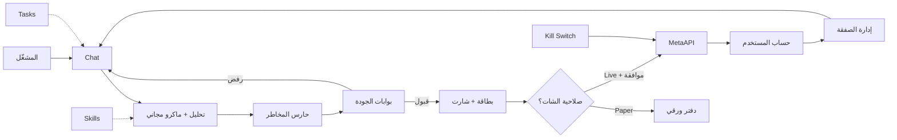

# برومبت Claude Code — محرك تداول الذهب XAUUSD

الملف التنفيذي الكامل (بالإنجليزية لـ Claude Code):

→ [`claude-code-xauusd-core-engine.md`](./claude-code-xauusd-core-engine.md)

هذا الملخص يوضح ماذا يتضمن البرومبت وكيف يتوافق مع وثائقك.

---

## ماذا يفعل البرومبت؟

يطلب من Claude Code تحويل الوكيل من **توصيات فقط** إلى **تحليل + تنفيذ حي** عبر **MetaAPI** (حساب MT5 الخاص بالمشغّل)، مع:

- منع أي خدمة مدفوعة (Bloomberg / Benzinga / X API مدفوع…)
- **منع الباكتيست بالكامل** (حتى بند 5.2 في الوثائق)
- الإبقاء على التشابه التاريخي المجاني فقط: Vector Playbook + FastDTW + دروس SQLite
- صلاحيات تنفيذ من الشات
- قسمي **Tasks** و **Skills** في الواجهة
- إعدادات تفعيل/تعطيل لكل قدرة

---

## سيناريو الصفقة (مختصر)

1. المشغّل يطلب تحليلاً في الشات  
2. الأسطول التحليلي + بوابات الجودة  
3. إن رُفضت الفكرة → لا أمر  
4. إن مُرّرت → بطاقة + صورة شارت  
5. التحقق: Kill Switch، Paper/Live، اتصال MetaAPI، صلاحية المحادثة، مخاطرة، سبريد، أخبار  
6. موافقة بشرية (Ask) أو Paper  
7. إرسال الأمر عبر MetaAPI مع وقف وأهداف  
8. إدارة لاحقة: trailing / breakeven / partial / news shield  
9. بعد الإغلاق → درس مستفاد في SQLite  

---

## صلاحيات التنفيذ في الشات

| المستوى | المعنى |
|--------|--------|
| `none` | تحليل + ورق فقط |
| `ask` | تنفيذ حي بعد موافقة كل صفقة (الافتراضي عند تفعيل Live) |
| `auto` | تنفيذ تلقائي بعد البوابات (معطّل وخطير — تأكيد مزدوج) |
| `manage` | تعديل/إغلاق مراكز قائمة |
| `adopt_manual` | تبني صفقات المشغّل اليدوية |

طرق المنح: شريحة فوق حقل الكتابة، أوامر `/trade`، لغة طبيعية، أزرار البطاقة، أزرار تيليجرام.

---

## أقسام الواجهة الجديدة

### Tasks (تجربة بسيطة)

- قائمة هادئة: ماذا يعمل / منتظر / انتهى  
- زر «مهمة جديدة» بثلاثة حقول فقط: ماذا / متى / أين  
- بدون تعقيد شاشة Automations الكاملة (تبقى في الإعدادات للمتقدمين)

### Skills

- تفعيل/تعطيل مهارات الذهب (قواعد الدخول، الوقف، الأخبار، …)  
- إضافة مهارة جديدة (رفع/لصق `SKILL.md`)  
- حزم Builtin منفصلة عن Workspace

---

## التدفق البصري

---

## خيارات الإعدادات الأساسية

- ربط MetaAPI (توكن المشغّل) / Paper / Live  
- نسبة المخاطرة، حد الخسارة اليومي، أقصى صفقات، الحد الأدنى R:R، التهدئة، السبريد  
- Trailing / Breakeven / Partial / News Shield  
- مفاتيح F01–F10 (تيليجرام أخبار، RSS، Nitter، تقويم، Regex، Vector، DTW، دروس، Ollama، أسواق متقاطعة)  
- Kill Switch / Pause / Flatten  

---

## إضافات واجهة مقترحة

شريط صلاحية التنفيذ، لوحة المراكز، Risk HUD، لوحة السيناريوهين A/B، عدّاد درع الأخبار، Kill Switch دائم، معالج MetaAPI بجانب تيليجرام، دفتر الدروس، شريط DXY/XAG/USOIL.

---

## كيف تستخدمه مع Claude Code؟

1. افتح الملف الكامل `claude-code-xauusd-core-engine.md`  
2. الصق رسالة البدء في §17 (Phase A أولاً)  
3. أكمل المراحل B→G بالترتيب  

لا تبدأ بالتنفيذ الكامل دفعة واحدة — المراحل مقصودة لتقليل المخاطر.
