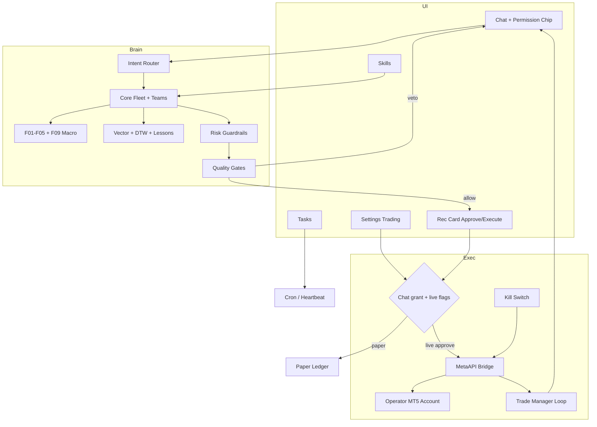
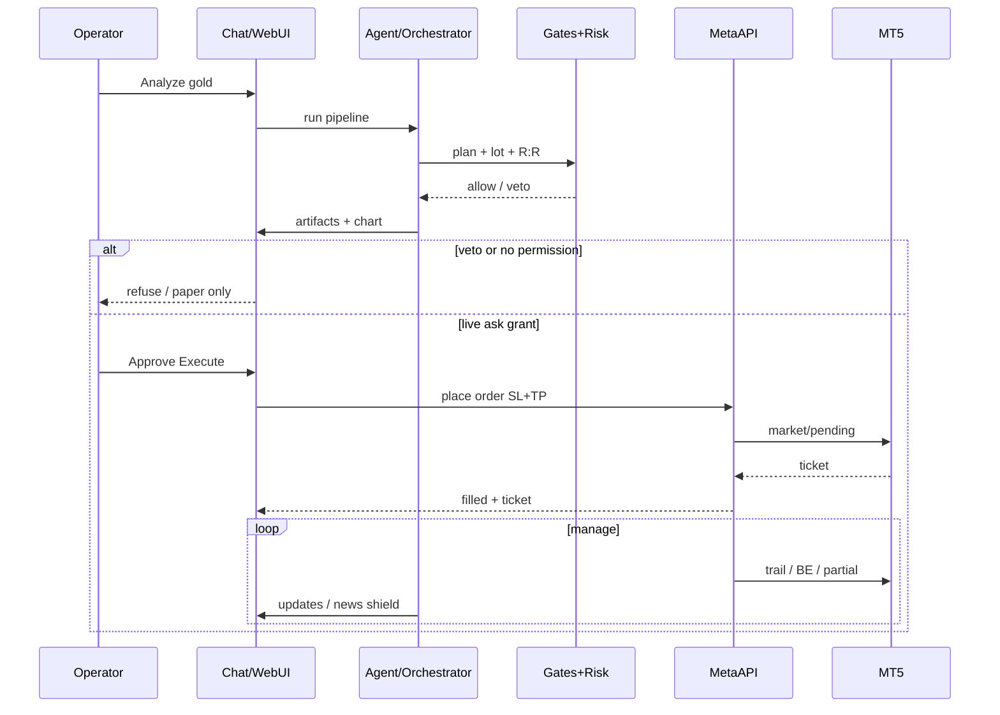

# Claude Code Prompt — XAUUSD Core Engine (NanoAgent / nanobot)

> **How to use:** Paste this entire document into Claude Code as the implementation brief.
> Repo: NanoAgent / nanobot (Python brain + React/TypeScript WebUI).
> Language of this prompt: English (implementation). Operator-facing UI/chat may be Arabic + English via existing i18n.

---

## 0. Mission

Extend the existing gold (XAUUSD-only) agent from **recommendations-only** into a **chat-first live trading operator** that:

1. Analyzes gold with the AiChart-style multi-agent pipeline already in `nanobot/trading/`.
2. Executes and manages trades on the **operator’s own MT5 account via MetaAPI** (BYOK — operator brings their own MetaAPI token/account).
3. Requires **explicit human permission** before live execution (chat + settings).
4. Adds first-class WebUI sections: **Tasks** and **Skills**.
5. Ships **zero paid SaaS dependencies** in the product (no Bloomberg, Benzinga, paid X API, paid news terminals, paid calendar APIs).

Do **not** rebuild the whole product. Extend what exists. Prefer small, reviewable PRs.

---

## 1. Hard constraints (non-negotiable)

### Must

| Rule | Detail |
|------|--------|
| Symbol | **XAUUSD only** |
| Execution bridge | **MetaAPI only** for live orders (connect operator MT5 account). Store credentials encrypted locally. |
| Cost | **No paid third-party services** baked into the product. Free/open/local only (see §3). |
| Backtest | **No backtesting engine.** Do **not** implement Fast Backtest (old §5.2). Historical pattern similarity (vector playbook + FastDTW) is allowed; formal backtest/walk-forward is forbidden. |
| Gates | Existing quality gates remain mandatory before any publish/execute path. Never bypass. |
| Paper default | `paper_mode=true` until operator enables live + grants chat execution permission. |
| Kill switch | Master kill switch closes all MetaAPI positions/orders and freezes the agent. |
| Charts | TradingView Advanced Charts only (already vendored). No lightweight-charts, no TV iframe. |
| Design | Follow `.agent/design.md`, `.agent/security.md`, `.agent/gotchas.md`. |

### Must not

- No paid news/data subscriptions.
- No broker SDKs other than MetaAPI for execution (OANDA/yfinance remain **market data / intermarket** helpers only if free and already present — do not use them to place orders).
- No G5-style backtest gate revival.
- No Martingale / grid doubling.
- No auto-raise of risk after losses.
- Do not delete existing recommendation/artifact pipeline; extend it.

---

## 2. Current codebase anchors (reuse)

Study before coding:

| Area | Path |
|------|------|
| Orchestrator | `nanobot/trading/orchestrator.py` |
| Gates | `nanobot/trading/gates/` |
| Runtime (pause/kill/paper) | `nanobot/trading/runtime_state.py` |
| Paper ledger | `nanobot/trading/paper.py` |
| Skills | `nanobot/skills/gold-trading/`, `trading-proactive/`, `cron/`, `memory/` |
| Tools | `nanobot/agent/tools/trading_chart.py`, `trading_team.py` |
| WebUI shell | `webui/src/App.tsx`, `webui/src/components/Sidebar.tsx` |
| Rec card (approve/reject paper) | `webui/src/components/trading/TradingRecommendationCard.tsx` |
| Connect channels | `webui/src/components/trading/TradingConnect.tsx` |
| Automations UI | `webui/src/components/settings/system/AutomationsSettings.tsx` |
| Skills UI | `webui/src/components/settings/SkillsCatalogSettings.tsx` |
| Config schema | `nanobot/config/schema.py` |
| Design docs | `docs/designs/gold-trading-agent.md`, `docs/designs/gold-trading-roadmap.md` |

---

## 3. Zero-cost stack (allowed integrations)

Implement FEATURE-01…10 using **only** free/local tools:

| ID | Feature | Stack |
|----|---------|-------|
| F01 | Telegram news MTProto listener | `telethon` (operator’s own Telegram user session — BYOK) |
| F02 | Async RSS aggregator | `aiohttp` + `feedparser` (Reuters/AP/Fed open feeds) |
| F03 | VIP statements | public/self-hosted **Nitter RSS** or `snscrape` (no X paid API) |
| F04 | Economic calendar | open JSON/HTML scrapers (ForexFactory / Investing open endpoints) — extend existing `nanobot/trading/news/forex_factory.py` |
| F05 | Zero-latency regex emergency filter | Python `re` in-process |
| F06 | Local vector playbook | **ChromaDB or LanceDB** local only |
| F07 | FastDTW pattern matcher | `fastdtw` + `numpy` (+ `scipy` if needed) |
| F08 | Post-mortem lessons | **SQLite** local |
| F09 | Local sentiment | **Ollama** local (Qwen 2.5 3B/7B or FinBERT) — optional; degrade gracefully if Ollama down |
| F10 | Intermarket macro | MetaAPI/MT5 symbols if available, else free `yfinance` fallback for DXY/XAG/USOIL |

**Explicitly forbidden paid:** Bloomberg Terminal, Benzinga, paid X API, paid calendar SaaS, paid sentiment APIs, paid vector cloud, cloud LLM for news classification (use Ollama or skip).

**MetaAPI note:** Operator supplies their own MetaAPI token + account id (BYOK). The product never ships a shared paid MetaAPI key.

---

## 4. Product capability map (from operator docs)

Implement as modules/toggles. Group by capability domain.

### 4.1 Technical & Price Action

- Supply/Demand + FVG (3-candle imbalance, fill state).
- Multi-timeframe: D1/H4 bias → H1/M15 entry timing.
- Liquidity sweeps / turtle soup / fakeouts (rejection wicks).
- Structure: swing points, BOS, CHoCH.
- Auto Fib + Discount/Premium (0.618–0.786), dynamic S/R.
- Tick volume + ATR for momentum and SL distance.
- RSI/MACD divergence warnings.

### 4.2 Macro & Sentiment Radar

- Live calendar (rate, CPI, NFP) + surprise delta.
- DXY confluence (inverse gold bias; allow geo-decoupling exception).
- Fed tone Hawkish/Dovish via local Ollama when available.
- Geopolitical safe-haven keyword radar (F01+F05 first, then F09).

### 4.3 Risk Guardrails (always on when live)

- Auto lot from risk % + SL distance.
- Daily drawdown breaker (default example 3%) → flatten + freeze until next day.
- Spread guard before send.
- Cooldown lock after N consecutive losses (default 2 → freeze 60–240m).
- Max concurrent gold positions (default 2).
- Min R:R filter (default ≥ 1:2). Reject below threshold.
- No widening SL after entry. No revenge trading.

### 4.4 Execution & Trade Management (MetaAPI)

- Market + pending (limit/stop) orders.
- Trailing SL (structure or ATR / Chandelier).
- Auto breakeven after TP1 (and only after M15 structure confirms when skill rules say so).
- Partial TP ladder (e.g. 50% / 25% / 25%).
- News shield: alert and/or protect positions N minutes before high-impact events.
- Early exit recommendation/action on momentum death.
- Magic numbers: separate scalping vs swing.

### 4.5 Memory & Internal Review (NO backtest)

- Historical similar setups via F06 vector playbook.
- Shape match via F07 FastDTW on last ~30 bars (not a backtest report).
- Post-trade self-review → F08 SQLite lessons.
- Pre-trade dual review: technical idea + risk engine must both pass.
- Before new signal: query last 3 similar losers; refuse if repeat pattern.

### 4.6 Alerts & Operator Interface

- Instant alert + chart snapshot (entry/SL/TP/reason) — reuse `capture_gold_chart`.
- Human-in-the-loop Approve / Reject before live execute.
- Morning brief before London / New York.
- Daily/weekly PnL + win-rate reports.
- Natural-language Q&A on gold state.
- Feed disconnect / stale tick alerts.
- Fan-out: WebUI + Telegram (+ WhatsApp if already enabled).

### 4.7 Security & Resilience

- Master kill switch (UI + chat phrase + API).
- Encrypt MetaAPI secrets at rest (local keyring / encrypted file under `~/.nanobot/`).
- Persist open tickets + management state in SQLite for restart recovery.
- Bad-tick filter (ignore absurd spikes that snap back).
- Adopt operator’s manual MT5 trades into management when asked.

### 4.8 Multi-task & Orchestration

- Async: manage open trades while scanning for new setups.
- Dual conditional scenarios (buy breakout / sell failure) — arm one, cancel the other.
- Scalp vs swing isolation via magic numbers.
- Natural-language trade commands (“move all gold stops to breakeven if price tags 2500”).
- Feature toggles per skill in Settings + Skills UI.

### 4.9 Behavioral Alignment

- Tone modes: strict when risk-breaking, light sarcasm vs overconfidence, supportive after losses.
- Honest loss admission — no excuses.
- Silence in dead ranges (no spam signals).
- End-of-day reflection question for journal.

### 4.10 Field rulebooks (embed as skills, not hardcode all)

Port the operator rule encyclopedias into **skills** (English `SKILL.md` bodies):

1. `gold-trading` — constitution (update; remove “recommendations only / never execute” where live is enabled).
2. `gold-entry-timing` — rules 1–25 entry flexibility.
3. `gold-stop-protection` — rules 26–55 SL philosophy.
4. `gold-retest` — rules 56–80.
5. `gold-trendlines` — rules 81–105.
6. `gold-xauusd-dynamics` — rules 106–135.
7. `gold-take-profit` — rules 136–160.
8. `gold-candle-traps` — rules 161–180.
9. `gold-execution-discipline` — rules 181–200.
10. `gold-news-volatility` — 100 news/volatility rules.
11. `gold-news-candle-detection` — 100 news-candle detection rules.
12. `trading-proactive` — keep; extend for execution alerts.

Skills are toggleable. Builtin skill files remain **English only**; operator replies match operator language.

---

## 5. Trade execution scenario (when & how)

### 5.1 Happy path — live execution with human approval

```text
1. Operator asks in chat: "Analyze gold" / "حلل الذهب"
2. Intent router → full pipeline (market → specialists → risk → synthesizer → gates)
3. If gates veto → WAIT / refuse; NO order; explain which user-facing check failed
4. If gates allow → emit artifacts (decision, level_map, chart_snapshot, gate_report)
5. Execution eligibility check:
   a. runtime.kill_switch == false
   b. runtime.paused == false
   c. MetaAPI connected + account healthy
   d. settings.trading.liveExecutionEnabled == true
   e. THIS chat has execution permission (session grant) OR global "always ask"
   f. Risk guardrails pass (spread, DD, cooldown, max positions, R:R, lot)
   g. News shield not in hard freeze (unless geo override skill says buy panic)
6. Agent presents recommendation + chart + lot + R:R
7. Operator taps Approve / types "نفّذ" / Telegram inline Approve
8. Agent sends MetaAPI market or pending order with SL+TP packet (SL first)
9. Persist ticket to SQLite; overlay on TradingView chart
10. Trade manager loop: trailing / BE / partials / news shield / early exit
11. On close → post-mortem lesson row + performance update
```

### 5.2 Paper path (default)

Same as above through step 6, then Approve writes to **paper ledger** only (`nanobot/trading/paper.py` extended). No MetaAPI order.

### 5.3 Auto-execute path (optional, dangerous, off by default)

Only if:

- `liveExecutionEnabled`
- `autoExecuteApprovedSetups === true`
- chat grant includes `auto`
- discipline skill rule 182 applies (zero hesitation) **and** human previously opted in

Still blocked by kill switch, DD breaker, cooldown, news freeze, bad tick, stale quote (>5s).

### 5.4 Dual scenario arming

```text
Agent proposes:
  A) Buy stop above breakout level
  B) Sell limit on failed breakout / turtle soup
Operator approves "arm both"
→ MetaAPI places both pendings with OCO-like software cancel:
  first fill cancels the sibling
→ Expiry: cancel unfilled pendings after 3 hours (rule 183)
```

### 5.5 Natural-language management

Examples the agent must support when permission granted:

- “انقل وقف كل صفقات الذهب للدخول”
- “Close 50% at market”
- “Enable trailing ATR 1.5”
- “Kill switch now”

Map to MetaAPI modify/close tools; confirm when action is destructive unless kill switch.

### 5.6 When the agent must stay silent / refuse

- Dead range / compressed ADR day (behavioral + XAUUSD dynamics).
- Pre-news freeze window (default 15m for red events).
- Midnight spread trap / rollover window.
- Cooldown lock / daily DD hit.
- R:R < minimum.
- Stale ticks / disconnected MetaAPI.
- Repeat of last 3 lesson failures (F08).

---

## 6. Chat execution permissions (UX + data model)

### 6.1 Permission model

| Scope | Meaning |
|-------|---------|
| `none` | Analysis + paper only |
| `ask` | Live allowed after explicit Approve each trade (default when live enabled) |
| `auto` | Live auto-send when gates+risk pass (must be double-confirmed in Settings) |
| `manage` | May modify/close existing positions via chat |
| `adopt_manual` | May detect & manage operator’s manual MT5 trades |

Grants are stored per **session/chat** (and optionally global default in Settings).

### 6.2 How operator grants in chat

1. **Slash / soft command:** `/trade allow ask` · `/trade allow auto` · `/trade revoke` · `/trade status`
2. **Natural language:** “أسمح لك بالتنفيذ في هذه المحادثة بعد موافقتي”
3. **UI chip** above composer: `Execution: Off | Ask | Auto` (per chat)
4. **Recommendation card buttons:**
   - `Approve (Paper)` always available
   - `Execute Live` visible only if MetaAPI connected + live enabled + grant ≥ ask
   - `Reject`
   - `Arm Dual Scenario`
5. **Telegram:** inline keyboard Approve / Reject / Kill (Arabic labels OK on Telegram)

### 6.3 Safety copy (must show before first live grant)

Short modal/chat notice:

> Live execution will place real orders on your MT5 account via MetaAPI. Paper mode is safer. Kill switch is always available.

Require checkbox acknowledgment once per account connect.

---

## 7. Settings — toggles to add

Add Settings section **`Trading`** (or under Capabilities → Trading Runtime). Persist in `config.json` via Pydantic (`nanobot/config/schema.py`) + runtime overrides in `TradingRuntimeState`.

### Connection

- MetaAPI token (secret)
- MetaAPI account id
- MetaAPI region / provisioning status
- Connect / Disconnect / Test heartbeat
- Account read-only mode (sync positions, no send)

### Mode

- Paper mode (default ON)
- Live execution enabled (default OFF)
- Default chat grant: `none | ask | auto`
- Require acknowledgment before live

### Risk

- Risk percent per trade (default 1%)
- Daily max drawdown % (default 3%)
- Max open gold positions (default 2)
- Min R:R (default 2.0)
- Cooldown after consecutive losses (count + minutes)
- Max lot hard cap
- Spread max points (absolute) + “3× normal” multiplier
- Slippage tolerance points
- Volatility-adjusted lots (ATR scaling) ON/OFF

### Execution management

- Trailing stop ON/OFF + mode (`structure` | `atr` | `chandelier`)
- Auto breakeven ON/OFF + trigger rule
- Partial TP ladder (editable percents)
- Pending order TTL hours (default 3)
- Magic number scalp / magic number swing
- Adopt manual trades prompt ON/OFF
- Early exit on momentum death ON/OFF

### News & macro

- News shield ON/OFF + minutes before red news
- Pre-news freeze ON/OFF
- Telegram MTProto news listener ON/OFF (F01)
- RSS aggregator ON/OFF (F02)
- VIP/Nitter tracker ON/OFF (F03)
- Calendar scraper ON/OFF (F04)
- Regex emergency freeze ON/OFF (F05)
- Local Ollama sentiment ON/OFF (F09)
- Intermarket confluence required ON/OFF (F10)

### Memory

- Vector playbook ON/OFF (F06)
- FastDTW matcher ON/OFF (F07)
- Lessons DB refuse-on-repeat ON/OFF (F08)
- **Backtest:** do not add any toggle — feature does not exist

### Alerts

- Morning London brief
- Morning NY brief
- End-of-day reflection question
- Performance daily/weekly report
- Disconnect / stale tick alert
- Outcome alerts (in_trade, TP1, invalidated) — keep existing
- `gateway.tradingCron.enabled` remains opt-in (default false)

### Safety

- Kill switch button (red)
- Pause agent
- Flatten all + cancel pendings
- Encrypt secrets status indicator

---

## 8. New WebUI sections

### 8.1 Sidebar IA (target)

```
Chat
Chart
Performance
Recommendations
Briefing
Tasks          ← NEW (top-level, simple)
Skills         ← NEW (top-level; can deep-link to settings skills)
Telegram / WhatsApp (Connect)
Settings
```

Routes: `#/tasks`, `#/skills` (plus existing `#/chat`, `#/performance`, …).

### 8.2 Tasks — UX must be simple

**Goal:** One glance “what is running / waiting / done” — not a dense automations console.

Reuse cron/automations backend (`AutomationsSettings` / cron tool) but present a **friendlier Tasks surface**:

| Element | Behavior |
|---------|----------|
| Header | “Tasks” + primary button **New task** |
| Empty state | One sentence + example chips (“Brief me before London”, “Alert if TP1 hits”, “Pause after 2 losses”) |
| List rows | Title · next run/relative time · status pill (Active / Paused / Done / Failed) · chat link |
| Row actions | Pause · Run now · Edit · Delete (overflow menu) |
| Create flow | 3 fields only: *What* (text), *When* (natural or simple presets), *Where* (this chat / Telegram) — agent can refine via chat |
| Filters | All / Active / Done — no complex sort menus by default |
| System tasks | Collapsed “System” disclosure (heartbeat, optional trading cron) |

Do **not** dump full AutomationsSettings complexity into Tasks. Keep Advanced Automations in Settings for power users; Tasks is the calm daily surface.

### 8.3 Skills — operator adds / toggles agent skills

Promote skills from buried settings into a first-class page:

| Element | Behavior |
|---------|----------|
| Installed | Cards/rows: name, short description, Enabled switch, source (builtin/workspace) |
| Trading pack | Group for gold-* skills with one-click enable pack |
| Add skill | (1) Paste/upload `SKILL.md` (2) Create blank from template (3) Optional marketplace discover — keep existing marketplace if free; do not require paid registries |
| Detail drawer | Full markdown, required env keys, “Used when…” |
| Danger | Disable skill instantly; affects next agent turn |

Wire to existing `/api/webui/skills*` APIs; extend if upload/create workspace skill is missing.

---

## 9. Suggested additional UI (nice-to-have, same PR series)

Prioritize after Tasks/Skills + MetaAPI:

1. **Execution permission banner** on chat (grant state + MetaAPI connection dot).
2. **Positions panel** — open MetaAPI positions/pendings with one-click flatten.
3. **Risk HUD** — today’s DD used, cooldown timer, spread, lot preview.
4. **Scenario board** — armed A/B pendings with cancel.
5. **Lessons timeline** — last refused repeats from F08.
6. **News shield countdown** chip before red events.
7. **Kill switch** always visible in Trading Status Bar.
8. **Connect MetaAPI** wizard beside Telegram/WhatsApp in Connect view.
9. **Trade journal** view (post-mortems + EOD reflection answers).
10. **Intermarket strip** — DXY / XAG / USOIL sparklines under chart.

---

## 10. Architecture (implement this shape)



### Execution sequence



---

## 11. Module layout to add

```text
nanobot/trading/
  metaapi/
    client.py          # REST/WS wrapper
    account.py         # connect, heartbeat, positions
    orders.py          # place/modify/cancel/close
    recover.py         # ticket state restore
    secrets.py         # encrypted local secrets
  risk/
    lot.py
    drawdown.py
    spread.py
    cooldown.py
    rr_filter.py
  manage/
    trailing.py
    breakeven.py
    partials.py
    news_shield.py
    early_exit.py
    dual_scenario.py
  memory_engine/
    playbook.py        # F06
    dtw_match.py       # F07
    lessons.py         # F08
  macro_free/
    telegram_mtproto.py  # F01
    rss_aggregator.py    # F02
    vip_nitter.py        # F03
    calendar_scrape.py   # F04 (extend forex_factory)
    regex_emergency.py   # F05
    sentiment_ollama.py  # F09
    intermarket.py       # F10
  permissions/
    grants.py            # per-session execution grants

nanobot/agent/tools/
  trading_exec.py        # execute_gold_order, modify_gold_position, flatten_gold, kill_switch
  trading_account.py     # account status, positions

webui/src/components/trading/
  TradingTasks.tsx
  TradingSkillsPage.tsx  # or reuse/enhance SkillsCatalog as page
  ExecutionGrantChip.tsx
  MetaApiConnect.tsx
  PositionsPanel.tsx
  RiskHud.tsx
```

Update `gold-trading/SKILL.md`: allow execution tools only when grants + live flags say so; never claim broker names/gate ids to the operator (keep i18n labels).

---

## 12. API surface (add)

| Method | Route | Purpose |
|--------|-------|---------|
| GET/POST | `/api/trading/metaapi/connect` | Save/test connection |
| GET | `/api/trading/metaapi/status` | Heartbeat, equity, margin |
| GET | `/api/trading/positions` | Open + pending |
| POST | `/api/trading/execute` | Place order (server rechecks grants/risk) |
| POST | `/api/trading/manage` | trail/BE/partial/modify/close |
| POST | `/api/trading/flatten` | Close all gold + cancel pendings |
| POST | `/api/trading/kill` | Kill switch |
| GET/PUT | `/api/trading/permissions/:sessionKey` | Chat grants |
| GET/PUT | `/api/trading/settings` | Trading toggles |
| GET | `/api/trading/tasks` | Tasks list projection |
| CRUD | existing automations/cron | Tasks backend |
| existing | `/api/webui/skills*` | Skills page |

All mutate routes must re-validate: kill switch, pause, grant, paper/live, risk, stale quote, bad tick.

---

## 13. Implementation phases (Claude Code order)

### Phase A — Permissions + Settings + Paper/Live split

- Extend `TradingRuntimeState` + config schema.
- Chat grant chip + slash commands.
- Recommendation card: Execute Live vs Paper.
- Settings Trading panel (toggles above).
- Tests for grant matrix.

### Phase B — MetaAPI bridge + Positions + Kill

- Connect wizard in Connect view.
- Place/modify/close/flatten.
- Restart recovery SQLite.
- Bad tick + stale quote guards.
- Status bar kill switch.

### Phase C — Trade manager

- Trailing, BE, partials, dual scenario, magic numbers.
- News shield timers.
- NL management commands.

### Phase D — Zero-cost macro FEATURES F01–F05, F09–F10

- Pluggable; each behind settings toggle; default safe (calendar on if free scrape works; MTProto off until configured).

### Phase E — Memory F06–F08 (no backtest)

- Playbook + DTW + lessons refuse-on-repeat.
- Wire into pre-trade review.

### Phase F — WebUI Tasks + Skills pages

- Simple Tasks UX.
- First-class Skills page + gold skill pack toggles.
- Port rulebooks into skill files.

### Phase G — Behavioral + briefs + reports

- Tone skill, silence rules, EOD question.
- Morning briefs, performance reports (extend existing Performance view).

---

## 14. Testing requirements

- `pytest tests/trading -q` must stay green; add tests for:
  - grant matrix (none/ask/auto)
  - risk rejects (R:R, DD, cooldown, spread, max positions)
  - kill switch flatten
  - paper vs live branching
  - pending TTL cancel
  - lesson repeat refusal
  - regex emergency freeze
- WebUI: `cd webui && bun run test` / build.
- Never hit real MetaAPI in unit tests — mock client.
- Manual: paper approve path + mocked live execute path.

---

## 15. Definition of done

1. Operator can connect **their** MetaAPI account from WebUI.
2. Default remains paper; live requires settings flag + chat grant + Approve.
3. Full analyze → gate → artifact → approve → order (mocked in CI) works.
4. Kill switch flattens and freezes.
5. Tasks page is simple and usable in &lt;30 seconds.
6. Skills page can enable/disable gold rule packs and add a workspace skill.
7. No paid SaaS required; no backtest module exists.
8. Docs updated: short operator guide under `docs/` + this prompt kept as source brief.
9. Update `docs/designs/gold-trading-agent.md` deferred list: live execution via MetaAPI is now in scope; backtest stays deferred/forbidden.

---

## 16. Coding style reminders

- Python 3.11+, asyncio, ruff E/F/I/N/W, line length 100.
- Minimal core changes to `agent/loop.py` / `runner.py` — prefer tools + trading package.
- Config explicit in Pydantic schema.
- Skill files English-only.
- Do not force-push; small commits; run tests before claiming done.

---

## 17. One-shot starter message for Claude Code

Copy this into Claude Code after attaching this file:

```text
Implement Phase A from docs/prompts/claude-code-xauusd-core-engine.md
on a new branch. Respect hard constraints: MetaAPI BYOK only, no paid SaaS,
NO backtest, paper default, chat execution grants, keep existing gates.
Start by reading runtime_state.py, TradingRecommendationCard.tsx, schema.py,
and gold-trading SKILL.md. Deliver Settings trading toggles + per-chat grant
chip + Paper vs Execute Live buttons with tests. Do not implement MetaAPI
orders yet beyond interfaces/mocks.
```

Then continue Phase B…G in order.
